# 介绍

- JavaScript：一门运行在**浏览器**端的**脚本 编程 语言**

# 引入方式

- 内嵌式：demo 学习阶段的主要写法
- 外链式：项目开发阶段使用；能够重复引入
- 行内式：了解，一般不用

# 变量

- 作用：语法的一部分，数据需要一个名称以便于使用，这个名称就叫做变量；本质就是存**数据**的；
- 变量：与之对应叫常量（一直不变的量）;

## 命名

- 范围：字母、数字、下划线、\$符号；
- **变量名字不能用  数字  特殊符号 作为开头，不能使用 JavaScript 语法中的关键字和保留字**
- 变量名字是区分大小写的；

# 数据类型

- 变量：用于接收数据，数据的类型不同；
- 怎么区别不同？
  - 值的大小，比如：5 6 区别
  - 类型：我 、1；
- 为什么不同？
  + 生活中需要不同的类型描述不同的事情，程序源于生活又高于生活；

# 基本类型

- 数字（NaN）类型、 字符串类型、布尔类型、null（复杂数据类型，被归为简单数据类型的原因在于它只是表示一个空值）、undefined 类型；

## Number 类型

- 所有的数字都是 number 类型，如：10，99.8，-12...
- NaN：**not a number，不是某个数，泛指，不知道指哪个数，但是为 Number 类型；**

## String 类型

- 语法：**一定要带引号，单双无所谓；**只要你戴上引号，就是字符串；

## 布尔(Boolean)类型

- 语法：标示某个结果，存在或者不存在（真--1 与 假--0）；只有两个值；

## null 值

- 值：null 用来表示尚未存在的对象（**复杂类型**）；**专门赋值为 null；**
- **其实 null 不是简单类型，为复杂类型；**

## undefined 类型

- undefined 类型：undefined 值；
- 变量没有赋值，**也不知道是啥**，不是空；默认赋值为 undefined

# 查看数据类型

- 作用：不同的数据类型，参与运算结果不同；需要判断数据是什么类型；
- 语法：反应判断当前值的类型的说明；**typeof 数据;typeof(数据);**

# 数据类型转换

- 目的：数据参与运算，保证**数据类型**一致，才能得到预期的结果；

## 其他类型 转 Number 类型

- 其他：字符串类型、布尔类型、null 值 、undefined 类型；

### Number()

- 语法：把需要转的值或者变量放入括号内部；
- 结果：肯定能转成功；
  - 数字
  - NaN

  ```js
    var res0 = Number('abc');
    console.log(res0); // 输出数字NaN
  ```


    var res1 = Number('123');
    console.log(res1); // 输出数字123
    console.log(typeof res1); // 输出 number
    
    var res2 = Number(true);
    console.log(res2);// 输出 1
    console.log(typeof res2); // 输出number
    
    var res3 = Number(null);
    console.log(res3); // 输出0
    console.log(typeof res3); // 输出number
    
    var res4 = Number(undefined);
    console.log(res4); // 输出 NaN  , NaN 就是 not a  number 的缩写，表示某个结果不是某个数字
    console.log(typeof res4); // 输出 number
    
    ```

### parseInt()

- 将其他类型为数字**整数**；
- 转成功类型为**字符串**，纯字符串、true、null、undefined 都是 NaN；
  - 如果**字符串前面是数字**，可以把前面的数字转化为数字类型；
  - 如果字符串中前面不是数字，转 NaN；

### parseFloat()

- parseFloat 这个方法用于转换字符串转换成小数(在编程中，小数也称浮点数)
- 转成功类型为**字符串**，**纯字符串、true、null、undefined 都是 NaN**；
  - 如果**字符串前面是数字**，可以把前面的数字转化为数字类型；
  - 如果字符串中前面不是数字，转 NaN；

## 其它类型 转 String 类型

- 其他类型：Number 类型、boolean 类型、null（值）、undefined 类型（值 undefined）

### String()   (重点)

- 转化特点：有引号就行了；

- 语法：转呗；反正最后就是用单双引号包起来了；

### .toString()   (重点)

- 语法：undefined 和 null 不能使用这个方式变成字符串；

## 其它类型 转 Boolean 类型

- 其他类型：字符串类型、数字类型、null（值）、undefined 类型（值）
- 特点：返回一个布尔值；true、false；

### Boolean()   (重点)

- 语法：Boolean()

- 在 js 里面，我们在转换其它类型为布尔类型的时候，只有 6 个情况是 false

```js
var res1 = Boolean(0);
console.log(res1); //输出false  0

var res3 = Boolean(NaN);
console.log(res3); //输出false  NaN

var res2 = Boolean(""); // 空字符，里面啥没有，空格也没有；
console.log(res2); //输出false

var res6 = Boolean(false);
console.log(res6); //输出false  false

var res5 = Boolean(null);
console.log(res5); //输出false  null

var res4 = Boolean(undefined);  //undefined
console.log(res4); //输出false
```

# 操作符

- 数据运算：数据参加比较、运算；
- 不同的数据类型参加运算，会有问题；比如上面的 字符串+数字；
- **学习关注：常规需要什么；返回什么；**

## 算术操作符

- 需要：数字类型参加运算；
- 返回：就是数字类型计算的结果；

```js
// +  -  *  /  %
// ++ --
```

### 字符串+

- **字符串+**：与字符串临近的类型，转为字符串；里面存在一个**隐式转化**；看不到的转化；
- 隐式转化：在字符串+情况下，数字隐转为字符串；
- 情况：
  - 字符串 + ；
  - +字符串；

```js
// 字符串 +
// 从左到右执行，数字相加，字符串拼接
var res3 = 10 + 10 + "abc" + "def";
console.log(res3); //输出 20abcdef
```

### 字符串 其他

- 字符串遇见 \* / - %；
- \* 隐式转化为**Number类型**：字符串会转为数字，再次参加运算；

```
var res3 = '456' - 123;
console.log(res3); // 输出 数字 333

// 'abc' 隐式转化为NaN，所有输出NaN；
var res4 = 'abc' - 123;
console.log(res4); // 输出NaN
```

### 自增++、自减--    **（重点  必须会）**

- `++` 自增操作符的作用是让一个数字在原来的基础上自增 1

- 区别：同理 **--**
  - **a++** : 参与运算的时候，会先用原来的值先运算，再自增；（**写在后面就后加**）
  - **++a**: 参与运算的时候，会先在原来的基础上自增，再使用新的值参与运算（**写在前面就先加**）

## 比较操作符    **（重点  必须会）**

- 需要：**常规：Number 类型参与比较；**
- 语法：比较两个值的大小，**常规比较就是数字**
- 返回：**比较后的结果，对或错，Boolean 值；标示状态成立与否；**
- 语法：> < >= <=
- 非常规操作：非 Number 类型要和 Number 类型比较的话，非 Number 类型就要隐式转换为数字；

- `==` 和 `===` 是用来比较两个数据是否相等的;
- 需要：所有类型都可以；
- 返回：Boolean 值；标示状态成立与否；

```js
// 语法：== (相等)	!=(不相等)  ===(绝对相等)  !==(绝对不相等)
```

- 区别：**（重点  必须会）**

  - `==`
    - **同类型：比较值是否一样；特别 NaN==NaN false**
    - **不同类型：转为 Number 类型，看值是否一样；**
  - `===`
    - **同类型：再看值；**
    - **不同类型：false**;

- ECMAScript 认为 undefined 是从 null 派生出来的，所以把它们定义为相等的

## 逻辑操作符

- 语法：&&    ||     ！
- 需要：
  - 常规：左右两边需要 true 或 false 进行比较，**布尔类型的值进行逻辑判断，**
  - 非常规：需要转 Boolean 值； **隐式转换为boolean类型再进行比较**
- **返回：用 Boolean 值进行逻辑判断后，把最后一个成立或不成立的《结果返回》；**

- `&&` 且：所有条件都要满足的情况下；

```js
true && true; //true;第二个true
true && false; //false;

1 && 2; // 2;  返回的是第二个值

console.log("abc" && 1);
console.log(null && 0);
```

- 特点：遇见有一个 false，那么就直接返回 false;

- `||` 或：只要你有满足的条件就行；
- 特点：只有有一个 true，那么就直接返回是 true 的这个结果;

- `!` ：取反；常规 Boolean 值取反；不要去玩非常规了，没有意义；

## 赋值运算符

- 语法：给变量赋值； 配合算术运算符在里面； += -= \*= /= %= (a+=b---->a=a+b)

## 优先级 (重点：必须得牢记)

- 大致优先级：

  - 括号先算
  - 其次算算术：++在前 优先;
  - 再次算比较 > ==
  - 然后算逻辑 && ||
  - 最后算赋值 =

- 具体计算优先级

```javascript
    1. 第一优先级： [] . ()
    2. 第二优先级： ++ -- !
    3. 第三优先级： *  /  %
    4. 第四优先级： +  -
    5. 第五优先级： >   >=   <   <=
    6. 第六优先级： ==   !=    ===    !==
    7. 第七优先级： &&
    8. 第八优先级： ||
    9. 第九优先级： = += -= *= /= %=
```

# 流程控制

- 流程控制：我们想要实现一个复杂的效果，只简单的代码是肯定不行的，还要实现代码执行过程的控制；
- 生活：我这种情况下，要做这件事；那种情况下，要做那件事；
- 程序：来源生活，高于生活；

## 表达式

- 在 js 代码中，只要可以返回一个**结果**的，都可以称为一个表达式；

## 语句

- 语句可以理解为一个**行为**，一般在行为和行为之间，都会使用 `;` 隔开。
- 行为：告诉浏览器，我要干什么，你按照我写的思路，给我实现出来给用户看；
- 可以理解为：**语句，是有思维参与在里面的表达式，升级版的表达式；**
- 语句有时候会有返回值，有时候就没有；更侧重是一个**行为上**的理解；

- 简而言之：一个`程序`可以由多个`语句`组成，一个`语句`可以由多个`表达式`组成；
- **技巧：**和上面一样，也可以在浏览器控制台打印语句；默认也会把语句的返回值显示出来；

## 结构

- 写程序，就是写各种**语句的组织**，归根到底，就是各种表达式参与我们的思维的体现；在写代码的结构表现上分为下面三种：
  - 顺序结构：从上到下执行的代码就是顺序结构，**程序默认就是由上到下顺序执行的**；
  - 分支结构：不同的情况下，走不同的分支；
  - 循环结构：重复做一件事情，其作用就是用来重复执行代码的；
- **程序的世界中大量的逻辑就是 分支和循环；**

# 分支结构

- 作用：不同的条件，采取不同的行为；

## if 结构

- **if 结构**：单个 if 结构，解决的一个分支的判断问题；

```js
// if语句：我想看条件表达式的结果成立时，会怎么样；
// 条件表达式：需要返回Boolean值；如果返回的不是Boolean值，就隐式转化为Boolean值；
if (条件表达式) {
  // 当 条件表达式 的结果是 true 时 执行的代码
}
```

- **if-else**：解决两个分支的判断问题

```js
if (条件表达式) {
  //当条件表达式的结果是 true 时执行的代码
} else {
  //当条件表达式的结果是 false 时执行的代码
}
```

## switch-case 结构

- switch-case 结构：主要用于多个**固定值**之间的判断，只能做固定值的判断

```js
switch （数据）{
  case 固定值1:
    // 当数据 === 固定值1时执行的代码; 先看类型，看值；
    // 表示当前 情况结束；
    break;
  case 固定值2:
    // 当数据 === 固定值2时执行的代码;
    break;
  case 固定值3:
    // 当数据 === 固定值3时执行的代码;
    break;
  // 中间还可以写多个判断
  default :
    // 当数据和上面的所有固定值都相等的时候执行的代码
    break;
}

```

- 注意：这个结构里面的 break 并不是必须的，如果两个 case 之间没有 break ，执行完了一个 case 之后，会继续执行下面的 case 的代码；但是一般情况都是带着 break 的；
- 案例：输入星期几，看要做什么事情；

## 三元表达式

- 表达式：**有值会返回；**

- 语法：if else 的简写；有返回值；

```js
// 表达式1 ? 表达式2 : 表达式3

// 首先 要知道 表达式 会返回结果；
// 这个表达式会先执行表达式1，判断其结果是true还是false，
// 如果是true，则执行表达式2，然后将 表达式2的执行结果 作为整个三元表达式的结果，
// 如果是false，则执行表达式3，并 表达式3的结果 作为整个三元表达式的结果

//例如： 求二个数字中谁更大
var a = 10;
var b = 20;
var max = a > b ? a : b;
console.log(max);
```

## 小结

- if else 多用于判断一个区间、不固定值的判断
- switch-case：多用于固定值的判断；

# 循环结构

- 作用：**只要有重复的思想在里面，就要用到循环；**
- **程序的世界中大量的逻辑就是 分支和循环；**阿里百秀，新闻列表，循环；

## while 循环

- 语法：

```javascript
// 条件表达式结果需要布尔值，若不是Boolean值，隐式转化；
while (条件表达式) {
  // 循环体就是重复执行的代码
}
```

- 特点：

  - 设置为 true，容易卡死；
  - 设置 false，直接就不执行；

- 直接写 true false 直接就玩死：

```js
// 初始化变量
var num = 1;

// 退出条件：
while (num <= 10) {
  // 循环体：过程，你想要重复的事情；这样里面就循环了十次

  // 满足退出条件的代码
  num++;
}
// 写这种可以配合着循环变化的表达式（先成立，最后不成立）
```

- 执行过程：
  - 1.**先执行条件表达式，得到一个布尔类型的结果**
  - 2.如果表达式的结果为 false，循环结束，不执行循环后面的代码
  - 3.如果表达式的结果为 true，执行循环体；
  - 4.重复 1~3 的过程，直到表达式结果为 false，结束循环；

## for 循环！！！

### 语法

```js
for (初始化表达式; 条件表达式; 自增表达式) {
  循环体;
}
```

- 执行过程：

1. **执行初始化表达式**
2. **执行条件表达式**
3. 如果条件表达式的结果为 false,结束循环，继续向下执行循环后面的代码
4. 如果条件表达式的结果为 true，执行循环体
5. **执行自增表达式**重复 2~5 的步骤，直到条件表达式的结果为 false，结束循环

### 案例：打印正方形

- 分析：

  - 行和列的点阵；
  - 每行，是个循环；
  - 每行的每个点，是个循环；

  ```js
  for (var i = 1; i <= 6; i++) {
    for (var j = 1; j <= 8; j++) {
      document.write("○");
    }
    document.write("<br>");
  }
  ```

## do-while循环(补充)

* 语法

```javascript
do {
  //循环体
}while(条件表达式)
    
    
// 记录输出的次数
var count = 0;
// 只要次数不够3次，就循环的输出
do {
  console.log('班长很漂亮');
  // 让次数+1
  count++;
}while (count < 3)
```

* 执行过程：
  * 先执行循环体
  * 执行条件表达式
  * 如果条件表达式结果为false，结束循环
  * 如果条件表达式结果为true，执行循环体
  * 重复2~4的步骤，直到条件表达式结果为false，结束循环

* 特点：
  * 至少会执行一次；
  * 写true也会卡死；

## 小结

* while、do-while 循环不易看出循环的次数，一般用于未知次数的循环
* for循环明显看出循环的次数，一般用于已知次数的循环；使用最多是for；
* while、for循环可能一次循环都不会执行
* do-while循环至少执行一次；


## break和continue

* 循环退出：
  * 满足条件退出
  * 关键字退出：某些情况下，我们不一定要循环从头到尾执行，这个时候就要使用break和continue控制循环的次数；

* 总结：这个地方只是用for做终止
  * break用于结束整个循环

  * continue用于结束整个循环中的一次，**结束当前这次循环**；

  * break和continue**后面的代码都不会执行**，执行前面的代码；

# 调试

* 对于初学者来说，感受代码的执行过程是非常重要的，浏览器中提供了一个可以观察代码执行过程的工具

* 第一步：F12打开开发者工具，点击Sources选项

* 第二步：在左边找到代码所在文件，双击打开

* 第三步：在中间部分找到自己写的代码，在想要暂停的**数字**地方打上断点

* 第四步：触发代码的执行，现在我们的代码是在浏览器打开的时候执行，所以我们只要刷新页面即可。当代码执行到断点所在行，会暂停

* 第五步：通过点击右边的控制执行按钮，可以让代码按照你的意愿


# 数组

* 一个人的成绩可以用一个变量存储，500个人的成绩，我们就不用500个变量存储了，我们可以使用数组存储。

## 介绍

* 数组是一个有**顺序**、**有长度**的数据集合；
* 数组：类型Object；
* 特点：
  * 把数据存储在一起；
  * 有先后位置上的顺序；
  * 有数据的长度；

## 声明

```javascript
// 5个人的成绩为： 91，88，72，45，63
// 先声明一个数组，字面量的形式
var arr = [];

// 输出 []  这是一个没有数据在里面的数组，称为空数组
console.log(arr,typeof arr);
```

## 存值

* 数组中的数据使用**索引**管理。
* 索引就是**序号、顺序、排位、位置**
* **索引从0开始**
* 把 *数组[索引]*格式当成一个变量使用就行，

* 如果一开始就知道数组了，可以直接使用一个简单的语法存储数据

```javascript
var arr = [91,88,72,45,63];
console.log(arr); // 输出的结果是一样的
```

## 取值

* 把数据取出来，得知道你要取哪个位置上的数据。
* 数据取值同样使用**索引**取。
* 使用**循环来遍历**数组，当数组中的数据比较多的时候，会比较方便。**一般是使用for循环；**

## 数组长度

### 语法

* 存取数据：涉及到就是数组的**顺序**问题，通过索引去存取；

* 数组长度：数组中一共存放了多少数据；**arr.length**

## 数组的构造函数

* 数组在JS中还可以使用另一种方式创建，这个方式我们称为 ： 构造函数
* 构造函数：能构造一个你需要的东西（对象）；

```javascript
// 使用 构造函数 创建数组
var arr = new Array();
// 存储数据
arr[0] = 10;
arr[1] = 20;
console.log(arr);

var arr = new Array(10,20);
console.log(arr);
```

* 注意：一个数据，不要使用这个方式存储数据；它会认为你想要设置数组的长度，而不是要把数据存储在数组中。

```javascript
var arr = new Array(10);
console.log(arr); // 输出 [empty × 10]
```
#git

## 介绍

* git：做版本管理的；
* 版本管理：写代码，不是一次性把所有功能模块写完善的，或者写完的，代码和功能都是一点一点迭代出来，就是形成不同的版本；
* 特点：
  * **代码安全**：git这个工具，可以将我们写好的代码，备份到网络上面（比如：github），将来如果想要恢复，可以直接恢复；
  * **团队开发**：在现在公司里面，绝大多数情况都是团队开发，如果没有一个可以协同的软件，人工进行代码的合并、管理是非常吃力的；
  * **责任明确**：版本管理工具，是可以管理到出问题的代码是谁合并到一起的。
  * **代码回滚**：之前有一个版本，是没有问题的，现在为了加新的功能，影响了原来的版本，就可以先把当前的版本进行撤销，恢复到上一个版本先进行使用。
* **什么时候用？大家只要做个不小的项目，都要初始化一个git。**

## 安装

* 官网下载对应电脑的版本：[git下载页面](https://www.git-scm.com/download/)

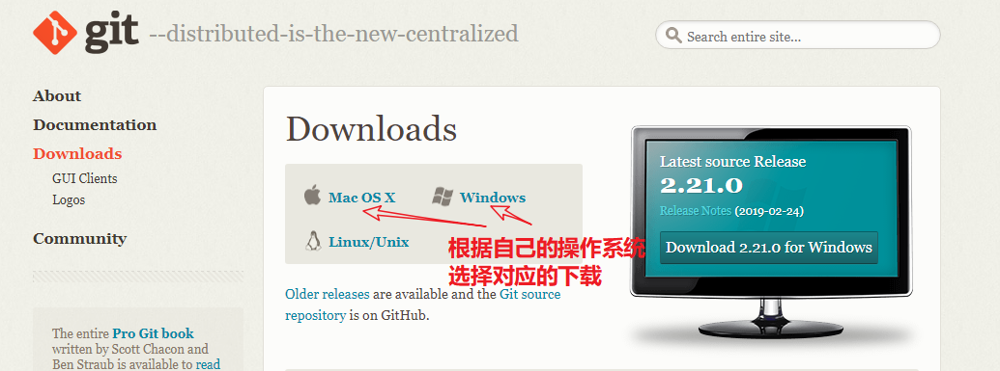

* 下载完成就会得到一个安装文件,直接双击安装，无脑下一步安装即可。

## 配置

* 配置个人信息：**用于追责用**；在任务位置右键，选择 `Git Bash Here`

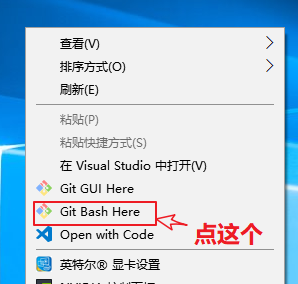

* 出现一个黑色的窗口，在窗口内输入：

```cmd
git config --global user.email "你自己的邮箱"
git config --global user.name "你自己的名字"
```

* 查看配置：

```
git config --list
```

## 使用

* 其实，使用邮件这个黑色窗口使用命令行管理自己的代码是可以的，我们以后会学习，目前我们还是学习界面化操作；

* 在vscode中，我们可以找到这个图标

* 点击这个图标，就可以进行源代码管理，需要选择个我们要管理代码的目录初始化：

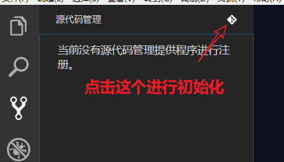

* 初始化之后，会在当前要管理的文件夹下面有.git文件夹；之后当你的代码发生变量，都会在里面有提示；这个文件就是用于管理我们多个版本的文件夹；

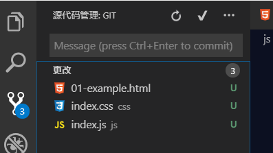

* 此时如果我们想保存一下当前这个版本的代码

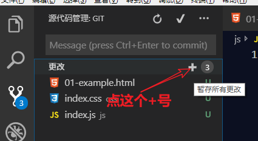

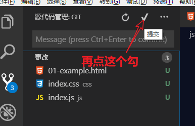

* 必须输入备注信息，标识该次提交的简单的备注；

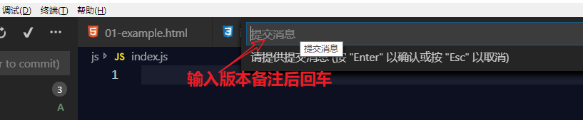

## 查看

* 上面只是对每次的修改做一次提交，每次提交就算是一个版本；
* VSC下载**gitLens插件**查看每次提交的版本记录

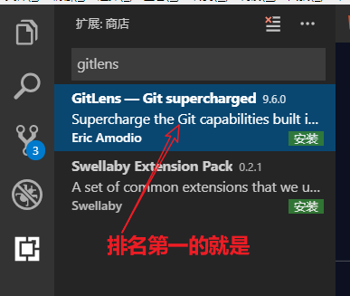

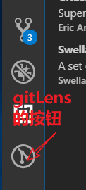

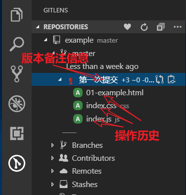

* 多次提交版本，只能看到与上次版本的对比，如果当前最新版本有问题，我们删除了当前版本的部分代码即可；

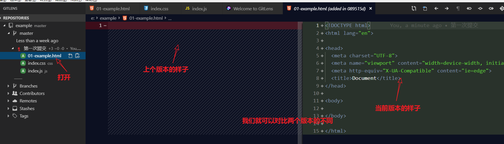


# 函数

## 介绍

* 函数：我们**把一段相对独立的具有特定功能的代码块封装起来**，形成一个**独立实体**，起个名字（函数名），在后续开发中可以**随时反复调用**。
* 作用：**封装（包起来）一段代码，将来可以随时拿来使用。**
* **封装：功能要单一；**

## 语法

```js
// function 关键字 用于声明函数
// tellStroy 函数名
function tellStroy(){
  // 里面叫函数体：我们封装，我们想随时随地拿来使用的东西；
  console.log("从前有座山，山里有座庙");
  console.log("庙里有个在给小和尚讲故事");
  console.log("讲的是什么呢？");
  console.log("老和尚对小和尚说：");
}
```

* 调用：声明的函数，知识一段代码被包起来；需要被调用，才能执行当前的函数；

```js
tellStroy(); //此时在控制台中就会输出一个故事

// 如果想输出多次，就可以调用多次这个函数
tellStroy(); 
tellStroy(); 
tellStroy(); 
```

* 起名字重名，会覆盖；和变量一样；

## 参数

### 配置参数

* 参数：对于函数来说，函数 内部的变量；
* 为什么？给别人讲故事，得不同的情况套用不同的人名把；
* 参数：形式上的参数，为什么叫形式上的参数，它就是代替位置，相当于是变量在这占了个坑；至于这个参数真实背后代表什么值，我们现在还不知道；
* 语法：

```javascript
// 在小括号内的变量，对于函数来说，就是参数；
// 参数就是函数 内部的变量；
function 函数名(参数){
  // 函数体
}

function tellStroy(name){
  console.log("从前有座山，山里有座庙");
  console.log("庙里有个老和尚在给小和尚讲故事");
  console.log("讲的是什么呢？");
  console.log("老和尚对"+ name +"说：");
}
```

* 既然是**变量**，可以被改变存储值；如何改变？调用时传递一个值；

```javascript
// 调用函数的时候，传入参数；
tellStroy('清风');
tellStroy('明月');
```

### 参数不赋值

* 变量：函数内部的变量，没有赋值，默认为undefined；和我们的变量一模一样；

* 解决：对参数进行判断，如果是undefined，给一个默认值；

```js
function tellStroy(name){
  // if 条件语句
  if(name==undefined) {
      name = '小和尚'
  }else {
      name = name;
  }
  // 三元表达式；
  name = name?name:"小和尚"；
  console.log("老和尚对"+ name +"说：");
}
```

### 形参与实参（重要，之前不太明白）

* 参数：
  * 可以是一个，也可是多个；
  * 函数内部的变量
* 名称：
  - 在定义函数时写的**占位**用的参数，我们称为**形参**（**形式上的参数**）；
  - 在调用函数，**实际参与函数执行的真实的参数**，我们称为**实参**（**实际上的参数**）；

### 相互不影响（重要，之前不太明白）

```js
var a = 10;
var b = 20;

function fn(x,y){
  x = x + y;
  console.log(x,y);
}

// 传入实参a b，相当于是变量a的值，赋值给了函数内部变量x，
// x再以后的运算和a没有任何关系；
// 输出 30，20
fnm(a,b); 

// 输出 10,20 a的值并没有受到x的变化影响
console.log(a,b);
```

* 想要：函数内部打印这个值，不是输出这个和，想得到这个和，该怎么呢？
* **函数的返回值**：什么是函数的返回值？函数执行完毕，会得到一个结果，这个结果就是函数的返回值；

## 返回值 (重点)

```javascript
// 默认情况下，函数的返回值是undefined，如果想改变这个返回值，需要使用`return`关键字；
var result = getSUm(20,30);
console.log(result);// 输出undefined
```

### 修改返回值

* **`return`作用1**：修改函数的返回值，若后面有值，则返回，若没有值；默认还是undefined；

```javascript
function getSum(a,b){
  var sum = a + b;
  return sum;
}
```

### 终止函数执行

* **`return`作用2**：终止函数的执行；

* 求n-m之间所有数的和

```js
  function getSum(n，m) {
    var sum = 0;
    for (var i = n; i <= m; i++) {
      sum += i;
    }
    return sum;
  }

// 经验：以后大家会经常看别人写的函数，用法；
/**
 * 函数的作用 - 求n-m之间的整数和
 * @param {type:number} n 较小值
 * @param {type:number} m 较大值
 * @returns {type:number} 整数和
 */
```

## arguments （重点   必须会）

* arguments：获取所有实参的对象，**内部的变量（不是我们声明的，也不需要我们声明）**

```javascript
function fn(){
  console.log(arguments);
}
fn(1); // 输出 [1]
fn(1,2) // 输出 [1,2]
fn(1,2,3,4,5) // 输出 [1,2,3,4,5]
```

* arguments 这个东西看起来**样子像数组**，但是其实不是一个数组，我们管它叫 `伪数组`。它具有数组的长度和顺序等特征。
* arguments 伪数组也可以**循环遍历**；
* 场景：**当我们不知道我们的参数个数的时候；**

## 函数表达式

* js中声明函数的方式不只有一种，还有一各叫`函数表达式`；
* 声明变量，赋值为函数；

```javascript
var 函数名 = function(参数){
 	//函数体
}

var getSum = function(a,b){
  return a + b;
}
getSum(10,20);
```

## 匿名函数

* 匿名函数就是没有名字的函数，但是在js的语法中，是不允许匿名函数单独存在的，要配合其它语法使用：
  
  如：

```javascript
function (参数){
  函数体
}

var fn = function(a,b){
  return a + b;
}
```

* 自调用函数：匿名函数的另外一种使用方法；

```js
// 定义之后，立刻调用，输出10
(function(){  
  console.log(10);  
})();
```

## 函数类型

```javascript
function fn(){}
console.log(typeof fn); // 输出 字符串的  function
```

* **在js中，只要是一种数据类型的，都可以作为函数的参数**，

```javascript
function f1(a,b){
  return a + b;
}
f1(10,20); // 数字作为参数
f1('abc','def') // 字符串作为参数
```

## 回调函数   （重中之重   之前不理解）   就是把函数当做形参传入另一个函数    作为那个函数的一个参数

* 函数也是数据类型，也可以作为别的函数的参数

```javascript
// fn 只不过在函数内部是一个形参，内部变量；
function f1(a,fn){
  console.log(a);
  // 函数的调用，在函数名的后面加括号；
  // 这样，把函数作为实参传入，传入的函数对外面的函数叫回调函数；
  fn(); 
}

function f2(){
  console.log('f2函数执行了');
}
f1(10,f2);// 输出 10 和 'f2函数执行了'
```

* 像这种作为函数的参数，并在之内调用的函数，我们称为 `回调函数`；

# 作用域

* 作用域：作用范围，能生效的范围；
* 为什么要学作用域？**目前，我们要分清楚自己的声明的变量在哪个作用域下，也就是生效的范围是多大；配合下面预解析的知识，经常是面试比较常问的基础题**
* 全局作用域：能在页面的任何位置都可以访问
* 全局变量：在全局作用哉下声明的变量；
* 局部作用域：只能在函数内访问；
* 局部变量：在局部作用域下声明的变量

```javascript
var a = 10;
function f1(){
  console.log(a);
}
f1();// 变量a在函数外定义，可以在函数内使用


function f2(){
  var b = 20;
}
// 变量b在函数内定义，在函数外无法访问，报错： b is not defined
console.log(b); 
```


# 预解析

* 作用域内：你声明的变量在**任何地方**都可以访问；是**任何地方**；
* 预解析：提前、解析（分析）
  * 会把**初始化的声明的变量、函数**，全部提升到**当前作用域**的最顶端；
  * 变量：已经声明；函数：已经声明；
  * 而变量的赋值和函数的调用还在原来的位置。
* **找到当前作用域的顶端，提升上去**

```javascript
fn();// 正常执行
function f1(){
  console.log(1);
}
fn(); // 正常执行


f2();// 报错 ： f2 is not a function
var f2 = function(){
  console.log(2);
}
// function 关键字定义的函数，可以在定义之前使用，函数表达式的不行
```

* 上面的代码预解析后：

```javascript
function f1(){
  console.log(1);
}
var f2;


fn();
fn();


f2();
f2 = function(){
  console.log(2);
}
```

* 所以在调用f1的时候，其实函数已经声明好了，但是在调用f2的时候，f2还是undefined，就会报错

* 面试基础题：

```javascript
// 观察下面的代码，说出执行结果
var num = 10;
fun();

function fun() {
  console.log(num);
  var num = 20;
}
```

# 函数

## 返回值

- 需求： 使用函数的方式求两个数字的和

- 提炼函数：这个过程中，a和b是两个随时要变化的数据，所以我们把它们作为两个参数；

- 想要：函数内部打印这个值，不是输出这个和，想得到这个和，该怎么呢？

- **函数的返回值**：函数执行完毕，会得到一个结果，这个结果就是函数的返回值；

### 修改返回值

- **`return`作用1**：修改函数的返回值，若后面有值，则返回，若没有值；默认还是undefined；

### 终止函数执行

- **`return`作用2**：终止函数的执行；

```javascript
function fn(){
  console.log(1);
  console.log(2);
  return;
  console.log(3);
  console.log(4);
}
fn(); // 只输出了1和2，3和4没有执行，return 终止了函数的执行，即： return 后面的代码不会执行
```

## 案例

### 求1-n之间所有数的和，写函数

- 实际：1-10和;
- 抽象：把某些地方变为参数；

- 步骤：
  1. 写出要实现的过程
  2. 分析过程中哪些是会变化的，哪些是不会变化的
  3. 把变化的作为参数，不变的作为函数体
  4. 按照函数的语法把代码写来
  5. 考虑是否需要修改函数的返回值
- 求n-m之间所有数的和

// 经验：以后大家会经常看别人写的函数，用法；
/**
 * 函数的作用 - 求n-m之间的整数和
 * @param {type:number} n 较小值
 * @param {type:number} m 较大值
 * @returns {type:number} 整数和
 */
```

## arguments

- 案例：求三个数的和返回

- 目标：无论输入多少个参数，都可以参加运算；

- arguments：获取所有实参的对象，**函数内部的变量（不是我们声明的，也不需要我们声明）**

- arguments 这个东西看起来**样子像数组**，但是其实不是一个数组，我们管它叫 `伪数组`。它具有数组的长度和顺序等特征。本质为对象，

- arguments 伪数组可以**循环遍历**

- 应用场景：**当我们不知道我们的参数个数的时候；**

## 函数表达式

- js中声明函数的方式不只有一种，还有一种方式叫`函数表达式`；
- 声明变量，赋值为函数；

## 匿名函数

- 匿名函数：没有名字的函数，但是在js的语法中，是不允许匿名函数单独存在的，要配合其它语法使用

## 函数类型

- **在js中，只要是一种数据类型，都可以作为函数的参数**，

## 回调函数

- 函数也是数据类型，也可以作为别的函数的参数

​```javascript
// fn 只不过在函数内部是一个形参，内部变量；
function f1(a,fn){
  console.log(a);
  // 函数的调用，在函数名的后面加括号；
  // 内部的函数对外面的函数叫回调函数；
  fn(); 
}

function f2(){
  console.log('f2函数执行了');
}
f1(10,f2);// 输出 10 和 'f2函数执行了'
```

- 像这种作为函数的参数，并在之内调用的函数，我们称为 `回调函数`；

# 作用域

- 作用域：var 变量  function fn(){} 作用范围，能生效的范围；
- 为什么要学作用域？**目前，我们要分清楚自己的声明的变量在哪个作用域下，也就是生效的范围是多大；配合下面预解析的知识，经常是面试比较常问的基础题**；
- 全局：
  - 全局作用域：能在页面的任何位置都可以访问
  - 全局变量：在全局作用域下声明的变量；
- 局部：
  - 局部作用域：只能在局部的作用域范围进行访问；
  - 局部变量：在局部作用域下声明的变量；

# 预解析

- 在声明变量的作用域范围内，你声明的变量在**任何地方**都可以访问。是**任何地方**；
- 预解析：提前、解析（分析）会把**初始化的声明的变量、函数**，全部提升到**当前作用域**的最顶端；
- 也叫变量提升：从概念的字面意义上说，“变量提升”意味着**变量和函数的声明**会在物理层面移动到代码的最前面，但这么说并不准确。实际上变量和函数声明在代码里的位置是不会动的，而是在编译阶段被放入内存中。
  - 变量：已经声明；函数：已经声明；
  - 而变量的赋值和函数的调用还在原来的位置；
- **找到当前作用域的顶端，提升上去**


# 对象

## 介绍

* 核心概念：**万物皆对象**，我们在编程中，使用对象来描述万事万物。
* 对象：使用`属性`描述事物的`特征`，使用`方法`来描述`功能`， 就是对象这种语法。
* 对象**：属性和方法的集合体**；
* 数组：有先后属性，有长度的数据集合；
* 对象描述扳手：
  - 属性(特征)：名称 金属、银白色
  - 方法：能拧螺丝、防身等；

## 语法

### 创建

* 构造函数：

```javascript
var obj = new Object(); // 这是一个没有属性和方法的对象
console.log(obj);
```

* 字面量：从字面上能看出数据的类型；

```javascript
var obj = {}; // 这也是一个没有属性和方法对象，其本质和构造函数创建的对象是一样的
console.log(obj,typeof obj);
```

### 添加

* 如： 使用对象描述一个叫`狗蛋`的人，先字面量声明一个对象，再给对象上属性和方法赋值；

```javascript
var obj = {};

// 对象.属性 = 值;
obj.name = '狗蛋';// 名字是一个人的特征

// 在对象上的任何方法内都可以获取，和设置；

// 对象.方法名 = function(){}
// 注意：该方法后面的的赋值为一个函数，函数在什么时候执行？调用的时候才会执行；
obj.sayName = function(){  // 人会说出自己的名字，也就是人有自己的行为
	console.log('你好，我叫' + obj.name);
}
```

* 通过字面量初始化对象时，初始化属性

```js
// 描述一个学生
var student = {
  name : '狗蛋',
  age : 12,
  gender : '男',
  sayName : function(){
    console.log(student.name);
  }
}
// 

```

* 一个属性和一个值叫**键值对**。多个键值对之间使用逗号分隔，键的方式添加属性：

```js
// 对象[属性名]  属性名必须是String类型，里面可以写字符串；
var obj = {};
obj['name'] = '狗蛋';
obj['sayName'] = function(){
  console.log('你好，我叫' + obj['name']);
}
```

### 获取

* 点属性获取

```javascript
// 得到对象的名字,属性可以当成变量使用
console.log(obj.name);
// 调用对象的方法，方法的本质是函数
obj.sayName();
```

* 以键的方式访问属性

```js
console.log(obj['name']);
obj['sayName']();
```

### 遍历

* 数组可以遍历；对象也可以遍历；

```javascript
// key 就是obj这个对象中的每个键，obj就是要遍历的对象。
for(var key in obj){
}

var obj = {
  name : '狗蛋',
  age : 12,
  gender : '男'
};
for(var key in obj){
  console.log(key);
  // 只能通过键的方式获取值
  console.log(obj[key]);
}
```

# 简单类型和复杂类型

## 简单类型的储存

* 简单类型

* **简单类型数据存储在内存的栈空间中，复杂类型的数据存储在内存的堆空间中**

* 把一个变量赋值给另一个变量的时候，其实是**把栈空间的数据(格子内的值复制了)复制了一份**

* 当另一个数据发生变化，会根据变量找到对应的**栈内存**上盒子的内容，进行修改；
* **此时，简单类型的的变量赋值给另一个变量，当另一个变量改变了，不会影响原来的变量；**

## 复杂类型的储存

* **复杂类型在内存的储存，赋值给其他变量，也是把格子内的内容复制了一份，**
* **格子里是地址；相当于两个对象内容存的是同一份地址；**

* 当另一个变量发生变化时，**修改的是同一个堆内存地址上的数据，所以obj1和obj2修改的其实是同一个对象**

# 内置对象

* 对象：属性和方法的集合体；**我们关注如何使用就可以；**
* 内置：JS语法给我封装好了一些对象，里面提供了很多常用、实用的属性和方法；

## Math

* Math.random()；这个方法的作用是生成一个 [0,1) 之间的随机浮点数

* Math.floor(x)   把一个浮点数进行向下取整

* Math.round(x)  把一个浮点数进行四舍五入取整

* Math.ceil(x)  把一个浮点数进行向上取整

* Math.abs(x)  求一个数的绝对值 正数

* Math.max(x,y...)  求多个数字中的最大值，同理 Math.min(x,y...);

## Date 

* 语法：

```js
var date = new Date(); // 得到的是当前时间的日期对象
```

```js
// new Date(); // 得到的是当前时间的日期对象
// var date = new Date();
// console.log(date);

// console.log(date.getDate());//获取日
// console.log(date.getDay());//获取星期几
// console.log(date.getFullYear());//获取年
// console.log(date.getHours());//获取小时
// console.log(date.getMonth());//获取月
// console.log(date.getSeconds());//获取秒
// console.log(date.getMinutes());//获取分钟
// console.log(date.getMilliseconds());//获取毫秒

// 创建一个指定日期的对象
// 给一个日期格式字符串
// var date=new Date('2019-01-01 19:20:56');
// console.log(date);

// // 分别传入年月日时分秒。注意传入的月份是从0开始算的
// var date = new Date(2019,0,1,12,33,12);
// console.log(date);

// 获取从1970年1月1日到现在的总毫秒数，常说的时间戳
var date = new Date();
console.log(date.valueOf());
console.log(date.getTime());
console.log(1*date);
console.log(Date.now());
```

## Array

### 对元素操作

* push 从数组后面推入一个元素或多个元素

* pop 删除数组最后一个元素

* unshift 从数组前面添加一个或多个元素

* shift 用于将数组的第一个元素移除

* splice：可进行数组**任何位置**的增删改

### 与字符串互转

* join 用于将数组中的多元素以指定分隔符连接成一个字符串

* split 字符串的方法：转数字，后面为分隔的字符

### 查找元素

* indexOf：根据元素查找索引，如果这个元素在数组中，返回索引，否则返回-1，找元素在不在数组内部

* findIndex方法用于查找满足条件的第一个元素的索引，如果没有，则返回-1

### 遍历数组

* for循环：JS基础语法；
* forEach：遍历数组；

```js
// 数组的 forEach 方法用于遍历数组
var arr_1 = [10,20,30,40,50];

// forEach方法需要一个参数是一个函数，这个函数也接收3个参数，
// item是数组中的每个元素，index是item的索引,arr表示当前数组；
// 对本数组操作，没有返回值；
arr_1.forEach(function(item,index,arr){
  console.log(item,index);
});
```
* filter 筛选出数组中满足条件的数组，**返回是一个新的数组；**

	* fitler方法的的参数要求是一个函数，这个函数接收2个参数：item是数组中的每个元素，index是item对应的索引,arr代表当前的数组
	
### 拼接与截取

* concat  拼接数组，**不改变原数组，创建新数组返回**

* slice 截取数组：**不对原数组操作，返回的是新的数组；**

### 复制

```js
var arr = [10,20,30,40,50];

// 直接给，可以么？
var new_arr = arr;

var new_arr = [];
arr.forEach(function(item,index,arr){
  new_arr.push(item)
});

// 过滤
var new_arr = arr.filter(function(item,index,arr){
  return item;
});

var new_arr = arr.concat();
var new_arr = arr.slice();
```

## String

### 不可变

* 旧的字符串赋值在一个变量上，给变量重新赋值新的字符串（完全新的字符串，或者拼接后字符串），旧的字符串不是被覆盖；**在内存的游离状态；**
* **所以尽量避免大量使用字符串的拼接；这个算性能优化的一点；**

### 查找

* indexOf  字符串中是否存在指定字符 存在就返回找到的下标，没有就-1；

```
// 这个方法用于查找某个字符串是否包含于另一个字符串
var str = '我爱中华人民共和国';
console.log(str.indexOf('中华'));
```

* lastIndexOf  用法和indexOf一样，只不过是从后面开始找，不常用；
* charAt：

```js
// 这个方法用于获取字符串中位于指定位置的字符
var str = '我爱中华人民共和国';
console.log(str.charAt(2));
```

* charCodeAt

```js
// 这个方法用于获取字符串中位于指定位置的字符的ASCII码
var str = 'abcdef'
console.log(str.charCodeAt(0));
```

### 转为数组

* split 字符串转数组，后面的分隔的字符

```javascript
// 这个方法用于将一个字符串以指定的符号分割成数组
var str = '刘备|关羽|张飞';
var arr = str.split('|');
console.log(arr);
```

* 案例：解析地址`b.com?id=1&name=2`中的参数；

### 拼接与截取

* +

* concat 拼接

* substring 截取字符串，不操作原字符串；返回截取出来的字符串；

* slice

```js
// 这个方法用于获取字符串中的部分字符
var str = '我爱中华人民共和国';
var res = str.slice(2,4);// 从索引2开始，到索引4结束，得到之间的字符，不包含索引4的字符
console.log(res);

// 看起来和substring 没有啥区别，
// slice()可以设置参数为负数，slice()方法在遇到负的参数的时候，会将这个负值与字符串的长度相加。
console.log(str.slice(-6,7));
console.log(str.slice(2,-5));
console.log(str.slice(-9,-7));
```

* substr

```javascript
// 这个方法用于获取字符串中的部分字符
var str = '我爱中华人民共和国';
var res = str.substr(2,2);// 索引2开始，总共获取2个字符，第二个参数为个数
```


## 本来想重新整理一遍的   奈何时间不允许

## js是什么样的一门语言
  * 运行在浏览器端的脚本 编程 语言
  * 是一门解释性语言    没有预编译    浏览器读一行代码执行一行代码   是弱类型语言
  * 可以使用TypeScript使JavaScript变为伪强类型语言
  * 在ECMAScript2015（即ES6）后，JavaScript更加类似于后端语言
  * 添加了模板字符串 解构赋值 代理 let  const class等等供能强大的东西（很多东西还不怎么会，需要多看多 练）
  * 可以配合Node.js写所有后端能写的东西
  * ...
## js的作用：
  + 与HTML   CSS共同构建成网页
    + HTML为页面的架构
    + CSS  是页面的样式（皮肤）
    + JavaScript  是页面的交互  行为
  + 有了js 才有了网页与用户的交互   没有js  网页就是死的 只能观看  不能操作
## js的引入方式
  + 内嵌式
  + 行内式
  + 外联式
## 注释：
  + 行内  //
  + 多行/**/
## 与用户的交互   输入输出  p'rompt（） 弹出对话框  用户可以进行输入内容操作    后期不用
## 输出语法
  + log()控制台日志
  + write()页面展示
  + err()错误日志
  + alert()对话框弹出
  + dir......
## 变量（重点：必会）
  + 作用：用于储存一个数据  方便使用
    + 对应的是常量      也叫字面量    就是一直不变的两
  + 语法：
    + ES5中使用var定义变量
    + ES6新增const、let来存储变量   
      + 区别：是块级变量   const声明必须负值  不可变（定义常量）    let定义变量
      + 具有暂时性死区的特性  每次使用不会受其他因素影响等等
## 命名规则
    + 范围:

