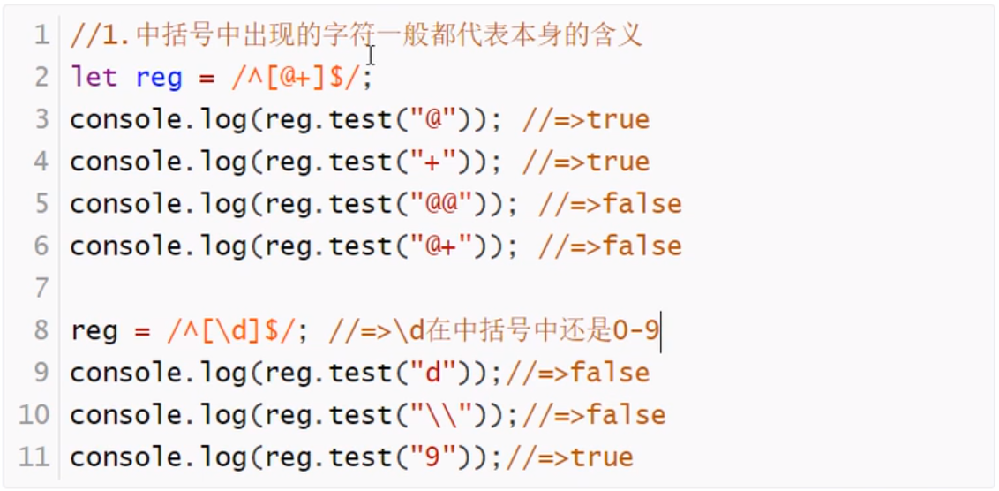

# JavaScript正则表达式

## 正则表达式

+ regular  expression : RegExp   正则表达式    
  + 作用：
    + 用来处理字符串的规则 
    + 只能处理字符串、
    + 他是一个规则   可以验证字符串是否符合某个规则(test方法)，也可以把字符串中符合规则的内容捕获到(exec/match方法)


## **编写正则表达式**

### 创建方式有两种

  ```js
  //字面量的方式创建  (两个//之间包起来的都是用来描述正则规则的元字符)
  let reg=/\d+/;
  
  //实例的方式  构造函数创建   两个参数： 一个是元字符字符串    修饰符字符串
  let reg1=new RegExp('\\d+');
  ```

### 正则表达式由两部分组成

  > 元字符
  >
  > 修饰符
  >
  > ```js
  > /* 1. 常用的元字符*/
  > 
  > // ==>  1.量词元字符  设置出现的次数
  >  //  1. *  0到多次
  >  //  2. +  1到多次
  >  //  3. ？  0次 || 一次
  >  //  4. {n} 出现n次  n为大于0的正整数
  >  //  5. {n,m} 出现 n 到 m 次
  > 
  > /* 2.特殊元字符 ： 单个或者组合在一起代表特殊的含义*/
  > // 1. \   转义字符（普通字符->特殊->普通）
  > // 2. .   除\n（换行符）以外的任意字符
  > // 3. ^   以哪一个元字符作为开始（^看瑞特符号）
  > // 4. $   以哪一个元字符作为结束
  > // 5. \n  换行符
  > // 6. \d  0~9之间的一个数字
  > // 7. \D  非0~9之间的一个数字
  > // 8. \w  数字、字母、下划线 中的任意一个字符
  > // 9. \s  一个空白字符  （包含空格  制表符  换页符等）
  > // 10.\t  一个制表符  （一个TAB键：4个空格）
  > // 11.\b  匹配一个单词的边界
  > // 12.x|y x或者y中的一个字符
  > // 13.[xyz] x或者y或者z中的一个字符
  > // 14.[^xy] 除了x、y以外的字符
  > // 15.[a-z] 指定a到z这个范围中的任意字符   [0-9a-zA-Z_] === \w
  > // 16.[^a-z] 15/条的取反
  > // 17.()  正则中的分组
  > // 18.(?:) 只匹配不捕获
  > // 19.(?=) 正向预查
  > // 20.(?!) 负向预查
  > 
  > /* 3.普通元字符 ： 代表本身含义的 */
  > //  /zhnegze/  此正则匹配的就是 'zhengze'
  > ```
  >
  > 修饰符
  >
  > ```js
  > /* 正则表达式常用的修饰符：i m g */
  > //  1.   i    ignoreCase (一个闹尅死)   忽略单词大小写匹配
  > //  2.   m    multiline（莫体力）    忽略换行匹配   能够多行匹配
  > //  3.   g    global (阁楼布偶)    全局匹配
  > 
  > // /A/.test('lalala');  ===>false
  > // /A/i.test('lalala');  ===>true
  > ```

  ## **元字符详细解析**

  ### `^ 开头 $ 结尾`

    ```js
    let reg = /^\d/ ;  //任意数字开头
    reg.test('hahaha');   //===>false
    reg.test('lalala123');   //===>false
    reg.test('20191101hah'); //===>true
    ```

    ```js
    let reg = /\d$/ ;    //任意数字结尾
    reg.test('hahaha');   //===>false
    reg.test('lalala123');   //===>true
    reg.test('20191101hah'); //===>false
    ```

    ```js
    //两个都不加 : 字符串中包含符合规则的就可以
    let reg = /\d+/ ;  //包含数字就可以
    reg.test('hahaha');   //===>false
    reg.test('lalala123');   //===>true
    reg.test('20191101hah'); //===>true
    
    //两个都加 : 字符串只能和规则一致
    let reg1 = /^\d+$/; //之能是以数字开头  数字结尾 的数字
    
    //验证手机号码
    let reg2 = /^1\d{10}$/;//只能以1开头 以数字结尾  中间是0~9之间的数   出现10次
    ```

  

  ### `\`

    ```js
    //把特殊符号转换为  普通  符号
    ```

    

  ### `x|y`

    ```js
    let reg1 = /^18|19$/;
    reg.test('18');  //===>true
    reg.test('19');	 //===>true
    reg.test('189'); //===>true
    reg.test('119'); //===>true
    reg.test('81'); //===>false
    reg.test('819'); //===>true
    //-------------直接使用会存在很乱的优先级问题  一般写的时候一般都伴随着（）  因为小括号会改变处理的优先级  --> 小括号： 分组
    let reg1 = /^18|19$/;
    reg.test('18');  //===>true
    reg.test('19');	 //===>true
    reg.test('189'); //===>false
    ```

  ### `[]`

    ```js
    //1.中括号中出现的字符一般都代表本身的含义
    //2.中括号中不存在多位数
    ```

    


## **常用的正则表达式**

> 1.  常用的有效数字
>
>    ```js
>    有效数字: 0   1  12   0.2  -1   -12.3
>    		/*
>    		 * 规则分析
>    		 * 		1.可能出现 -  + 号
>    		 *		2.一位0~9都可以，多位首位不能是0
>    		 *		3.小数部分可有可无，有的话必须有小数点和数字
>    		 */
>    let reg = /^[+-]?(\d|([1-9]\d+))(\.\d+)?$/;
>    ```
>
> 2. 验证密码
>
>    ```js
>    // 字母、数字、下划线
>    // 长度 ： 6~16位
>    let reg = /^\w{6,16}$/;  
>    reg.test(val)//返回true代表符合规则    false不符合规则
>    ```
>
> 3. 验证真实姓名
>
>    ```js
>    /*
>     *  1.汉字 /^[\u4E00-\u9FA5]$/
>     *	2.名字长度 2~10
>     *	3.可能有译名 XX·XXX  '尼古·哈哈'
>     *	4.可能有少数民族名字 2~10
>     */
>    let reg = /^[\u4E00-\u9FA5]{2,10}(·[\u4E00-\u9FA5]{2,10}){0,2}$/;
>    ```
>
> 4. 验证邮箱
>
>    ```js
>    
>    /*
>     * 1.@符号前 \w+((-\w+)|(\.\w+))*
>     *		1.1.以数字  字母  下划线 开头  1到多位
>     *		1.2.还可以是 - 数字 字母 下划线 或者 .数字 字母 下划线 整体出现 0 到 多次
>     *			邮箱名：由 数字 字母 下划线 . - 组成  切必须以 数字 开头  -/. 不能连续出现
>     * 2.[A-Za-z0-9]+   @xxx.com
>     *		2.1.@后紧跟着 数字 字母 1到多位
>     * 3.((\.|-)[A-Za-z0-9]+)*   xxx@xxx.[com].cn  匹配com 对@后面名字的补充
>     *		3.1.
>     * 4.\.[A-Za-z0-9]+    .cn   .com ...
>     */
>    let reg = /^\w+((-\w+)|(\.\w+))*@[A-Za-z0-9]+((\.|-)[A-Za-z0-9]+)*\.[A-Za-z0-9]+$/;
>    ```
>
> 5. 身份证号码
>
>    ```js
>    /*
>     * 1.一共18位
>     * 2.最后一位可能是X   X代表的是10
>     *   身份证前六位意义： 省 市 县
>     *   中间八位意义：   年 月 日
>     *   最后四位意义： 	最后一位 X或者数字  
>     *					倒数第二位： 偶数是  女  基数是  男
>     *					其余位数是经过算法算出来的
>     */
>    //let reg = /^\d{17}(\d|X)$/;不用
>    //小括号作用   ： 1. 分组捕获   不仅可以把大正则匹配的信息捕获到，还可以单独捕获到每个小分组的内容   2.改变优先级
>    let reg = /^(\d{6})(\d{4})(\d{2})(\d{2})(\d{2})(\d)(\d|X)$/;
>    reg.exec('4114121198902034432')  //捕获结果是一个数组
>    ```
>
>    

## **正则表达式捕获的懒惰性**

> 实现正则捕获的方法       懒惰性的解决办法
>
### 正则RegExp.prototype上的方法

#### exec

>     ```js
>     /*
>      *  基于exec实现正则的捕获
>      *		1. 捕获到的结果是null / 一个数组    第一项捕获到的是内容   其余项  对应小分组本次单独捕获到的内容    index项 当前捕获到的 在原字符串的起始索引   input项   原始字符串
>      *		2.每执行一次 exec只能捕获到一个符合正则规则的   默认情况下 即使多次捕获 捕获的结果永远是第一个    即=>正则的懒惰性    默认只捕获一个
>      *		    
>      *	lastIndex代表当前正则下一次匹配的起始索引位置 console.log(reg.lastIndex);  ===0   
>      *	正则懒惰性的原因就是因为lastIndex默认情况下是不会被修改/改变的   每次都是从起始位置开始查找    lastIndex不能手动修改不行   只能使用全局修饰符  g  /\d+/g  匹配后lastIndex值会自动改变		
>      */
>     ```
>
>     ```js
>     //需求：编写一个方法execAll()，执行一次可以把所有匹配的结果捕获到（前提：正则一定要设置全局修饰符  g）
>     
>     function(){
>         function execAll(str){
>             // str ： 是要匹配的字符串
>             // this ：RegExp的实例（当前操作的正则）
>             // 首先验证传进来的正则是否设置了全局修饰符 g 如果没有 则不进行捕获 
>             if(!this.global) return this.exec(str);
>             // arr : 存储最后所有捕获的信息
>             // res ：存储每次捕获的内容 
>             let arr = [];
>             let res = this.exec(str);
>             while(res){
>                 //把每次捕获的数组的第一项内容放到数组arr中
>                 arr.push(res[0]);
>                 //只要捕获的内容部位null 则继续捕获
>                 res = this.exec(str);
>             }
>             return arr === 0 ？ null : arr;
>         }
>         RegExp.prototype.execAll=execAll;
>     }();
>     let reg = /\d+/g;
>     console.log(reg.execAll(str));
>     ```
>
>     
>
### test

### 字符串String.prototype上支持正则表达式处理的方法

#### replace

#### match
>
>     ```js
>     // 字符串.match(正则);    返回所有匹配的数   以数组的形式返回   即  返回 所有符合正则的 项 的数组  如果一项都没有匹配  则返回null
>     // match 可以在执行一次的情况下  捕获到所有匹配的数据  ( 前提 ：正则需要加全局修饰符 g )
>     
>     // 上面那些代码 就是 match 实现原理
>     ```
>
>     
>
#### splite
>
#### ......
>
> ```js
> //实现正则匹配的前提是：当前正则要和字符串匹配   如果不匹配   （exec）捕获的是null
> ```
>
> 

## 正则的分组捕获

```js
/*
 * ?: =>只匹配不捕获    如果设置了分组   又不想捕获到  就需要加 `？:` 来处理
 */
let reg=/^(\d{6})(\d{4})(\d{2})(\d{2})\d{2}(\d)(？:\d|X)$/;
let str='411411199801224422';
console.log(str.match(reg)); 
//返回发结果 ：["411411199801224422", "411411", "1998", "01", "22", "2",  index: 0, input: "411411199801224422", groups: undefined]
```

```js
/* 
 * ===> 获取自己想要的数据
 * 多次匹配时   只能捕获到大正则匹配到的数据   小分组的信息拿不到
 * 解决方案
 */
let str = '{1993}年{03}月{23}日';
let reg = /\{(\d+)\}/g;
let aryBig = [];
let arySmall = [];
let res=reg.exec(str);
while(res){
    let [big,small] = res;
    aryBig.push(big);
    arySmall.push(small);
    res=res.exec(str);
}
console.log(aryBig,arySmall);
// 执行结果为 ：aryBig==>['{1993}','{03}','{23}']    arySmall==>['1993','03','23']
```

### 分组的第三个作用  :  分组引用

  ```js
  // 分组的第三个作用  :  分组引用
  let str = 'book';  //'good'  'look'   'moon'   'foot' ......
  let reg = /^[a-zA-Z]([a-zA-Z])\1[a-zA-Z]$/; //分组引用 ： 就是通过 '\数字' 让其代表和对应分组出现一模一样的内容
  console.log(reg.test('book'));//==>true
  console.log(reg.test('deep'));//==>true
  console.log(reg.test('some'));//==>false
  ```

  

## 正则捕获的贪婪性

```js
/*
 * =>正则捕获的贪婪性 ：默认情况下  正则捕获的时候 是按照当前正则所匹配的最长结果来获取的
 *   
 */
let str = '啦啦啦2019&&加油2020';
let reg = /\d+/g;
console.log(str.match(reg));//===>["2019", "2020"]

//----解决办法 ： ==>在量词元字符后面加上一个 `？` 表示取消正则的贪婪性(按照正则匹配的最短结果来获取)----
let str = '啦啦啦2019&&加油2020';
let reg = /\d+?/g;
console.log(str.match(reg));//["2", "0", "1", "9", "2", "0", "2", "0"]
```

+ ？在正则中的   五大作用

  > 1. ?左边是非量词元字符 ：本身代表量词元字符  出现0到1次
  > 2. ?左边是量词 元字符 ： 取消捕获时候的贪婪性
  > 3. (?:) : 值匹配不捕获
  > 4. (?=) : 正向预查
  > 5. (?!) : 负向预查

## 其他正则捕获的方法

1. test也能捕获 (本意是匹配)     **一般不用   了解就好**  

   ```js
   let str = '{2019}年{11}月{2日}'；
   let reg = /\{(\d+)\}/g;
   console.log(reg.test(str));//==>true
   console.log(RegExp.$1);//==>2019
   
   console.log(reg.test(str));//==>true
   console.log(RegExp.$1);//==>11
   
   console.log(reg.test(str));//==>true
   console.log(RegExp.$1);//==>2
   
   console.log(reg.test(str));//==>false
   console.log(RegExp.$1);//==>'2' 存储的是上次捕获的结果
   //RegExp.$1~$9 : 获取当前本次正则匹配后   第一个到第九个分组的信息
   ```

2. replace  字符串中实现替换的方法   (一般都是伴随正则一起使用的) **重点**

   ```js
   let str = 'jiege@2019|jiege@2020';
   // ==>把 'jiege' 转换为 '杰哥'
   // 1. 不使用正则   执行一次只能替换一个
   str=str.replace('jiege','杰哥');
   console.log(str);//==>'杰哥@2019|jiege@2020'
   
   //2. 使用正则   一次就可以完成所有匹配
   str=str.replace(/jiege/g,'杰哥');
   console.log(str);//==>'杰哥@2019|杰哥@2020'
   
   // 必须使用正则   不然不好弄
   
   //不使用正则   每次替换从头开始   类似于正则的懒惰性
   str=str.replace('jiege','jiegehaobang').replace('jiege','jiegehaobang');
   console.log(str);//==>'jiegehaobanghaobang@2019|jiege@2020'
   
   //使用正则
   str=str.replace(/jiege/g,'jiegehaobang');
   console.log(str);//==>'jiegehaobang@2019|jiegehaobang@2020'
   ```

   案例1：把时间字符串进行处理

   ```js
   let time = '2019-11-02';
   //变为 ==> 2019年11月02日
   let reg = /^(\d{4})-(\d{1,2})-(\d{1,2})$/;
   time = time.replace(reg,'$1年$2月$3日');
   console.log(time)//==>"2019年11月02日"
   ```

    replace 实现原理   [str].replace([reg],[function])

   ```js
   let time = '2019-11-02';
   //变为 ==> 2019年11月02日
   let reg = /^(\d{4})-(\d{1,2})-(\d{1,2})$/;
   
   // 实现原理   [str].replace([reg],[function])
   // 1.replace 首先拿reg和time进行匹配捕获，能匹配到几次就会把传递的函数执行几次  （而且是 匹配一次就执行一次）
   // 2.不仅把方法执行了，而且replace还给方法传递了实参信息(是 exec捕获 的内容一致的信息：大正则匹配的信息  小分组匹配的系信息......)
   // 3.在函数中  返回的是什么，就把当前大正则匹配的内容替换成什么
   
   /*time = time.replace(reg,(big,$1,$2,$3)=>{
       //$1,$2,$3是自己设置的变量
       console.log(big,$1,$2,$3);//==>2019-11-02 2019 11 02
   })*/
   
   time = time.replace(reg,(...arg)=>{
       let [,$1,$2,$3]=arg;
       $2.length < 2 ? $2 = `0${$2}` : null;
       $3.length < 2 ? $3 = `0${$3}` : null;
       return `${$1}年${$2}月${$3}日`
   })
   console.log(time);//==>'2019年11月02日'
   ```

   案例2：单词首字母大写

   ```js
   let str = 'good good study,day day up!';
   let reg = /\b([a-zA-Z])[a-zA-Z]*\b/g;
   //=>函数执行了6次，每一次都把正则匹配到的信息传递给函数
   //=>每一次arg存的都是一个数组：['good','g']......
   str = str.replace(reg,(...arg)=>{
       let [content,$1]=arg;
       $1 = $1.toUpperCase();
       content = content.substring(1);
       return $1+content;
   })
   console.log(str);
   ```

   案例3：验证一个字符串中那个字母出现的次数最多，多少次？

   ​	做法1：

   ```js
   /*======去重思维=====*/
   let str = '2019nianshayemeiganchneg';
   //创建一个对象用来存放字符串的每一个不同的项
   let obj = {};
   //将字符串中的每一项都放在对象中
   [].forEach.call(str,char=>{
       //判断对象中有没有这个字符，有就把值加一   没有就赋值为一
       if(typeof obj[char]!=='undefined'){
           obj[char]++;
           return;
       }
       obj[char]=1;
   })
   let max = 1;
   //储存次数最多的字符的数组
   let res = [];
   //判断出现次数最多的字符出现的次数
   for(let key in obj){
       let item = obj[key];
       item > max ? max = item : null;
   }
   //判断出现次数最多的字符
   for(let key in obj){
       let item = obj[key];
       if(item === max){
           res.push(key);
       }
   }
   console.log(res,max) //["n"] 4
   ```

   ​	做法2：

   ```js
   /*======排序=====*/
   let str = '2019nianshayemeiganchnega';
   
   str=str.split('').sort((a,b)=>a.localeCompare(b)).join('');
   console.log(str)//0129aaaceeegghhiimnnnnsy
   let reg = /([a-zA-Z0-9])\1+/g;
   let ary = str.match(reg);
   console.log(str.match(reg));//["aaaa", "eee", "gg", "hh", "ii", "nnnn"]
   ary.sort((a,b)=>b.length - a.length);//sort()数组排序
   console.log(ary.sort((a,b)=>b.length - a.length));//["aaaa", "nnnn", "eee", "gg", "hh", "ii"]
   console.log(`出现最多的是${ary[0].slice(0,1)},出现了${ary[0].length}`);//出现最多的是n,出现了4
   let max = ary[0].length;
   let res = [ary[0].substr(0,1)];
   for (let i = 1; i < ary.length; i++) {
       let item = ary[i];
       if (item.length<max) {
           break;
       }
       res.push(item.slice(0,1));
   }
   console.log(max,res);
   ```

   ​	做法3：**代码最少   推荐 **

   ```js
   /*======从最大到最小去找--正则匹配=====*/
   let str = '2019nianshayemeiganchnega';
   
   //把字符串变成数
   str = str.split('').sort((a, b) => a.localeCompare(b)).join(''); //字母的比较不能用加减  只能用a.localeCompare(b)
   //接收最大值
   let max = 0;
   let res = [];
   let flag = false;
   console.log(str); //0129aaaaceeegghhiimnnnnsy
   for (let i = str.length; i > 0; i--) {
       let reg = new RegExp('([a-zA-Z])\\1{' + (i - 1) + '}', 'g');
       str.replace(reg, (content, $1) => {
           res.push($1);
           max = i;
           flag = true;
       });
       if (flag) {
           break;
       }
   }
   console.log(`出现次数最多的字符为${res},出现了${max}次`);
   
   ```

   ​	做法4：查找字母删减去重法

   案例4：正则表达式  之  时间字符串格式化

   ```js
   ~ function () {
       /**
        * formatTime:时间字符串的格式化处理方法
        * @param {String} templete  期望获取的日期格式模板
        *      模板规则：{0} ->{0~5}->年月日时分秒
        * @returns {String} 格式化后的时间字符串
        */
       function formatTime(templete = '{0}年{1}月{2}日  {3}时{4}分{5}秒') {
           //先获取时间字符串中的年月日时分秒等信息
           let timeAry = this.match(/\d+/g);
           console.log(timeAry); //["2019", "8", "13", "16", "51", "3"]
           return templete = templete.replace(/\{(\d+)\}/g, (content, $1) => {
               //content : 代表当前本次大正则匹配的信息   $1代表小粉猪单独匹配的信息
               //以$1的值为索引，到timeary中找到对应的时间(如果没有  用'00'代替)
               let time = timeAry[$1] || '00';
               time.length < 2 ? time = `0${time}` : null;
               return time;
           });
       }
       /* 扩展到内置类String.prototype上 */
       ['formatTime'].forEach(item => {
           String.prototype[item] = eval(item);
       })
   }();
   
   let time = '2019-8-13 16:51:3';
   // 服务器获取的时间数据 ：2019-8-13 16:51:3    2019/8/13 16:51:3
   // 想要转变的格式 ：'08月13日 16时51分'    '2019年08月13日' ......
   
   // 如果想要[time.formatTime()]这样调用，则方法必须在字符串的原型上
   time.formatTime();
   time.formatTime('{0}年{1}月{2}日'); //"2019年08月13日"
   time.formatTime('{0}/{1}/{2}');//"2019/08/13"
   time.formatTime('{0}-{1}-{2}  {3}:{4}:{5}');//"2019-08-13  16:51:03"
   ```

   ​	案例4：正则表达式之qureyURLParams

   ```js
   ~ function () {
       /**
        * qureyURLParams:获取url地址问号后面的参数系信息（可能包含hash值）
        * @param
        * @return
        *      [object]把所有问号参数信息以键值对的方式存储起来并返回
        */
       function qureyURLParams() {
           let obj = {};
           this.replace(/([^=#&?]+)=([^=#&?]+)/g, (...[, $1, $2]) => obj[$1] = $2);
           this.replace(/#([^=#&?]+)/g, (...[, $1]) => obj['HASH'] = $1);
           return obj;
       }
       /* 扩展到内置类String.prototype上 */
       ['qureyURLParams'].forEach(item => {
           String.prototype[item] = eval(item);
       })
   }();
   
   let url = 'https://www.baidu.com/s?wd=dnf&rsv_spt=1';
   url.qureyURLParams();
   ```

   ​	案例4：正则表达式之千分符

   ```js
   ~ function () {
       /**
        * millimeter:实现大数字的千分符处理
        * @param
        * @return
        *      [String] 千分符后的字符串
        */
       function millimeter() {
           return this.replace(/\d{1,3}(?=(\d{3})+$)/g, content =>content + ',');
       }
       /* 扩展到内置类String.prototype上 */
       ['millimeter'].forEach(item => {
           String.prototype[item] = eval(item);
       })
   }();
   
   let num = '123445112'; //=>'112,212,323,123'
   num.millimeter();
   ```
