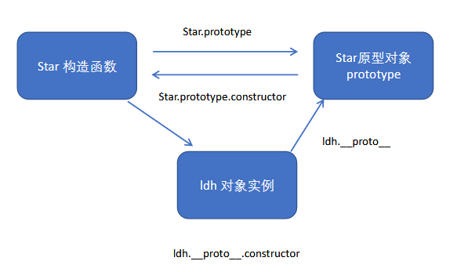
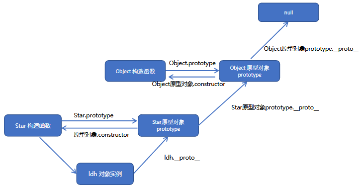

# js高级

## JavaScript面向对象

### 面向过程

面向过程：POP(Process-oriented programming)

> 面向过程就是分析出解决问题所需要的步骤，然后用函数把这些步骤一步一步实现，使用的时候再一个一个的依次调用就可以了。

### 面向对象

面向对象：OOP (Object Oriented Programming)

> 面向对象是把事务分解成为一个个对象，然后由对象之间分工与合作。

### 区别

+ 面向过程：小项目
+ 面向对象：多人合作大项目

## 面向对象的三大特性

+ 封装性
+ 继承性
+ 多态性

### 面向对象和面向过程的优缺点

#### 面向过程

+ 优点：性能比面向对象高，步骤练习紧密
+ 缺点：不好维护，不易多次使用及扩展

#### 面向对象

+ 优点：易维护，可复用，可扩展，灵活性高
+ 缺点：性能没有面向过程高

> 面向过程就是一份蛋炒饭，味道均匀，但是假如有的人不喜欢吃鸡蛋，没办法分开
>
> 面向对象就是一个盖浇饭，但是味道不均匀，而不想吃某种味道，可以分开
>
> 简单程序面向过程，复杂程序用面向对象

## ES6中的类和对象

类：泛指一类

对象：类中的具体的某个实例，【属性和方法的集合体】

### 类

类模拟抽象的，泛指的，对象是具体的

面向对象模拟现实世界，更贴近实际生活，生活照分为抽象事物和具体事物

把一类事物进行封装     泛指某一类

### 对象

类中的具体的某个实例【属性和方法的集合体】

+ 万物皆对象     对象是一个具体的事物，看得见摸得着的实物

在JavaScript 中，对象是一组无序的相关属性和方法的集合，所有的事物都是对象，例如字符串、数值、数组、函数等。

+ **对象是由属性和方法组成的**
  + 属性：对象有什么【访问】【语法：对象.属性】【arr.length】
  + 方法：对象做什么【执行】【语法：对象.方法()】【arr.push(a)】
  + 属性：事物的特征，在对象中用属性来表示（常用名词）
  + 方法：事物的行为，在对象中用方法来表示（常用动词）

#### 思维特点

1. 抽取（抽象）对象共用的属性和方法组织(封装)成一个类(模板)
2. 对类进行实例化, 获取类的对象

+  类抽象了对象的公共部分，它泛指某一大类（class）

### 创建类

```bash
语法：class 类名 {属性和方法}【构造函数语法糖】

注意类名首字母大写

类要抽取公共属性方法，定义一个类
```

```js
class Star {
};

var ldh = new Star();

//类就是构造函数的语法糖
```

### constructor构造函数

语法：

```js
class Star {
	constructor (uname,age){
		this.uname = uname;
		this.age = age;
	}
}
//属性：放到constructor，构造函数里面
```

```bash
注意：类里面的方法不带function，直接写既可

类里面要有属性方法，属性方法要是想放到类里面，我们用constructor构造器

构造函数作用：接收参数，返回实例对象，new的时候主动执行，主要放一些公共的属性
```

> constructor() 方法是类的构造函数(默认方法)，用于传递参数,返回实例对象，通过new命令生成对象实例时，自动调用该方法。
>
> 注意：每个类里面一定有构造函数，如果没有显示定义, 类内部会自动给我们创建一个constructor() ，
>
> 注意：this代表当前实力化对象，谁new就代表谁

### 类添加方法

语法：注意方法和方法之间不能加逗号

```js
class Star {

	constructor () {}

	sing () {}

	tiao () {}

}
```

```bash
class 类名 { constructor(){}   方法名(){} }

注意：类中定义属性，调用方法都得用this
this.属性
this.方法()
```

### 总结：

+ 类有对象的公共属性和方法
+ 用class创建
+ class里面包含constructor和方法
+ 我们把公共属性放到constructor里面
+ 把公共方法直接往后写既可，但是注意不要加逗号

## 类的继承

### **extends关键字**

```js
// 语法：

​	class Father {}

​	class Son extends Father{}

// 注意：是子类继承父类
```

### **super关键字**

应用的过程中会遇到父类子类都有的属性，此时，没必要再写一次，可以直接调用父类的方法就可以了

**super关键字用于访问和调用对象父类上的函数。可以调用父类的构造函数，也可以调用父类的普通函数**

注意：

> **当子类没有constructor的时候可以随意用父类的，但是如果子类也含有的话，constructor会返回实例，this的指向不同，不可以再直接使用父类的东西**

#### **调用父类构造函数**

```js
class F { constructor(name, age){} }

class S extends F { constructor (name, age) { super(name,age); } }

// 注意: 子类在构造函数中使用super, 必须放到this 前面(必须先调用父类的构造方法,在使用子类构造方法
```

####  **调用父类普通函数**

```js
class F { constructor(name, age){} say () {} }

class S extends F { constructor (name, age) { super(name,age); } say () { super.say() } }

// 注意：如果子类也有相同的方法，优先指向子类，就近原则
```

#### **总结**

+ **super调用父类的属性和方法，那么查找属性和方法的原则就近原则**
+ 如果子类不写东西，那么直接继承父类就可以用
+ 但是如果子类有自己的构造函数和父类同名的方法，此时不可以直接用父类的东西，需要用super调用父类的方法和构造函数

## 三个注意点

1. 在ES6中类没有变量提升，所以必须先定义类，才能通过类实例化对象.
2. 类里面的共有属性和方法一定要加this使用，类里面的this指向问题
3. constructor 里面的this指向实例对象, 方法里面的this 指向这个方法的调用者

## **构造函数和原型**

### 创建对象的三种方式

1. 对象字面量 let xxx = {}
2. new Object()【构造函数】
3. 自定义构造函数 function Fn () {}

### 构造函数和原型

```js
构造函数是一种特殊的函数，主要用来初始化对象，即为对象成员变量赋初始值，它总与new一起使用。我们可以把对象中一些公共的属性和方法抽取出来，然后封装到这个函数里面。
function Fn () {}
```

**注意**：

+ 造函数用于创建某一类对象，其首字母要大写
+ 构造函数要和new 一起使用才有意义

### **new在执行时会做四件事情**

1. 在内存中创建一个新的空对象。
2. 让this指向这个新的对象。
3. 执行构造函数里面的代码，给这个新对象添加属性和方法。
4. 返回这个新对象（所以构造函数里面不需要return）。

### **静态成员和实例成员**

JavaScript 的构造函数中可以添加一些成员，可以在构造函数本身上添加，也可以在构造函数内部的this 上添加。通过这两种方式添加的成员，就分别称为静态成员和实例成员。

+ 静态成员：在构造函数本身上添加的成员称为静态成员，只能由构造函数本身来访问
+ 实例成员：在构造函数内部创建的对象成员称为实例成员，只能由实例化的对象来访问

```js
function Person (uname, age) {
    this.uname = uname;
    this.age = age;

    this.say = function () {
        console.log(123);
    }
}

var obj = new Person('张三丰',22);	
console.log(obj.uname);// 实例成员

// console.log( Person.uname );
Person.leibie = '人';

console.log(Person.leibie);//静态成员
console.log(obj.leibie);
```

### **构造函数原型prototype**

构造函数的属性，这个属性是一个对象，我们也称呼，prototype 为原型对象。

作用：**是为了共享方法，从而达到节省内存**

**注意：每一个构造函数都有prototype属性**

> 构造函数通过原型分配的函数是所有对象所共享的。
>
> JavaScript 规定，每一个构造函数都有一个prototype 属性，指向另一个对象。注意这个prototype 就是一个对象，这个对象的所有属性和方法，都会被构造函数所拥有。我们可以把那些不变的方法，直接定义在prototype 对
>
> 象上，这样所有对象的实例就可以共享这些方法。

**总结：所有的公共属性写到构造函数里面，所有的公共方法写到原型对象里面**

### **对象原型：____proto____**

**主要作用：指向prototype**

构造函数和原型对象都会有一个属性__proto__ 指向构造函数的prototype 原型对象，之所以我们对象可以使用构造函数prototype 原型对象的属性和方法，就是因为对象有__proto__ 原型的存在

**注意：____proto____是一个非标准属性，不可以拿来赋值或者设置【只读属性】____proto____对象原型的意义就在于为对象的查找机制提供一个方向**

###  **constructor  构造函数**

> <u>**记录是哪个构造函数创建出来的**</u>
>
> 指回构造函数本身

原型（__proto__）和构造函数（prototype）原型对象里面都有一个属性constructor属性，constructor 我们称为构造函数，因为它指回构造函数本身。constructor 主要用于记录该对象引用于哪个构造函数，它可以让原型对象重新指向原来的构造函数。一般情况下，对象的方法都在构造函数的原型对象中设置。如果有多个对象的方法，我们可以给原型对象采取对象形式赋值，但是这样就会覆盖构造函数原型对象原来的内容，这样修改后的原型对象constructor  就不再指向当前构造函数了。此时，我们可以在修改后的原型对象中，添加一个constructor 指向原来的构造函数。

**总结：constructor  主要作用可以指回原来的构造函数**

### **构造函数、实例、原型对象三者之间的关系**



### **原型链**



作用：提供一个成员的查找机制，或者查找规则

## 继承

### 组合继承

#### 属性的继承

```js
function Father (uname,age) {
    // this指向父类的实例对象
    this.uname = uname;
    this.age = age;
    // 只要把父类的this指向子类的this既可
}
function Son (uname, age,score) {
    // this指向子类构造函数
    // this.uname = uname;
    // this.age = age;
    // Father(uname,age);
    Father.call(this,uname,age);
    this.score = score;
}
Son.prototype.sing = function () {
    console.log(this.uname + '唱歌')
}
var obj = new Son('刘德华',22,99);
console.log(obj.uname);
console.log(obj.score);
obj.sing();
```

#### 方法的继承

**实现方法把父类的实例对象保存给子类的原型对象**

```js

function Father () {

}
Father.prototype.chang = function () {
    console.log('唱歌');
}

function Son () {

}
// Son.prototype = Father.prototype;
Son.prototype = new Father();
var obj = new Son();
obj.chang();

Son.prototype.score = function () {
    console.log('考试');
}

// obj.score();
// console.log(Son.prototype);
console.log(Father.prototype);
```

**注意：一定要让Son指回构造函数**

```js
// 实现继承后，让Son指回原构造函数

Son.prototype = new Father();

Son.prototype.constructor = Son;
```

**总结：用构造函数实线属性继承，用原型对象实线方法继承**

## ES6中新增的方法

```bash
迭代(遍历)方法：forEach()、map()、filter()、some()、every()；

这些方法都是遍历数组的
```

### forEach()

```bash
array.forEach(function(currentValue, index, arr))

currentValue：数组当前项的值
index：数组当前项的索引
arr：数组对象本身
```

```js
var arr = ['red','blue','yellow','orange'];

arr.forEach(function (elm,i,arrAbc) {
	console.log(elm,i,arrAbc);
});
```

### filter()

```bash
array.filter(function(currentValue, index, arr))

filter() 方法创建一个新的数组，新数组中的元素是通过检查指定数组中符合条件的所有元素,主要用于筛选数组

注意它直接返回一个新数组

currentValue: 数组当前项的值

index：数组当前项的索引

arr：数组对象本身回调函数里面添加return添加返回条件
```

```js
var arr = [100,66,99,123,333,33,44,66];
var reArr = arr.filter(function (elm, a, n) {

// console.log(elm,a, n);
return elm % 2 == 0;

});

console.log(reArr);
```

### some()

```bash
array.some(function(currentValue, index, arr)) 【注意：找到或者满足条件立刻停止】

some() 方法用于检测数组中的元素是否满足指定条件. 通俗点查找数组中是否有满足条件的元素

注意它返回值是布尔值, 如果查找到这个元素, 就返回true , 如果查找不到就返回false.

如果找到第一个满足条件的元素,则终止循环. 不在继续查找.

currentValue: 数组当前项的值index：数组当前项的索引

arr：数组对象本身
```

```js
var arr = [100,200,300,400];
var re = arr.some(function (elm,i,arr) {
		// console.log(elm,i,arr);
		console.log(i);
		return elm >= 200;
	});
console.log(re);
```

## 函数进阶

### 函数的定义和调用

#### 定义

1. 函数声明方式function 关键字(命名函数)
2. 函数表达式(匿名函数)【自调用函数】
3. Function 里面参数都必须是字符串格式
4. 所有函数都是Function 的实例(对象)
5. 函数也属于对象

#### 调用

调用方式：

1. 普通函数【fn()】
2. 对象的方法【对象.方法()】
3. 构造函数【new Fn()】
4. 绑定事件函数【obj.onclick = function () {}】
5. 定时器函数【window.setInterval(fun
6. ction () {},1000)】
7. 立即执行函数【(function () {})()】

### bind()、call()、apply()

都可以改变this的指向

#### call 方法

fun.call(thisArg, arg1, arg2, ...)
thisArg：在fun 函数运行时指定的this 值

arg1，arg2：传递的其他参数

返回值就是函数的返回值，因为它就是调用函数

#### apply 方法

fun.apply(thisArg, [argsArray]):调用函数

thisArg：在fun函数运行时指定的this值

argsArray：传递的值，必须包含在数组里面

返回值就是函数的返回值，因为它就是调用函数

#### bind 方法

bind() 方法不会调用函数。但是能改变函数内部this 指向

fun.bind(thisArg, arg1, arg2, ...)

thisArg：在fun 函数运行时指定的this 值

arg1，arg2：传递的其他参数

返回由指定的this 值和初始化参数改造的原函数拷贝

因此当我们只是想改变this 指向，并且不想调用这个函数的时候，可以使用bind

#### 区别

bind：接收无限多的参数    不执行函数  改变this指向

call：接收无限多的参数     执行函数    改变this执向

apply：接收一个数组     执行函数    改变this指向

#### 主要使用场景

1. call 经常做继承. 
2. apply 经常跟数组有关系.比如借助于数学对象实现数组最大值最小值
3. bind  不调用函数,但是还想改变this指向. 比如改变定时器内部的this指向

## 严格模式

JavaScript 除了提供正常模式外，还提供了严格模式（strictmode）。ES5 的严格模式是采用具有限制性JavaScript 变体的一种方式，即在严格的条件下运行JS 代码。
严格模式在IE10 以上版本的浏览器中才会被支持，旧版本浏览器中会被忽略。
严格模式对正常的JavaScript 语义做了一些更改：

1.消除了Javascript语法的一些不合理、不严谨之处，减少了一些怪异行为。【例如变量，不声明就报错】
2.消除代码运行的一些不安全之处，保证代码运行的安全。
3.提高编译器效率，增加运行速度。
4.禁用了在ECMAScript的未来版本中可能会定义的一些语法，为未来新版本的Javascript做好铺垫。比如一些保留字如：class, enum, export, extends, import, super 不能做变量名
5.严格模式下全局作用域中函数中的this是undefined。


### 开启严格模式

```bash
## 开启严格模式

开启严格模式："use strict"
<script>"use strict"</script>：脚本开启严格模式
<script>function fn () {"use strict"}</script>为函数开启严格模式
```

## 高阶函数

高阶函数是对其他函数进行操作的函数，它接收函数作为参数或将函数作为返回值输出

函数也是一种数据类型，同样可以作为参数，传递给另外一个参数使用。最典型的就是作为回调函数。

同理函数也可以作为返回值传递回来

```js
function fn(callback){
    callback&&callback();
}
fn(function(){
    alert('hi')
})
```

## 闭包

### 变量作用域

变量根据作用域的不同分为两种：全局变量和局部变量。

1. 函数内部可以使用全局变量。
2. 函数外部不可以使用局部变量。
3. 当函数执行完毕，本作用域内的局部变量会销毁

### **什么是闭包**

闭包（closure）指有权访问另一个函数作用域中变量的函数。【很多种解释，都并不权威】

简单理解就是，一个作用域可以访问另外一个函数内部的局部变量。

```js
function fn1(){
    // fn1 就是闭包函数
    var num = 10;
    function fn2(){
        console.log(num); // 10
    }
    fn2()
}
fn1();
```

**闭包作用：延伸变量的作用范围。**

**会造成内存泄漏**

## 递归

### 什么是递归

递归：函数调用函数其本身

简单理解:函数内部自己调用自己, 这个函数就是递归函数

**注意：**递归函数的作用和循环效果一样，由于递归很容易发生“栈溢出”错误（stack overflow），所以必须要加退出条件return。

#### n的阶乘

```js
//利用递归函数求1~n的阶乘 1 * 2 * 3 * 4 * ..n
 function fn(n) {
     if (n == 1) { //结束条件
       return 1;
     }
     return n * fn(n - 1);
 }
 console.log(fn(3));
```

#### 斐波那契数列

```js
// 利用递归函数求斐波那契数列(兔子序列)  1、1、2、3、5、8、13、21...
// 用户输入一个数字 n 就可以求出 这个数字对应的兔子序列值
// 我们只需要知道用户输入的n 的前面两项(n-1 n-2)就可以计算出n 对应的序列值
function fb(n) {
  if (n === 1 || n === 2) {
        return 1;
  }
  return fb(n - 1) + fb(n - 2);
}
console.log(fb(3));
```

### 深拷贝和浅拷贝

#### 浅拷贝

> 只拷贝最外面一层

```js
var obj = {
    name : '张三丰',
    age : 22
};
var newObj = {};
for (key in obj) {
    newObj[key] = obj[key];
}
console.log(newObj);	
// es6：新方法

Object.assign(target, sources);

console.log(newObj);
```

#### 深拷贝

> 深拷贝不能直接赋值，对象赋值的是地址
>
> 要一层层的拷贝

```js
var obj = {
    name : '1张三丰',
    age : 22,
    messige : {
        sex : '男',
        score : 16
    },
    color : ['red','purple','qing']
}
var newObj = {};
function kaobei (newObj,obj) {
    for (key in obj) {
        if (obj[key] instanceof Array) {
            newObj[key] = [];
            kaobei(newObj[key],obj[key]);
        } else if (obj[key] instanceof Object) {
            newObj[key] = {};
            kaobei(newObj[key],obj[key])
        } else {
            newObj[key] = obj[key];
        }
    }
}
obj.messige.sex = 99;
kaobei(newObj,obj);
console.log(newObj);
```

