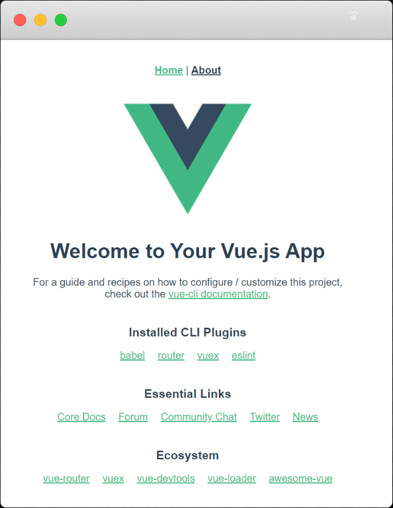

# 一、项目初始化

> 模块目标
>
> - 能使用 Vue CLI 创建项目
> - 能使用 Git 管理项目代码
> - 了解 Vant 组件库的导入方式
> - 了解 Vue 项目中如何进行 REM 适配
> - 了解 axios 请求模块的封装


## 使用 Vue CLI 创建项目

> 提示：该项目基于 VueCLI 版本 4 创建，如果你的版本低于 4，请升级继续下面的内容。
>
> ```sh
> # 查看 VueCLI 版本号
> vue --version
> 
> # npm 安装升级
> npm install @vue/cli
> 
> # Yarn 安装升级
> yarn global add @vue/cli
> ```

在命令行中输入以下命令创建 Vue 项目：

```sh
vue create vue-toutiao-webapp
```

```
Vue CLI v4.1.2
? Please pick a preset:
  default (babel, eslint)
> Manually select features
```

> default：默认勾选 babel、eslint，回车之后直接进入装包
>
> manually：自定义勾选特性配置，选择完毕之后，才会进入装包
>
> 选择第 2 种：手动选择特性，支持更多自定义选项

```
? Please pick a preset: Manually select features
? Check the features needed for your project:
 (*) Babel
 ( ) TypeScript
 ( ) Progressive Web App (PWA) Support
 (*) Router
 (*) Vuex
 (*) CSS Pre-processors
>(*) Linter / Formatter
 ( ) Unit Testing
 ( ) E2E Testing
```

> 分别选择：
>
> Babel：es6 转 es5
>
> Router：路由
>
> Vuex：数据容器，存储共享数据
>
> CSS Pre-processors：CSS 预处理器，后面会提示你选择 less、sass、stylus 等
>
> Linter / Formatter：代码格式校验

```
? Use history mode for router? (Requires proper server setup for index fallback in production) (Y/n) n
```

> 是否使用 history 路由模式，这里输入 n 不使用

```
? Pick a CSS pre-processor (PostCSS, Autoprefixer and CSS Modules are supported by default):
  Sass/SCSS (with dart-sass)
  Sass/SCSS (with node-sass)
> Less
  Stylus
```

> 选择 CSS 预处理器，这里选择我们熟悉的 Less

```sh
? Pick a linter / formatter config:
  ESLint with error prevention only
  ESLint + Airbnb config
> ESLint + Standard config
  ESLint + Prettier
```

> 选择校验工具，这里选择 ESLint + [Standard config](https://standardjs.com/)

```
? Pick additional lint features:
 (*) Lint on save
>(*) Lint and fix on commit
```

> 选择在什么时机下触发代码格式校验：
>
> - Lint on save：每当保存文件的时候
> - Lint and fix on commit：每当执行 `git commit` 提交的时候
>
> 这里建议两个都选上，更严谨。

```sh
? Where do you prefer placing config for Babel, ESLint, etc.? (Use arrow keys)
> In dedicated config files
  In package.json
```

> Babel、ESLint 等工具会有一些额外的配置文件，这里的意思是问你将这些工具相关的配置文件写到哪里：
>
> - In dedicated config files：分别保存到单独的配置文件
> - In package.json：保存到 package.json 文件中
>
> 这里建议选择第 1 个，保存到单独的配置文件，这样方便我们做自定义配置。

```sh
? Save this as a preset for future projects? (y/N) N
```

> 这里是问你是否需要将刚才选择的一系列配置保存起来，然后它可以帮你记住上面的一系列选择，以便下次直接重用。
>
> 这里根据自己需要输入 y 或者 n，我这里输入 n 不需要。

```sh
✨  Creating project in C:\Users\LPZ\Desktop\topline-m-fe89\topline-m-89.
�  Initializing git repository...
⚙  Installing CLI plugins. This might take a while...

[          ........] - extract:object-keys: sill extract json5@2.1.1
```

> 向导配置结束，开始装包。
>
> 安装包的时间可能较长，请耐心等待......

```sh
⚓  Running completion hooks...

�  Generating README.md...

�  Successfully created project topline-m-89.
�  Get started with the following commands:

 $ cd topline-m
 $ npm run serve
```

> 安装结束，命令提示你项目创建成功，按照命令行的提示在终端中分别输入：
>
> - `cd 你的项目`
> - `npm run serve`
>   - 如果你是 yarn 装的包就执行 `yarn serve`

```sh
 DONE  Compiled successfully in 7527ms


  App running at:
  - Local:   http://localhost:8080/
  - Network: http://192.168.10.216:8080/

  Note that the development build is not optimized.
  To create a production build, run npm run build.

```

> 启动成功，命令行中输出项目的 http 访问地址。
>
> 打开浏览器，输入其中任何一个地址进行访问。



如果能看到该页面，恭喜你，项目创建成功了。

## 初始目录结构说明

项目创建好以后，下面我们来了解一下目录结构的含义：

```
.
├── .browserslistrc
├── .editorconfig
├── .eslintrc.js
├── .gitignore
├── README.md
├── babel.config.js
├── package-lock.json
├── package.json
├── public
│   ├── favicon.ico
│   └── index.html
└── src
    ├── App.vue       根组件
    ├── assets        资源目录
    ├── components    公共组件
    ├── main.js       入口模块
    ├── router        路由
    ├── store         Vuex容器
    └── views         路由组件
```

> 关于 `lock` 文件
>
> - 如果你的项目使用的是 npm，则这里产生的是 `package-lock.json` 文件
>- 如果你的项目使用的 yarn，则这里生产的是 `yarn.lock` 文件

## 加入 Git 版本管理

几个好处：

- 代码备份
- 多人协作
- 历史记录

1、创建远程仓库（github、码云、coding。。。）

2、将本地仓库推到线上

正常的话我们需要创建 Git 仓库并提交历史记录。

```sh
git init
git add 文件
git commit "提交日志"
```

但是 Vue CLI 在生成项目的时候默认完成了 Git 仓库的初始化和初始提交，所以这里只需要 push 到线上即可。

```sh
git remote add 你的远程仓库地址
git push -u origin master
```

之后如果需要提交，则还是常规的 add、commit、push。

```sh
git add 文件
git commit -m "提交日志"
git push
```

## 调整初始目录结构

默认生成的目录结构不满足我们的开发需求，所以这里需要做一些自定义改动。

这里主要就是下面的两个工作：

- 删除初始化的默认文件
- 新增调整我们需要的目录结构

1、将 `App.vue` 修改为

```html
<template>
  <div id="app">
    <!-- 根路由出口 -->
    <router-view />
  </div>
</template>

<script>
export default {
  name: 'App'
}
</script>

<style scoped lang="less"></style>

```

2、将 `router/index.js` 修改为

```js
import Vue from 'vue'
import VueRouter from 'vue-router'

Vue.use(VueRouter)

const routes = []

const router = new VueRouter({
  routes
})

export default router

```

3、删除

- src/views/About.vue
- src/views/Home.vue
- src/components/HelloWorld.vue
- src/assets/logo.png

4、创建以下几个目录

- src/api
  - 存储接口封装
- src/utils
  - 存储一些工具模块
- src/styles
  - 存储样式

调整之后的目录结构如下。

```
.                                 
├── README.md                     
├── babel.config.js               
├── package-lock.json             
├── package.json                  
├── public                        
│   ├── favicon.ico               
│   └── index.html                
└── src                           
    ├── api
    ├── App.vue                   
    ├── assets                    
    ├── components                
    ├── main.js                   
    ├── router
    ├── utils
    ├── styles
    ├── store                     
    └── views                     
```


## 导入 Vant

### Vant 介绍


- [官方文档](https://youzan.github.io/vant/#/zh-CN/)
- [GitHub 仓库](https://github.com/youzan/vant)

Vant 是杭州有赞商城前端开发团队开发的一个基于 Vue.js 的移动端组件库，它提供了丰富的常见的移动端功能组件，开箱即用。

- 60+ 高质量组件
- 90% 单元测试覆盖率
- 完善的中英文文档和示例
- 支持按需引入
- 支持主题定制
- 支持国际化
- 支持 TS
- 支持 SSR

### 导入

方式一. 自动按需引入组件

- 和方式二一样，都是按需引入，但是加载更方便一些（需要额外配置插件）
- 优点：打包体积小
- 缺点：每个组件在使用之前都需要手动加载注册


方式二. 手动按需引入组件

- 在不使用插件的情况下，可以手动引入需要的组件
- 优点：打包体积小
- 缺点：每个组件在使用之前都需要手动加载注册


方式三. 导入所有组件

  - Vant 支持一次性导入所有组件，引入所有组件会增加代码包体积，因此不推荐这种做法
  - 优点：导入一次，使用所有
  - 缺点：打包体积大


方式四. 通过 CDN 引入

- 使用 Vant 最简单的方法是直接在 html 文件中引入 CDN 链接，之后你可以通过全局变量`vant`访问到所有组件。
- 优点：适合一些演示、示例项目，一个 html 文件就可以跑起来
- 缺点：不适合在模块化系统中使用


这里建议为了前期开发的便利性先一次性导入所有 Vant 组件，在最后做打包优化的时候配置按需加载以降低打包体积大小。


下面是具体的操作步骤。

1、安装 Vant

```js
npm i vant -S
```

2、在 `main.js` 中加载注册 Vant 组件

```js
import Vue from 'vue'
import Vant from 'vant'
import 'vant/lib/index.css'

Vue.use(Vant)
```

3、查阅文档使用组件

### 扩展：如何选择第三方包

[关于如何选择第三方包](/extend/?id=关于如何选择第三方包)。

## 样式

### 预处理器文件结构

在 styles 中创建以下文件结构：

```
styles/
  ├── base.less       公共基础样式（全局样式）
  ├── index.less      组织加载全局样式
  ├── mixins.less     公共的 mixin（哪里使用哪里加载）
  ├── reset.less      重置默认样式（全局样式）
  └── variables.less  公共变量文件（哪里使用哪里加载）
```

然后在 `main.js` 中加载全局样式使其生效：

```js
// 加载全局样式
// 注意：该样式文件要放到第三方样式之后
import './styles/index.less'
```


### normalize.css

​	[Normalize.css](http://necolas.github.io/normalize.css/) 只是一个很小的CSS文件，但它在默认的HTML元素样式上提供了跨浏览器的高度一致性。相比于传统的`CSS reset`，`Normalize.css`是一种现代的、为HTML5准备的优质替代方案。`Normalize.css`现在已经被用于[Twitter Bootstrap](http://getbootstrap.com/)、[HTML5 Boilerplate](http://html5boilerplate.com/)、[GOV.UK](http://www.gov.uk/)、[Rdio](http://www.rdio.com/)、[CSS Tricks](http://css-tricks.com/) 以及许许多多其他框架、工具和网站上。

- **保护有用的浏览器默认样式**而不是完全去掉它们
- **一般化的样式**：为大部分HTML元素提供
- **修复浏览器自身的bug**并保证各浏览器的一致性
- **优化CSS可用性**：用一些小技巧
- **解释代码**：用注释和详细的文档来

`Normalize.css`支持包括手机浏览器在内的超多浏览器，同时对HTML5元素、排版、列表、嵌入的内容、表单和表格都进行了一般化。尽管这个项目基于一般化的原则，但我们还是在合适的地方使用了更实用的默认值。

- [Normalize.css 官网](http://necolas.github.io/normalize.css/)
- [Normalize.css 在GitHub上的源码](https://github.com/necolas/normalize.css)

1、安装

```sh
npm i normalize.css
```


2、在 `main.js` 中引入

```js
import 'normalize.css'
```


但是我们的项目不需要加载它，不是不需要，因为我们使用了第三方组件库 Vant，它内置了 normalize.css，所以我们不需要自己手动安装配置它了。

### 关于字体图标

Vant 内置了很多丰富的[字体图标](https://youzan.github.io/vant/#/zh-CN/icon)，如果其中没有满足我们需要的，推荐使用 [iconfont](https://www.iconfont.cn/)。

### 配置 REM 适配

Vant 中的样式默认使用 `px` 作为单位，如果需要使用 `rem` 单位，推荐使用以下两个工具：

- [postcss-pxtorem](https://github.com/cuth/postcss-pxtorem) 是一款 postcss 插件，用于将单位转化为 rem
- [lib-flexible](https://github.com/amfe/lib-flexible) 用于设置 rem 基准值

下面我们分别将这两个工具配置到项目中完成 REM 适配。

一、使用 [amfe-flexible](https://github.com/amfe/lib-flexible) 动态设置 REM 基准值（html 标签的字体大小）

1、安装

```sh
# yarn add amfe-flexible
npm i amfe-flexible
```

2、然后在 `main.js` 中加载执行该模块

```js
...
import 'amfe-flexible'
```

最后测试：在浏览器中切换不同的手机设备尺寸，观察 html 标签 `font-size` 的变化。


二、使用 [postcss-pxtorem](https://github.com/cuth/postcss-pxtorem) 将 px 转为 rem

1、安装

```sh
# yarn add -D postcss-pxtorem
# -D 是 --save-dev 的简写
npm install postcss-pxtorem -D
```

2、然后在**项目根目录**中创建 `postcss.config.js` 文件

```js
module.exports = {
  plugins: {
    "postcss-pxtorem": {
      // 设计稿 375:37.5
      // 设计稿：750:75
      // Vant 是基于 375
      rootValue: 37.5,
      propList: ["*"]
    }
  }
}
```

3、**配置完毕，重新启动服务**

最后测试：在浏览器中审查元素的样式查看是否已将 px 转换为 rem。

> 注意：
>
> - **只能转换单独的 .css|.less|.scss 之类的文件、.vue 文件中的 style 中的 px**
> - **不能转换行内样式中的 px**

### 关于设计稿的使用

Vant 的组件是基于 375 宽写的，而我们的设计稿是 750 宽，这样的话转换规则就出现了冲突。

解决办法就是把我们应该将就 Vant，将转换规则中的 `rootValue` 设置为 `37.5`。


之后在测量我们的设计稿的时候，就需要通过下面的方式来处理使用。

方式一：

- 如果你的设计稿 375，写的时候就是量多少写多少
- 如果你的设计稿 750，写的时候就是测量尺寸 ÷ 2


方式二（扩展）：

- 在 Photoshop 中把设计稿图像尺寸修改为 375，测量多少写多少
- 有个缺点：它也会把图片转为 375 下的，会导致模糊
- 如果你真的想要这样做，那就是 750 把图片切出来，然后在 375 下量尺寸（不用/2）

## 代码规范

### JavaScript 代码规范

### Vue 代码风格

- Vue 官方风格指南：https://cn.vuejs.org/v2/style-guide/
- https://youzan.github.io/vant/#/zh-CN/style-guide

## 封装请求模块

这里我们直接把 axios 封装为一个请求模块，在需要的时候直接加载使用。

### axios

1、安装 axios

```sh
# yarn add axios
npm i axios
```

2、创建 `src/utils/request.js`

```js
/**
 * 封装 axios 请求模块
 */
import axios from "axios"

// axios.create 方法：复制一个 axios
const request = axios.create({
  baseURL: "http://ttapi.research.itcast.cn/" // 基础路径
})

export default request
```

3、如何使用

- 方式一（麻烦）：哪里使用，哪里 `import `加载
- 方式二（不利于接口维护）：我们可以把请求对象挂载到 `Vue.prototype` 原型对象中，然后在组件中通过 `this.xxx` 直接访问
- 方式三（推荐）：我们把每一个请求都封装成一个一个的独立功能函数，在需要的时候加载调用即可

在我们的项目中建议使用方式三，更推荐。

### 处理后端返回数据中包含超出 JS 安全整数范围数字问题

JavaScript 中可以处理的最大安全整数范围是

```js
Number.MAX_SAFE_INTEGER // 9007199254740991
```

```js
JSON.parse('{ "id": 9007199254740995 }') // { id: 9007199254740996 }
```

该项目所使用的后端接口数据中包含超出 JavaScript 安全整数范围的数字，所以也需要像之前的 PC 端项目一样使用 [json-bigint](https://github.com/sidorares/json-bigint) 将后端返回数据处理一下才能正确使用。

1、安装依赖

```sh
# yarn add json-bigint
npm i json-bigint
```

2、在 `utils/request.js`

```js
import jsonBig from 'json-bigint'
```

```js
// axios 开放了自定义转换后端返回数据的 API
// data 就是后端返回的原始数据
request.defaults.transformResponse = [function (data) {
  try {
    // 现在我们定制使用 json-bigint 来帮我们处理转换原始的 JSON 格式字符串
    // 这个方法类似于 JSON.parse，只不过它能把数据中的超出 JS 安全整数范围的数字给处理成正确的
    // 它内部有自己的算法，它会把大数字转为一个对象，我们在使用的时候把对象.toString() 就得到字符串形式的 id 了
    // 如果转换成功则返回成功的结果给请求使用
    // 如果转换失败则进入 catch，返回一个空对象
    return jsonBig.parse(data)

    // 它默认是这样的
    // return JSON.parse(data)
  } catch (err) {
    console.log('转换失败', err)
    return {}
  }
}]
```

## 总结

## 最终代码