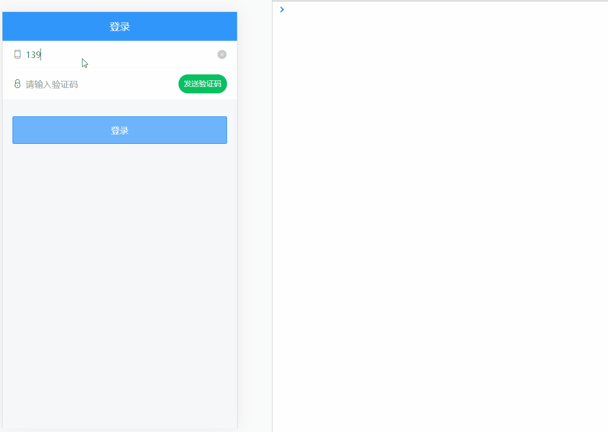
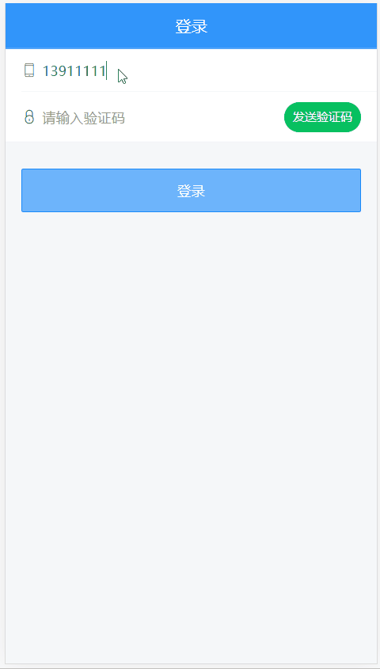
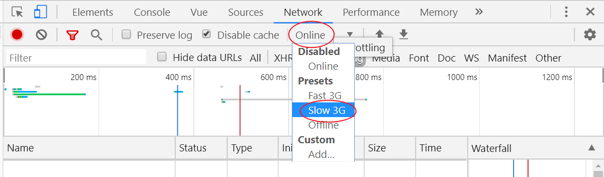
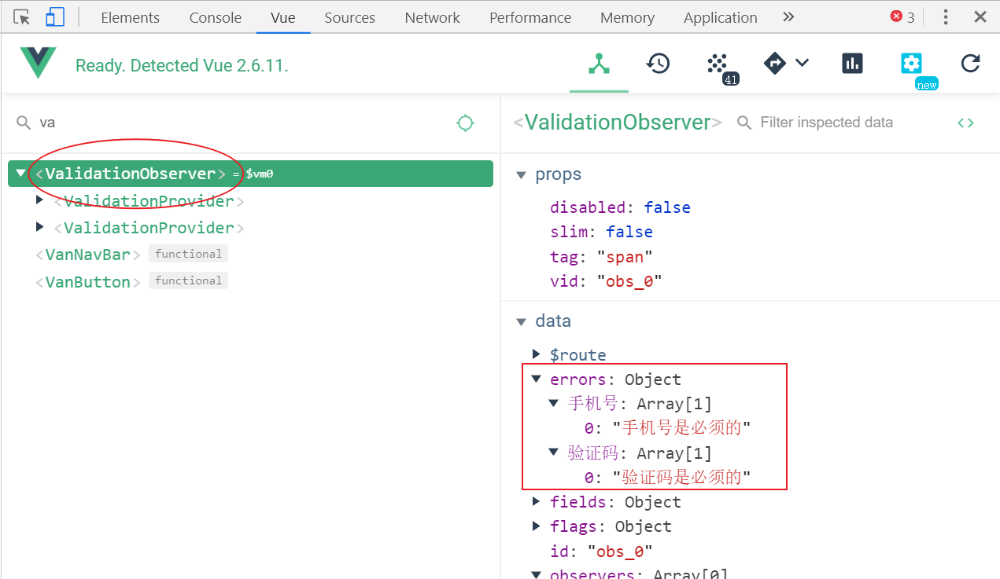

# 二、用户登录注册

> 目标
>
> - 能实现基本登录功能
> - 能了解 vant 中提示组件的使用
> - 能理解 api 请求模块的封装
> - 能了解在 Vue 中处理表单验证的方式


流程：

- 创建登录组件并配置路由
- 布局
- 完成登录功能

## 准备

### 创建登录组件并配置路由


1、创建 `views/login/index.vue` 并写入以下内容：

```html
<template>
  <div class="login">
    登录组件
  </div>
</template>

<script>
  export default {
    name: "LoginPage",
    components: {},
    props: {},
    data() {
      return {};
    },
    computed: {},
    watch: {},
    created() {},
    methods: {}
  };
</script>

<style scoped></style>
```

2、然后在 `router/index.js` 中配置路由表：

```js
import Vue from 'vue'
import VueRouter from 'vue-router'
+ import Login from '@/views/login'

Vue.use(VueRouter)

// 配置路由表
const routes = [
+  {
+    path: '/login',
+    component: Login
+  }
]

const router = new VueRouter({
  routes
})

export default router

```

最后，访问 `/login` 查看是否能访问到登录页面组件。

### 布局结构


这里主要使用到三个 Vant 组件：

- [NavBar 导航栏](https://youzan.github.io/vant/#/zh-CN/nav-bar)
- [Field 输入框](https://youzan.github.io/vant/#/zh-CN/field)
- [Button 按钮](https://youzan.github.io/vant/#/zh-CN/button)

1、登录页面的模板

```html
<template>
  <div class="login">
    <!-- 导航栏 -->
    <van-nav-bar title="登录" />
    <!-- 导航栏 -->

    <!-- 表单 -->
    <van-cell-group>
      <van-field label="手机号" placeholder="请输入手机号" />

      <van-field label="验证码" placeholder="请输入验证码" />
    </van-cell-group>
    <!-- /表单 -->

    <!-- 登录按钮 -->
    <div class="login-btn-box">
      <van-button type="info">登录</van-button>
    </div>
    <!-- /登录按钮 -->
  </div>
</template>
```

### 布局样式


我们把设置登录页头部的样式写到全局（全局生效），因为其它页面也要使用。把非公共样式写到页面组件内部，避免和其它组件样式冲突。

下面是具体实现步骤。

一、添加全局样式设置导航栏

1、在 `styles/base.less` 并写入以下内容

```less
// 把全局公共样式写到这里

.van-nav-bar {
  background-color: #3196fa;
  .van-nav-bar__title {
    color: #fff;
  }
}
```

完了测试查看效果。

二、添加局部样式处理登录按钮居中

在 `views/login/index.vue` 组件中的 style 中添加

```less
.login-container {
  .login-btn-container {
    padding: 20px;
    .login-btn {
      width: 100%;
    }
  }
}
```

## 实现基本登录功能



实现思路：

- 获取表单数据（根据接口要求使用 v-model 绑定）
- 注册点击登录的事件
- 表单验证
- 发请求提交
- 根据请求结果做下一步处理

### 数据绑定

**根据接口要求**绑定获取表单数据。

1、在登录页面组件的实例选项 data 中添加 `user` 数据字段

```js
...
data () {
  return {
    user: {
      mobile: '',
      code: ''
    }
  }
}
```

2、在表单中使用 `v-model` 绑定对应数据

```html
<!-- van-cell-group 仅仅是提供了一个上下外边框，能看到包裹的区域 -->
<van-cell-group>
  <van-field
    +
    v-model="user.mobile"
    required
    clearable
    label="手机号"
    placeholder="请输入手机号"
  />

  <van-field
    +
    v-model="user.code"
    type="password"
    label="验证码"
    placeholder="请输入验证码"
    required
  />
</van-cell-group>
```

最后测试。

> 一个小技巧：使用 VueDevtools 调试工具查看是否绑定成功。

### 请求登录

1、给登录按钮注册点击事件处理函数

```html
<van-button type="info" @click="onLogin">登录</van-button>
```

2、登录处理函数

```js
import request from '@/utils/request'
```

```js
async onLogin () {
  try {
    const res = await request({
      method: 'POST',
      url: '/app/v1_0/authorizations',
      data: this.user
    })
    console.log('登录成功', res)
  } catch (err) {
    console.log('登录失败', err)
  }
}
```

## 登录中提示



Vant 中内置了[Toast 轻提示](https://youzan.github.io/vant/#/zh-CN/toast)组件，可以实现移动端常见的提示效果。

```js
// 简单文字提示
Toast("提示内容");

// loading 转圈圈提示
Toast.loading({
  duration: 0, // 持续展示 toast
  message: "加载中...",
  forbidClick: true // 是否禁止背景点击
});

// 成功提示
Ttoast.success("成功文案");

// 失败提示
Toast.fail("失败文案");
```

> 提示：在组件中可以直接通过 `this.$toast` 调用。

另外需要注意的是：Toast 默认采用单例模式，即同一时间只会存在一个 Toast，如果需要在同一时间弹出多个 Toast，可以参考下面的示例

```js
Toast.allowMultiple();

const toast1 = Toast('第一个 Toast');
const toast2 = Toast.success('第二个 Toast');

toast1.clear();
toast2.clear();
```

下面是为我们的登录功能增加 toast 交互提示。

```js
async onLogin () {
  // 开始转圈圈
  this.$toast.loading({
    duration: 0, // 持续时间，0表示持续展示不停止
    forbidClick: true, // 是否禁止背景点击
    message: '登录中...' // 提示消息
  })

  try {
    const res = await request({
      method: 'POST',
      url: '/app/v1_0/authorizations',
      data: this.user
    })
    console.log('登录成功', res)
    // 提示 success 或者 fail 的时候，会先把其它的 toast 先清除
    this.$toast.success('登录成功')
  } catch (err) {
    console.log('登录失败', err)
    this.$toast.fail('登录失败，手机号或验证码错误')
  }
}
```

假如请求非常快的话就看不到 loading 效果了，这里可以手动将调试工具中的网络设置为慢速网络。



测试结束，再把网络设置恢复为 `Online` 正常网络。

## 优化封装请求模块

我们建议将所有请求都封装为函数的方式来进行使用，这样做的主要目的是为了便于重用和管理维护。

这里我们先把登录中的请求封装到请求模块中。

1、创建 `src/api/user.js`

```js
/**
 * 用户相关的请求模块
 */
import request from "@/utils/request"

/**
 * 用户登录
 */
export const login = data => {
  return request({
    method: 'POST',
    url: '/app/v1_0/authorizations',
    data
  })
}
```

2、然后在登录页面中加载调用

```js
import { login } from "@/api/user";
```

```js
async onLogin () {
  // const loginToast = this.$toast.loading({
  this.$toast.loading({
    duration: 0, // 持续时间，0表示持续展示不停止
    forbidClick: true, // 是否禁止背景点击
    message: '登录中...' // 提示消息
  })

  try {
+    const res = await login(this.user)
    console.log('登录成功', res)
    // 提示 success 或者 fail 的时候，会先把其它的 toast 先清除
    this.$toast.success('登录成功')
  } catch (err) {
    console.log('登录失败', err)
    this.$toast.fail('登录失败，手机号或验证码错误')
  }
}
```

3、测试功能是否正常

**之后项目中所有的请求就都不要在组件中去直接发了，而是都采用上面的方式封装之后进行使用，这是一个建议的做法。**

## 发送验证码

### 使用倒计时组件

1、在 data 中添加数据用来控制倒计时的显示和隐藏

```js
data () {
  return {
    ...
    isCountDownShow: false
  }
}
```

2、使用倒计时组件

```html
<van-field
  v-model="user.code"
  placeholder="请输入验证码"
>
  <i class="icon icon-mima" slot="left-icon"></i>
  <van-count-down
    v-if="isCountDownShow"
    slot="button"
    :time="1000 * 5"
    format="ss s"
    @finish="isCountDownShow = false"
  />
  <van-button
    v-else
    slot="button"
    size="small"
    type="primary"
    round
    @click="onSendSmsCode"
  >发送验证码</van-button>
</van-field>
```

### 发送验证码

1、在 `api/user.js` 中添加封装数据接口

```js
export const getSmsCode = mobile => {
  return request({
    method: 'GET',
    url: `/app/v1_0/sms/codes/${mobile}`
  })
}
```

2、给发送验证码按钮注册点击事件

3、发送处理

```js
async onSendSmsCode () {
  // 1. 获取手机号
  const { mobile } = this.user
  // 2. 校验手机号是否有效

  // 3. 发送验证码
  try {
    // 显示倒计时
    this.isCountDownShow = true

    // 发送
    await getSmsCode(mobile)
  } catch (err) {
    console.log(err)

    // 发送失败，关闭倒计时
    this.isCountDownShow = false

    if (err.response.status === 429) {
      this.$toast('请勿频繁发送')
      return
    }

    this.$toast('发送失败')
  }
}
```


## 表单验证

### 表单验证方式介绍

常见的表单验证方式一般有下面几种：

- 使用 HTML5 自带的表单验证
- 使用第三方组件库
- 自己写

下面针对这些方式一一说明。


**方式一：HTML5 自带的表单验证（了解即可）**

```html
<form>
  <div>
    <label for="">用户名</label>
    <input type="text" required minlength="3" maxlength="5">
  </div>
  
  <div>
    <label for="">密码</label>
    <input type="password" required>
  </div>
  
  <div>
    <button>登录</button>
  </div>
</form>
```

优点：原生支持，使用简单

缺点：兼容不好，功能有限


**方式二：自己写**

- 例如之前学习的自定义表单验证
- 例如 Vue 官方 Cookbook 中的[表单校验](https://cn.vuejs.org/v2/cookbook/form-validation.html)

优点：控制灵活

缺点：手写麻烦，效率低


**方式三：使用组件库内置的验证**

- 例如 element 内置的验证功能
- 但是 Vant 没有提供

优点：和组件库配套使用，功能强大

缺点：依赖 Vue 生态，特定组件库


**方式四：使用专门的验证插件**

- [vuelidate](https://github.com/monterail/vuelidate)
- [VeeValidate](https://github.com/baianat/vee-validate)（推荐）
- ...

优点：功能强大

缺点：依赖 Vue 生态，特定组件库


我们项目中主要讲解使用 VeeValidate 作为我们的表单验证解决方案。

### 安装和配置

1、安装

```sh
# yarn add vee-validate
npm i vee-validate
```


2、创建 `utils/validation.js`

```js
import Vue from 'vue'

// 加载需要使用的验证组件
import { ValidationProvider, ValidationObserver, extend } from 'vee-validate'

// 加载内置的验证规则
import * as rules from 'vee-validate/dist/rules'

// 加载中文语言包
// 官方文档：https://logaretm.github.io/vee-validate/guide/rules.html#importing-the-rules
import { messages } from 'vee-validate/dist/locale/zh_CN.json'

// 注册全局组件
Vue.component('ValidationProvider', ValidationProvider)
Vue.component('ValidationObserver', ValidationObserver)

// 配置验证规则和中文提示消息
Object.keys(rules).forEach(rule => {
  extend(rule, {
    ...rules[rule],
    message: messages[rule]
  })
})

```


3、在 `main.js` 中加载执行

```js
import './utils/validation.js'
```

### 基本使用

1、使用 `ValidationObserver` 把需要校验的整个表单包起来

2、使用 `ValidationProvider` 把需要校验的具体表单元素包起来，例如 input

3、通过 `ValidationProvider` 配置具体的校验规则

- `name` 配置验证字段的名称
- `rules` 验证规则
  - `rules="requried"` 单个验证规则
  - `rules="required|length:4"` 多个验证规则使用 | 分隔

- `v-slot="{ errors }"` 获取错误消息，使用 `errors[0]` 绑定展示错误消息


下面是一个基本使用示例。

```html
<ValidationObserver ref="form">
  <ValidationProvider name="手机号" rules="required">
    <van-field
      class="form-item"
      v-model="user.mobile"
      clearable
      placeholder="请输入手机号"
    >
      <i class="icon icon-shouji" slot="left-icon"></i>
    </van-field>
    <!-- errors[0] 获取验证失败的错误消息 -->
    <span>{{ errors[0] }}</span>
  </ValidationProvider>

  <ValidationProvider name="验证码" rules="required">
    <van-field
      class="form-item"
      v-model="user.code"
      placeholder="请输入验证码"
    >
      <i class="icon icon-mima" slot="left-icon"></i>
      <van-count-down
        v-if="isCountDownShow"
        slot="button"
        :time="1000 * 60"
        format="ss s"
        @finish="isCountDownShow = false"
      />
      <van-button
        v-else
        slot="button"
        size="small"
        type="primary"
        round
        @click="onSendSmsCode"
      >发送验证码</van-button>
    </van-field>
  </ValidationProvider>
</ValidationObserver>
```


### 使用内置验证规则

例如：

- `required`：必填项
- `email`：必须是邮箱
- `length`：长度
- `min`：最小长度
- `max`：最大长度
- `min_value`：最小数字
- `max_value`：最大数字
- ...

所有的内置验证规则都在[这里查询](https://logaretm.github.io/vee-validate/guide/rules.html#rules)。

### 使用自定义验证规则

```js
import { extend } from 'vee-validate';

extend('positive', value => {
  return value >= 0;
});
```

```html
<ValidationProvider rules="positive" v-slot="{ errors }">
  <input v-model="value" type="text">
  <span>{{ errors[0] }}</span>
</ValidationProvider>
```

添加自定义手机号验证规则。

```js
extend('mobile', {
  validate: value => {
    return /^1(3|5|6|7|8|9)\d{9}$/.test(value)
  },
  message: '手机号码格式错误'
})
```

添加自定义验证码验证规则。

```js
extend('code', {
  validate: value => {
    return /^\d{6}$/.test(value)
  },
  message: '验证码格式错误'
})
```

自定义异步验证示例：

```js
// 验证方法必须返回一个 Promise
// 1. 在 Promise 中执行异步操作（定时器、ajax请求）
// 2. 成功 resolve(true)
// 3. 失败 reject('错误提示消息')
extend('async-test', value => {
  return new Promise(resolve => {
    setTimeout(() => {
      return Math.random() > 0.5 ? resolve(true) : reject('错误消息')
    }, 500)
  })
})
```

### 手动触发验证

一、手动触发验证

1、给 `ValidationObserver` 组件添加一个 `ref`

```html
<ValidationObserver ref="form">
```

2、调用组件的 `validate` 方法

```js
this.$refs.form.validate().then(success => {
  if (!success) {
    // 表单验证失败处理
  } else {
    // 表单验证通过处理
  }
})
```

这里我们可以看到表单验证的方法支持 Promise，所以我们可以结合 async-await 获取表单验证结果。

```js
const success = await this.$refs.form.validate()

if (!success) {
  // 表单验证失败处理
  
  // 使用 return 阻止代码往后执行，不用把后续代码往 else 中嵌套了
  return
}

// 表单验证成功处理
```


二、获取验证失败的错误消息并给出轻提示

通过 ValidationObserver 组件的 `errors` 可以获取到报错信息。



> 通过调试工具也可以看到这个错误信息对象。

```js
const errors = this.$refs.form.errors
for (let key in errors) {
  const item = errors[key]
  if (item[0]) {
    this.$toast(item[0])

    // 找到第1个有错误的消息，给出提示，停止遍历
    return
  }
}
```

### 验证指定数据字段

```js
import { validate } from 'vee-validate'
```

```js
// 参数1：要验证的数据
// 参数2：验证规则
// 参数3：一个可选的配置对象，例如配置错误消息字段名称 name
// 返回值：{ valid, errors, ... }
//          valid: 验证是否成功，成功 true，失败 false
//          errors：一个数组，错误提示消息
const validateResult = await validate(mobile, 'required|mobile', {
  name: '手机号'
})

// 如果验证失败，提示错误消息，停止发送验证码
if (!validateResult.valid) {
  this.$toast(validateResult.errors[0])
  return
}
```

## 总结

## 最终代码

[https://github.com/lipengzhou/topline-m-89/tree/02-login](https://github.com/lipengzhou/topline-m-89/tree/02-login)

