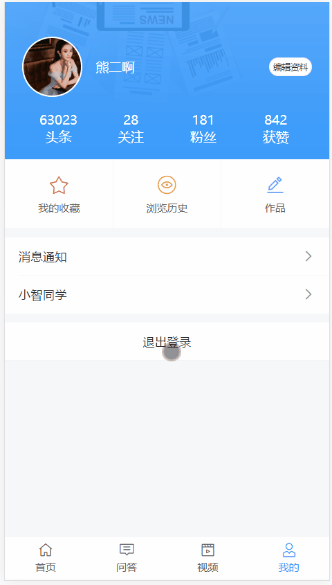

# 四、个人中心（我的）


## TabBar

通过分析页面，我们可以看到，首页、问答、视频、我的 都使用的是同一个底部标签栏，我们没必要在每个页面中都写一个，所以为了通用方便，我们可以使用 Vue Router 的嵌套路由来处理。

- 父路由：一个空页面，包含一个 tabbar，中间留子路由出口
- 子路由
  - 首页
  - 问答
  - 视频
  - 我的

### 创建 tabbar 组件并配置路由


这里主要使用到的 Vant 组件：

- [Tabbar 标签栏](https://youzan.github.io/vant/#/zh-CN/tabbar)

1、创建 `src/views/tabbar/index.vue`

```html
<template>
  <div class="tabbar-container">
    <!-- 子路由出口 -->
    <router-view />
    <!-- /子路由出口 -->

    <!-- tab-bar 标签栏 -->
    <van-tabbar route>
      <van-tabbar-item icon="wap-home-o" to="/">首页</van-tabbar-item>
      <van-tabbar-item icon="comment-o" to="/qa">问答</van-tabbar-item>
      <van-tabbar-item icon="video-o" to="/video">视频</van-tabbar-item>
      <van-tabbar-item
        icon="user-o"
        to="/my"
      >{{ $store.state.user ? '我的' : '未登录' }}</van-tabbar-item>
    </van-tabbar>
    <!-- /tab-bar 标签栏 -->
  </div>
</template>

<script>
export default {
  name: 'TabBar',
  components: {},
  props: {},
  data () {
    return {}
  },
  computed: {},
  watch: {},
  created () {},
  mounted () {},
  methods: {}
}
</script>

<style scoped></style>

```

2、然后将 tab-bar 组件配置到一级路由

```js
{
  path: '/',
  component: () => import('@/views/tab-bar')
}
```

访问 `/` 测试。

### 分别创建首页、问答、视频、我的页面组件

一、分别创建四个主页面

1、首页

```html
<template>
  <div class="home-container">首页</div>
</template>

<script>
export default {
  name: 'HomePage',
  components: {},
  props: {},
  data () {
    return {}
  },
  computed: {},
  watch: {},
  created () {},
  mounted () {},
  methods: {}
}
</script>

<style scoped></style>

```


2、问答

```html
<template>
  <div class="qa-container">问答</div>
</template>

<script>
export default {
  name: 'QaPage',
  components: {},
  props: {},
  data () {
    return {}
  },
  computed: {},
  watch: {},
  created () {},
  mounted () {},
  methods: {}
}
</script>

<style scoped></style>

```


3、视频

```html
<template>
  <div class="video-container">首页</div>
</template>

<script>
export default {
  name: 'VideoPage',
  components: {},
  props: {},
  data () {
    return {}
  },
  computed: {},
  watch: {},
  created () {},
  mounted () {},
  methods: {}
}
</script>

<style scoped></style>

```


4、我的

```html
<template>
  <div class="my-container">首页</div>
</template>

<script>
export default {
  name: 'MyPage',
  components: {},
  props: {},
  data () {
    return {}
  },
  computed: {},
  watch: {},
  created () {},
  mounted () {},
  methods: {}
}
</script>

<style scoped></style>

```


二、将四个主页面配置为 tab-bar 的子路由

```js
{
  path: '/',
  name: 'tab-bar',
  component: () => import('@/views/tab-bar'),
  children: [
    {
      path: '', // 默认子路由
      name: 'home',
      component: () => import('@/views/home')
    },
    {
      path: 'qa',
      name: 'qa',
      component: () => import('@/views/qa')
    },
    {
      path: 'video',
      name: 'video',
      component: () => import('@/views/video')
    },
    {
      path: 'my',
      name: 'my',
      component: () => import('@/views/my')
    }
  ]
}
```

最后测试。


## 我的页面布局

- 注册组件
  - Image
  - Grid
  - GridItem
  - Icon
- 把该页面需要的两个图片放到页面组件目录中
  - banner.png
  - mobile.png

```html
<template>
  <div class="my-container">
    <!-- 已登录：用户信息 -->
    <div class="user-info-wrap">
      <div class="base-info-wrap">
        <div class="avatar-title-wrap">
          <van-image
            class="avatar"
            round
            fit="cover"
            src="https://img.yzcdn.cn/vant/cat.jpeg"
          />
          <div class="title">黑马程序员</div>
        </div>
        <van-button round size="mini">编辑资料</van-button>
      </div>
      <van-grid class="data-info" :border="false">
        <van-grid-item>
          <span class="count">123</span>
          <span class="text">头条</span>
        </van-grid-item>
        <van-grid-item>
          <span class="count">123</span>
          <span class="text">关注</span>
        </van-grid-item>
        <van-grid-item>
          <span class="count">123</span>
          <span class="text">粉丝</span>
        </van-grid-item>
        <van-grid-item>
          <span class="count">123</span>
          <span class="text">获赞</span>
        </van-grid-item>
      </van-grid>
    </div>
    <!-- /已登录：用户信息 -->

    <!-- 未登录 -->
    <div class="not-login">
      <div class="mobile"></div>
      <div class="text">点击登录</div>
    </div>
    <!-- /未登录 -->

    <!-- 其它 -->
    <van-grid clickable :column-num="3">
      <van-grid-item text="我的收藏">
        <van-icon slot="icon" name="star-o" color="#eb5253" />
      </van-grid-item>
      <van-grid-item text="浏览历史">
        <van-icon slot="icon" name="browsing-history-o" color="#ffa023" />
      </van-grid-item>
      <van-grid-item text="作品">
        <van-icon slot="icon" name="edit" color="#678eff" />
      </van-grid-item>
    </van-grid>

    <van-cell-group :border="false">
      <van-cell title="消息通知" is-link />
      <van-cell title="小智同学" is-link />
    </van-cell-group>

    <van-cell-group>
      <van-cell
        style="text-align: center;"
        title="退出登录"
        clickable
      />
    </van-cell-group>
    <!-- /其它 -->
  </div>
</template>

<script>
export default {
  name: 'MyPage',
  components: {},
  props: {},
  data () {
    return {}
  },
  computed: {},
  watch: {},
  created () {},
  mounted () {},
  methods: {}
}
</script>

<style lang="less" scoped>
.my-container {
  .user-info-wrap {
    background: url("./banner.png") no-repeat;
    height: 182px;
    box-sizing: border-box;
    background-size: cover;
    padding: 40px 20px;
    font-size: 15px;
    color: #fff;
    .base-info-wrap {
      display: flex;
      justify-content: space-between;
      align-items: center;
      .avatar-title-wrap {
        display: flex;
        align-items: center;
        .avatar {
          margin-right: 15px;
          width: 66px;
          height: 66px;
          padding: 2px;
          background: #fff;
        }
      }
    }
    .data-info {
      ::v-deep .van-grid-item__content {
        background: none;
      }
    }
  }

  .not-login {
    background: url("./banner.png") no-repeat;
    height: 182px;
    box-sizing: border-box;
    background-size: cover;
    display: flex;
    justify-content: center;
    align-items: center;
    flex-direction: column;
    .mobile {
      background: url("./mobile.png") no-repeat;
      background-size: cover;
      width: 66px;
      height: 66px;
      margin-bottom: 10px;
    }
    .text {
      font-size: 14px;
      color: #fff;
    }
  }

  > .van-cell-group {
    margin-top: 10px;
  }
}
</style>

```


## 处理已登录和未登录的展示状态

- 未登录，展示登录按钮
- 已登录，展示登录用户信息

```html
<!-- 已登录：用户信息 -->
<div v-if="$store.state.user" class="user-info-wrap">
  ...
</div>
<!-- /已登录：用户信息 -->

<!-- 未登录 -->
<div v-else class="not-login" @click="$router.push('/login')">
  ...
</div>
<!-- /未登录 -->

<!-- 退出 -->
<van-cell-group v-if="$store.state.user">
  ...
</van-cell-group>
<!-- /退出 -->
```


## 展示当前登录用户信息


步骤：

- 封装接口
- 请求获取数据
- 模板绑定

1、在 `api/user.js` 中添加封装数据接口

```js
/**
 * 获取当前登录用户个人信息
 */
export const getUserInfo = () => {
  return request({
    method: 'GET',
    url: '/app/v1_0/user'
  })
}
```

2、在 `views/my/index.vue` 请求加载数据

```js
+ import { getUserInfo } from '@/api/user'

export default {
  name: 'MyPage',
  components: {},
  props: {},
  data () {
    return {
+      user: {} // 用户信息
    }
  },
  computed: {},
  watch: {},
+++  created () {
    // 初始化的时候，如果用户登录了，我才请求获取当前登录用户的信息
    if (this.$store.state.user) {
      this.loadUser()
    }
  },
  mounted () {},
  methods: {
+++    async loadUser () {
      try {
        const { data } = await getUserInfo()
        this.user = data.data
      } catch (err) {
        console.log(err)
        this.$toast('获取数据失败')
      }
    }
  }
}
```

3、模板绑定

## 用户退出



1、给退出按钮注册点击事件

2、退出处理

```js
async onLogout () {
  await this.$dialog.confirm({
    title: '退出提示',
    message: '确认退出吗？'
  })

  // 清除登录状态
  this.$store.commit('setUser', null)
}
```

最后测试。

## 总结

## 最终代码

[https://github.com/lipengzhou/topline-m-90/tree/04-my](https://github.com/lipengzhou/topline-m-90/tree/04-my)

