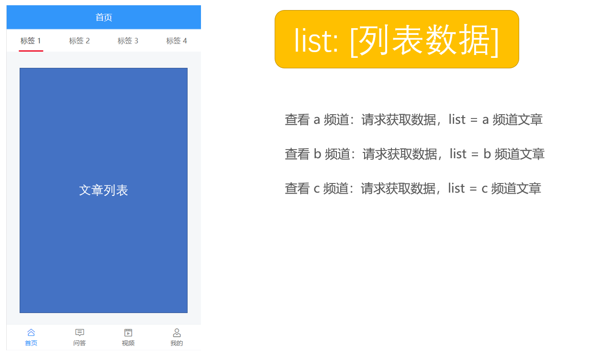
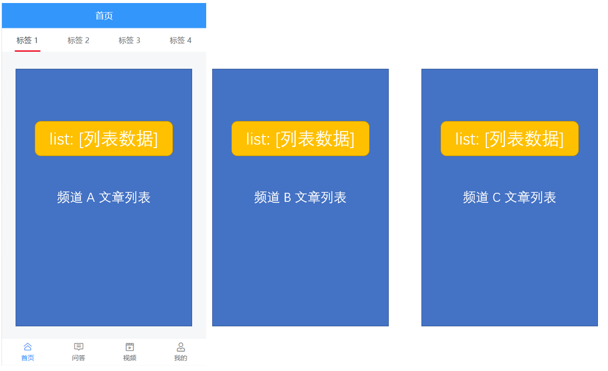
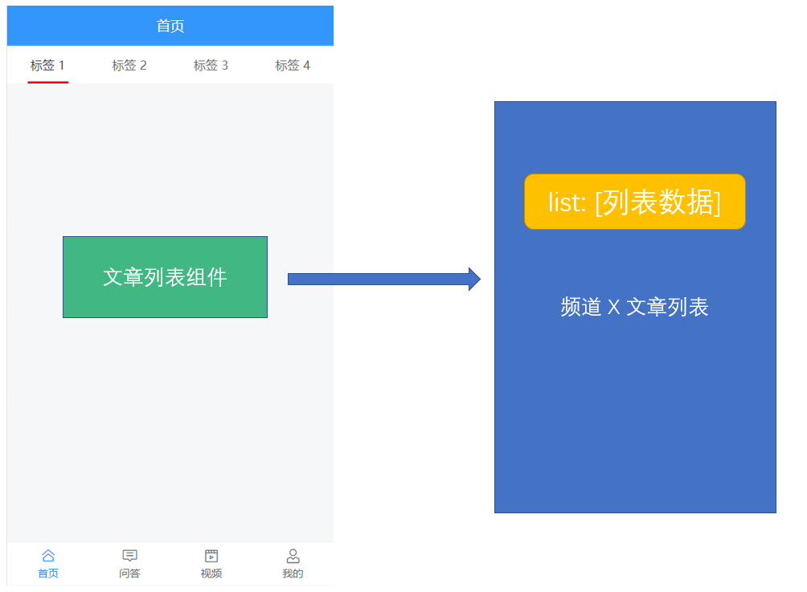

# 六、首页—文章列表


该模块主要处理两部分：

- 频道列表
- 频道的文章列表

## 布局

```html
<template>
  <div class="home-container">
    <!-- 导航栏 -->
    <div class="nav-bar">
      <div class="logo"></div>
      <van-button
        class="search-btn"
        round
        type="info"
        size="small"
        icon="search"
      >搜索</van-button>
    </div>
    <!-- /导航栏 -->

    <!-- 频道列表 -->
    <van-tabs v-model="active">
      <van-tab title="标签 1">
      	<!-- TODO: 文章列表 -->
      </van-tab>
      <van-tab title="标签 2">内容 2</van-tab>
      <van-tab title="标签 3">内容 3</van-tab>
      <van-tab title="标签 4">内容 4</van-tab>
    </van-tabs>
    <!-- /频道列表 -->
  </div>
</template>

<script>
export default {
  name: 'HomePage',
  components: {},
  props: {},
  data () {
    return {
      active: 0 // 控制标签页的激活项
    }
  },
  computed: {},
  watch: {},
  created () {},
  mounted () {},
  methods: {}
}
</script>

<style scoped lang="less">
.home-container {
  .nav-bar {
    position: fixed;
    top: 0;
    left: 0;
    right: 0;
    display: flex;
    justify-content: space-between;
    align-items: center;
    padding: 0 15px;
    height: 46px;
    background-color: #3196fa;
    z-index: 1;
    .logo {
      background: url("./logo-light.png") no-repeat;
      background-size: cover;
      width: 100px;
      height: 30px;
    }
    .search-btn {
      background-color: #5babfb;
      width: 50%;
    }
  }
}
</style>
```


## 展示频道列表

思路：

- 封装请求方法
- 请求获取数据
- 模板绑定

1、在 `src/api/channel.js` 中新增一个请求方法

```js
/**
 * 获取用户频道列表
 * 如果登录了：获取用户频道列表
 * 没有登录：获取默认推荐的频道列表
 */
export const getUserChannels = () => {
  return request({
    method: 'GET',
    url: '/app/v1_0/user/channels'
  })
}
```

2、在首页中请求获取数据

```js
+ import { getUserChannels } from '@/api/channel'

export default {
  name: 'HomePage',
  components: {},
  props: {},
  data () {
    return {
      active: 0,
+      userChannels: [] // 用户频道列表
    }
  },
  computed: {},
  watch: {},
  created () {
+    this.loadUserChannels()
  },
  mounted () {},
  methods: {
+++    async loadUserChannels () {
      const { data } = await getUserChannels()
      this.userChannels = data.data.channels
    }
  }
}
```

> 提示：代码写完以后在浏览器的调试工具中查看是否能够加载获取到 channels 数据，确保能正常获取到数据以后，再进行模板绑定。

3、拿到数据，渲染模板

```html
<!-- 频道标签列表 -->
<van-tabs v-model="active">
  <van-tab
    :title="channel.name"
    :key="channel.id"
    v-for="channel in channels"
  >
    <div>{{ channel.name }} 频道内容</div>
  </van-tab>
</van-tabs>
<!-- /频道标签列表 -->
```

## 文章列表

我们想要的功能是：

- 当查看某个频道的时候才初始加载
- 加载过的不要重新加载

就像手机版今日头条中的列表一样。



> 你的思路



> 多个列表



> 封装组件。

最好的方式就是封装组件，同样的外观，不同的数据。

### 文章列表组件

1、创建 `views/home/components/article-list.vue`

```html
<template>
  <div>{{ channel.name }}频道的文章列表</div>
</template>

<script>
export default {
  name: 'ArticleList',
  components: {},
  props: {
    // 频道对象，父组件提供
    channel: {
      type: Object,
      required: true
    }
  },
  data () {
    return {}
  },
  computed: {},
  watch: {},
  created () {},
  mounted () {},
  methods: {}
}
</script>

<style scoped></style>

```

2、在首页中注册使用

```html
<template>
  <div class="home-container">
    <!-- 导航栏 -->
    <van-nav-bar title="首页" />
    <!-- /导航栏 -->
    
    <!-- 频道列表 -->
    <van-tabs v-model="active">
      <van-tab
        :title="channel.name"
        v-for="channel in userChannels"
        :key="channel.id"
      >
+        <article-list :channel="channel" />
      </van-tab>
    </van-tabs>
    <!-- /频道列表 -->
  </div>
</template>

<script>
import { getUserChannels } from '@/api/user'
+ import ArticleList from './components/article-list'

export default {
  name: 'HomePage',
  components: {
+    ArticleList
  },
  ...
  ...
}
</script>

```


### 文章列表组件布局

这里主要使用到 [List 列表](https://youzan.github.io/vant/#/zh-CN/list) 组件，该组件支持上拉加载更多功能。

```html
<template>
  <van-list
    v-model="loading"
    :finished="finished"
    finished-text="没有更多了"
    @load="onLoad"
  >
    <van-cell
      v-for="(item, index) in list"
      :key="item"
      :title="item"
    />
  </van-list>
</template>

<script>
export default {
  name: 'ArticleList',
  components: {},
  props: {
    // 频道对象，父组件提供
    channel: {
      type: Object,
      required: true
    }
  },
  data () {
    return {
      list: [], // 列表数据
      loading: false,
      finished: false
    }
  },
  computed: {},
  watch: {},
  created () {},
  mounted () {},
  methods: {
    onLoad() {
      // 异步更新数据
      setTimeout(() => {
        for (let i = 0; i < 10; i++) {
          this.list.push(this.list.length + 1)
        }
        // 加载状态结束
        this.loading = false

        // 数据全部加载完成
        if (this.list.length >= 40) {
          this.finished = true
        }
      }, 500)
    }
  }
}
</script>
```

### 加载文章列表

实现思路：

- 封装获取数据接口
- 请求加载
- 模板绑定


1、创建 `src/api/article.js` 封装获取文章列表数据的接口

```js
/**
 * 文章接口模块
 */
import request from '@/utils/request'

/**
 * 获取频道的文章列表
 */
export const getArticles = params => {
  return request({
    method: 'GET',
    url: '/app/v1_1/articles',
    params
  })
}
```

> 注意：使用接口文档中最下面的 **频道新闻推荐\_V1.1**

2、然后在首页文章列表组件 `onload` 的时候请求加载文章列表

```html
<template>
  <van-list
    v-model="loading"
    :finished="finished"
    finished-text="没有更多了"
    @load="onLoad"
  >
    <van-cell
+      v-for="(article, index) in list"
+      :key="index"
+      :title="article.title"
    />
  </van-list>
</template>

<script>
+ import { getArticles } from '@/api/article'

export default {
  name: 'ArticleList',
  components: {},
  props: {
    // 频道对象，父组件提供
    channel: {
      type: Object,
      required: true
    }
  },
  data () {
    return {
      list: [], // 列表数据
      loading: false, // 上拉加载更多的 loading 状态
      finished: false, // 数据是否加载完毕
+      timestamp: null // 用于获取下一页数据的时间戳
    }
  },
  computed: {},
  watch: {},
  created () {},
  mounted () {},
  methods: {
+++    async onLoad () {
      // 1. 请求获取数据
      const { data } = await getArticles({
        channel_id: this.channel.id, // 频道id

        // 第1次使用 Date.now() 获取最新数据
        // 下一页的数据使用本次返回的数据中的 timestamp
        timestamp: this.timestamp || Date.now(), // 时间戳，请求新的推荐数据传当前的时间戳，请求历史推荐传指定的时间戳
        with_top: 1 // 是否包含置顶，进入页面第一次请求时要包含置顶文章，1-包含置顶，0-不包含
      })

      // 2. 把请求获取到的数据添加到数组列表中
      const results = data.data.results
      this.list.push(...results)

      // 3. 加载状态结束
      this.loading = false

      // 4. 数据全部加载完成
      if (results.length) {
        // 更新获取下一页数据的时间戳
        this.timestamp = data.data.pre_timestamp
      } else {
        // 没有数据了，把 finished 设置为 true，不再加载更多
        this.finished = true
      }
    }
  }
}
</script>

```

最后测试。


> 标签页组件本身就具有延迟渲染的功能：
>
> - 首次切换到标签时才触发内容渲染
> - 而且对于渲染过的就不再重新渲染

### 下拉刷新


这里主要使用到 Vant 中的 [PullRefresh 下拉刷新](https://youzan.github.io/vant/#/zh-CN/pull-refresh) 组件。

思路：

- 注册下拉刷新事件（组件）的处理函数
- 发送请求获取文章列表数据
- 把获取到的数据添加到当前频道的文章列表的顶部
- 提示用户刷新成功！

下拉刷新时会触发组件的 `refresh` 事件，在事件的回调函数中可以进行同步或异步操作，操作完成后将 `v-model` 设置为 `false`，表示加载完成。

```js
async onRefresh () {
  // 1. 请求获取数据
  const { data } = await getArticles({
    channel_id: this.channel.id, // 频道id
    timestamp: Date.now(), // 时间戳，请求新的推荐数据传当前的时间戳，请求历史推荐传指定的时间戳
    with_top: 1
  })

  // 2. 如果有最新数据，则把数据放到列表的顶部
  const { results } = data.data
  this.list.unshift(...results)

  // 3. 关闭下拉刷新的 loading 状态
  this.isLoading = false

  // 提示更新成功
  this.$toast(`更新了${results.length}条数据`)
}
```

## 样式调整

我们的需求：

- 头部固定定位
- 频道列表固定定位

1、让头部导航栏固定定位

```html
<van-nav-bar title="首页" fixed />
```

2、让频道列表固定定位

```less
.home-container {
  /deep/ .van-tabs__wrap {
    position: fixed;
    top: 46px;
    left: 0;
    right: 0;
    z-index: 1;
  }
}
```

> [关于 .vue 文件中的作用域样式](https://vue-loader.vuejs.org/zh/guide/scoped-css.html)

3、给页面容器添加上下内边距

```less
.home-container {
  padding-top: 90px;
  padding-bottom: 50px;
}
```


如果想要在父组件中影响子组件样式：

- 要么不要有作用域，那就是全局，影响任何组件

- 如果有作用域
  - 默认只能影响到自子组件的根节点
    - 审查元素找到子组件根节点类名使用
    - 或者手动给子组件添加一个 class，它会自动添加到子组件根节点的 class 中
  - 如果需要影响的更深，则使用深度选择器：`>>>`、`/deep/`、`::v-deep`
    - `>>>` 在 less、sass、stylus 等 CSS 预处理器中会报错
    - 所以建议使用 `/deep/` 或者 `::v-deep`

