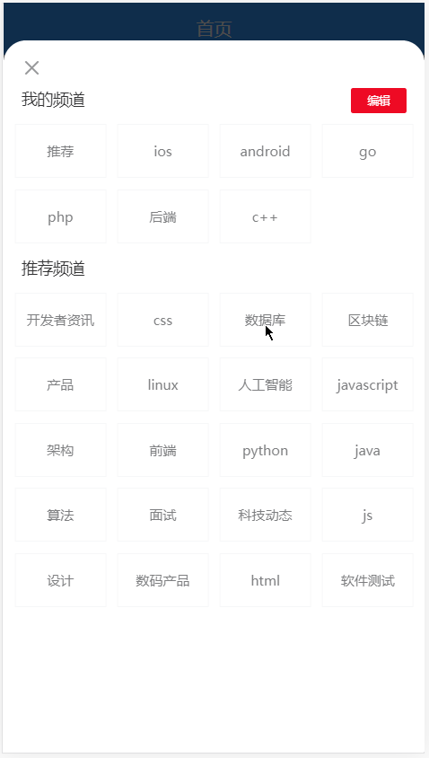

# 七、首页—频道编辑


## 准备

### 弹出层组件

Vant 中内置了 [Popup 弹出层](https://youzan.github.io/vant/#/zh-CN/popup) 组件。

1、在首页模板中的频道列表后面添加弹出层组件

```html
<van-popup
  v-model="isChannelEditShow"
  position="bottom"
  closeable
  close-icon-position="top-left"
  :style="{ height: '100%' }"
/>
```

2、然后在 `data`中添加一个数据用来控制弹层的显示和隐藏

```js
data () {
  return {
    ...
    isChannelEditShow: true // 这里我们先设置为 true 就能看到弹窗的页面了
  }
}
```

测试查看结果。

### 点击面包按钮展示弹出层

通过标签页的插槽插入一个面包菜单图标到频道列表中。

```html
<van-tabs v-model="active">
+  <van-icon
+    class="wap-nav"
+    slot="nav-right"
+    name="wap-nav"
+    @click="isChannelEditShow = true"
+  />
  <van-tab
    :title="channel.name"
    v-for="channel in userChannels"
    :key="channel.id"
  >
    <article-list :channel="channel" />
  </van-tab>
</van-tabs>
```

> 注意：我们这里是把面包按钮通过 van-tabs 组件的 nav-right 插槽插入进去的。

别忘了给它设置一下样式，定位到右侧不动：

```css
.wap-nav {
	position: fixed;
	right: 0;
	line-height: 44px;
	background: #fff;
}
```

测试查看结果。

### 频道编辑组件

1、创建 `views/home/components/channel-edit.vue`

```html
<template>
  <div class="channel-edit">频道编辑</div>
</template>

<script>
export default {
  name: 'ChannelEdit',
  components: {},
  props: {},
  data () {
    return {}
  },
  computed: {},
  watch: {},
  created () {},
  mounted () {},
  methods: {}
}
</script>

<style scoped></style>

```

2、在首页中加载注册

```js
import ChannelEdit from './components/channel-edit'
```

```js
export default {
  ...
  components: {
    ...
    ChannelEdit
  }
}
```


3、在弹出层中使用频道编辑组件

```html
<!-- 频道编辑 -->
<van-popup
  v-model="isChannelEditShow"
  position="bottom"
  closeable
  close-icon-position="top-left"
  :style="{ height: '100%' }"
>
+  <channel-edit />
</van-popup>
<!-- /频道编辑 -->
```


### 组件布局

```html
<template>
  <div class="channel-edit">
    <van-cell title="我的频道" :border="false">
      <van-button size="mini" round type="danger" plain>编辑</van-button>
    </van-cell>

    <van-grid :gutter="10">
      <van-grid-item
        v-for="value in 8"
        :key="value"
        text="文字"
      />
    </van-grid>

    <van-cell title="推荐频道" :border="false" />
    <van-grid :gutter="10">
      <van-grid-item
        v-for="value in 8"
        :key="value"
        text="文字"
      />
    </van-grid>
  </div>
</template>

<script>
export default {
  name: 'ChannelEdit',
  components: {},
  props: {},
  data () {
    return {}
  },
  computed: {},
  watch: {},
  created () {},
  mounted () {},
  methods: {}
}
</script>

<style scoped>
.channel-edit {
  padding: 40px 0;
}
</style>
```


## 展示我的频道

1、父组件给子组件传递数据

```html
<!-- 频道编辑 -->
<van-popup
  v-model="isChannelEditShow"
  position="bottom"
  closeable
  close-icon-position="top-left"
  :style="{ height: '100%' }"
>
  <channel-edit
+		:user-channels="userChannels"
	/>
</van-popup>
<!-- /频道编辑 -->
```


2、在子组件中声明接收父组件的 `userChannels` 频道列表数据并遍历展示

```html
<template>
  <div class="channel-edit">
    <van-cell title="我的频道" :border="false">
      <van-button size="mini" round type="danger" plain>编辑</van-button>
    </van-cell>

    <van-grid :gutter="10">
      <van-grid-item
+        v-for="channel in userChannels"
+        :key="channel.id"
+        :text="channel.name"
      />
    </van-grid>

    <van-cell title="推荐频道" :border="false" />
    <van-grid :gutter="10">
      <van-grid-item
        v-for="value in 8"
        :key="value"
        text="文字"
      />
    </van-grid>
  </div>
</template>

<script>
export default {
  name: 'ChannelEdit',
  components: {},
  props: {
+    userChannels: {
+      type: Array,
+      required: true
+    }
  },
  data () {
    return {}
  },
  computed: {},
  watch: {},
  created () {},
  mounted () {},
  methods: {}
}
</script>

<style scoped>
.channel-edit {
  padding: 40px 0;
}
</style>

```

> 简单写法：props: []
>
> 推荐写法：props: {}

## 展示推荐频道列表


没有用来获取推荐频道的数据接口，但是我们有获取所有频道列表的数据接口。

所以：`所有频道列表 - 我的频道 = 剩余推荐的频道`。

实现过程所以一共分为两大步：

- 获取所有频道
- 基于所有频道和我的频道计算获取剩余的推荐频道

### 获取所有频道

1、在 `src/api/channel.js` 中添加封装请求模块

```js
export const getAllChannels = () => {
  return request({
    method: 'GET',
    url: '/app/v1_0/channels'
  })
}
```

2、请求获取所有频道

```js
+ import { getAllChannels } from '@/api/channel'

export default {
  name: 'ChannelEdit',
  components: {},
  props: {
    userChannels: {
      type: Array,
      required: true
    }
  },
  data () {
    return {
+      allChannels: [] // 所有频道
    }
  },
  computed: {},
  watch: {},
  created () {
+    this.loadAllChannels()
  },
  mounted () {},
  methods: {
+    async loadAllChannels () {
+      const { data } = await getAllChannels()
+      this.allChannels = data.data.channels
+    }
  }
}
```


### 处理获取展示剩余推荐频道

思路：`剩余频道 = 所有频道 - 我的频道`

- 遍历所有频道
- 对每一个频道都判断：该频道是否属于我的频道
- 如果不属于我的频道，则收集起来
- 直到遍历结束，剩下来就是那些剩余的推荐频道

1、封装一个**计算属性**用来获取剩余频道

```js
computed: {
  remainingChannels () {
    const { allChannels, userChannels } = this
    // 剩余频道 = 所有频道 - 我的频道
    const channels = []
    // 遍历所有频道
    allChannels.forEach(item => {
      // 如果我的频道中不包含当前被遍历的频道，则要
      if (!userChannels.find(c => c.id === item.id)) {
        channels.push(item)
      }
    })
    return channels
  }
},
  
```

2、模板绑定进行展示

```html
<van-cell title="推荐频道" :border="false" />
<van-grid :gutter="10">
  <van-grid-item
    v-for="channel in remainingChannels"
    :key="channel.id"
    :text="channel.name"
  />
</van-grid>
```

## 添加频道



思路：

- 给推荐频道列表中每一项注册点击事件
- 获取点击的频道项
- 将频道项添加到我的频道中
- ~~将当前点击的频道项从推荐频道中移除~~
  - 不需要删除，因为我们获取数据使用的是计算属性，当我频道发生改变，计算属性重新求值了

1、给推荐频道中的频道注册点击事件

```html
<!-- 推荐频道 -->
<van-cell title="推荐频道" :border="false" />
<van-grid :gutter="10">
  <van-grid-item
    v-for="channel in recommendChannels"
    :key="channel.id"
    :text="channel.name"
    + @click="onChannelAdd(channel)"
  />
</van-grid>
<!-- /推荐频道 -->
```

2、在添加频道事件处理函数中

```js
onChannelAdd (channel) {
  // 将点击的频道项添加到我的频道列表中
  this.channels.push(channel)

  // 不需要删除，我的频道改变，计算属性 recommendChannels 重新调用求值
}
```

然后你会神奇的发现点击的那个推荐频道跑到我的频道中了，我们并没有去手动的删除点击的这个推荐频道，但是它没了！主要是因为推荐频道是通过一个计算属性获取的，计算属性中使用了 channels（我的频道）数据，所以只要我的频道中的数据发生变化，那么计算属性就会重新运算获取最新的数据。

## 编辑频道

### 处理编辑状态

1、在 data 中添加数据用来控制关闭按钮的显示隐藏

```js
data () {
  return {
    ...
    isEditShow: false
  }
}
```


2、通过组件插槽将关闭图标放到频道项中

```html
<van-grid :gutter="10" clickable>
  <van-grid-item
    v-for="(channel, index) in userChannels"
    :key="channel.id"
    :text="channel.name"
    @click="onUserChannelClick(index)"
  >
    <van-icon v-show="isEditShow && index !== 0" slot="icon" name="close" />
  </van-grid-item>
</van-grid>
```

3、将关闭的图标定位到频道项的右上角

```less
/deep/ .van-grid-item__icon-wrapper {
  position: absolute;
  top: -14px;
  right: -5px;
  .van-icon-close {
    font-size: 14px;
  }
}
```

4、处理编辑按钮

```html
<van-button
  size="mini"
  round
  type="danger"
  plain
  @click="isEditShow = !isEditShow"
>{{ isEditShow ? '完成' : '编辑'}}</van-button>
```

最后测试。

### 删除频道

两个功能需求：

- 切换频道
- 删除频道

1、给我的频道中的频道项注册点击事件

2、处理函数如下

```js
onUserChannelClick (index) {
  // 如果是编辑状态，则执行删除操作
  if (this.isEditShow && index !== 0) {
    this.userChannels.splice(index, 1) // 从索引处开始(包括索引本身)，删除指定的个数
  }
  // 如果是非编辑状态，则执行切换频道操作
}
```

最后测试结果。

### 切换频道

1、在父组件中

```html
<!--
  这里使用 v-model 绑定了 active 数据
		子组件在内部需要声明 value 属性接收使用
		子组件需要在内部通过 this.$emit('input', 数据) 修改该数据
-->
<channel-edit
  :user-channels="userChannels"
	:value="active"
	@input="active = $event"
  @close="isChannelEditShow = false"
/>

<!-- 这里的写法等价于上面的写法 -->
<channel-edit
  :user-channels="userChannels"
	v-model="active"
  @close="isChannelEditShow = false"
/>
```

> [在组件上使用 v-model]([https://cn.vuejs.org/v2/guide/components-custom-events.html#%E8%87%AA%E5%AE%9A%E4%B9%89%E7%BB%84%E4%BB%B6%E7%9A%84-v-model](https://cn.vuejs.org/v2/guide/components-custom-events.html#自定义组件的-v-model))

2、然后在子组件中切换频道

```js
onUserChannelClick (index) {
  // 如果是编辑状态，则删除频道
  if (this.isEditShow) {
    this.userChannels.splice(index, 1)
  } else {
    // 如果是非编辑状态，则切换频道
    this.$emit('input', index) // 修改激活的标签
    this.$emit('close') // 关闭弹层
  }
}
```

3、最后测试结果

## 频道数据持久化

正常的话我们需要调用接口对数据进行持久化存储，但是这里的项目接口暂时有问题。

我们这里先用本地存储来处理一下。

1、当我们添加或是删除频道的时候都需要对频道数据进行持久化，一种方式就是在分别在添加和删除或者比的修改 channels 数据变化的地方调用本次存储存储数据；一种方式，我们可以使用 Vue 中的 watch 功能来监视频道数据的变化，当数据发生改变，就把数据重新存储到本地存储。

```js
import { getItem, setItem } from "@/utils/storage";
```

```js
watch: {
  // 当 userChannels 发生改变的时候，将该数据存储到本地存储
  userChannels () {
    setItem('user-channels', this.userChannels)
  }
},
```

2、因为我们把数据持久化到了本次存储，所以我们需要在页面初始化的时候优先从本地存储来获取频道数据

```js
// 简单一句话：优先使用本地的，没有就使用线上的
async loadUserChannels () {
  // 1. 定义一个变量用来存储频道列表
  let channels = []

  // 2. 获取本地存储的频道列表
  const localUserChannles = getItem('user-channels')

  // 3. 如果本地存储有，就使用本地存储的
  if (localUserChannles) {
    channels = localUserChannles
  } else {
    // 4. 如果本地存储没有，则请求获取接口推荐的频道列表
    const { data } = await getUserChannels()
    channels = data.data.channels
  }

  // 5. 最后，把数据赋值到当前组件中
  this.userChannels = channels
}
```
