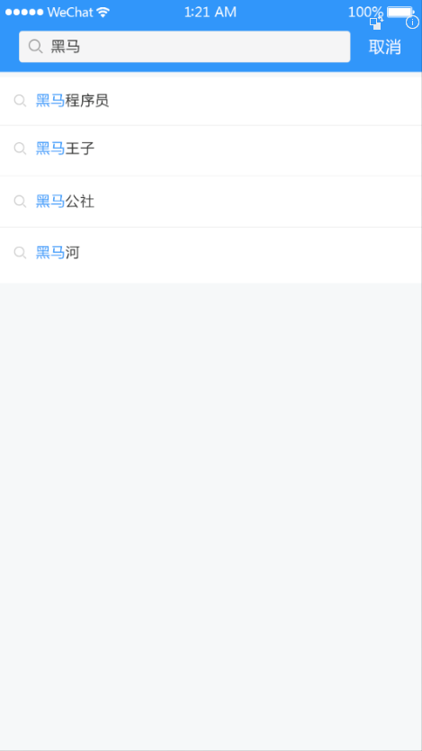
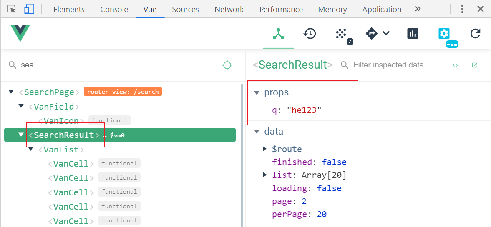

# 八、文章搜索




## 准备

### 创建组件并配置路由

1、创建 `src/views/search/index.vue`

```html
<template>
  <div class="search-container">搜索页面</div>
</template>

<script>
  export default {
    name: "SearchPage",
    components: {},
    props: {},
    data() {
      return {};
    },
    computed: {},
    watch: {},
    created() {},
    methods: {}
  };
</script>

<style scoped></style>
```

2、然后把搜索页面的路由配置到根组件路由（一级路由）

```js
{
  path: '/search',
  omponent: Search
}
```

最后访问 `/search` 测试。

### 页面布局

```html
<template>
  <div class="search-container">
    <!-- 搜索栏 -->
    <form action="/">
      <van-search
        v-model="searchContent"
        placeholder="请输入搜索关键词"
        show-action
				background="#3296fa"
        @search="onSearch"
        @cancel="onCancel"
      />
    </form>
    <!-- /搜索栏 -->

    <!-- 联想建议 -->
    <van-cell-group>
      <van-cell icon="search" title="单元格" />
      <van-cell icon="search" title="单元格" />
      <van-cell icon="search" title="单元格" />
      <van-cell icon="search" title="单元格" />
      <van-cell icon="search" title="单元格" />
      <van-cell icon="search" title="单元格" />
    </van-cell-group>
    <!-- /联想建议 -->

    <!-- 历史记录 -->
    <van-cell title="历史记录">
      <van-icon name="delete" />
      <span>全部删除</span>
      &nbsp;&nbsp;
      <span>完成</span>
    </van-cell>
    <van-cell-group>
      <van-cell title="单元格">
        <van-icon name="close"></van-icon>
      </van-cell>
      <van-cell title="单元格">
        <van-icon name="close"></van-icon>
      </van-cell>
      <van-cell title="单元格">
        <van-icon name="close"></van-icon>
      </van-cell>
      <van-cell title="单元格">
        <van-icon name="close"></van-icon>
      </van-cell>
      <van-cell title="单元格">
        <van-icon name="close"></van-icon>
      </van-cell>
    </van-cell-group>
    <!-- /历史记录 -->

    <!-- 搜索结果 -->
    <van-list
      v-model="loading"
      :finished="finished"
      finished-text="没有更多了"
      @load="onLoad"
    >
      <van-cell
        v-for="item in list"
        :key="item"
        :title="item"
      />
    </van-list>
    <!-- /搜索结果 -->
  </div>
</template>

<script>
export default {
  name: 'SearchPage',
  components: {},
  props: {},
  data () {
    return {
      searchContent: '', // 搜索内容
      list: [],
      loading: false,
      finished: false
    }
  },
  computed: {},
  watch: {},
  created () {},
  mounted () {},
  methods: {
    onSearch () {
      console.log('onSearch')
    },
    onCancel () {
      console.log('onCancel')
    },

    onLoad () {
      // 异步更新数据
      setTimeout(() => {
        for (let i = 0; i < 10; i++) {
          this.list.push(this.list.length + 1)
        }
        // 加载状态结束
        this.loading = false

        // 数据全部加载完成
        if (this.list.length >= 40) {
          this.finished = true
        }
      }, 500)
    }
  }
}
</script>

<style scoped lang="less">
.search-container {
  padding-top: 54px;
  // 让搜索栏固定在顶部
  .search-form {
    position: fixed;
    top: 0;
    left: 0;
    right: 0;
    z-index: 1;
  }
  .van-search__action {
    color: #fff;
  }
}
</style>

```


## 处理(历史记录/联想建议/搜索结果)显示状态

1、在 `data` 中添加数据用来控制搜索结果的显示状态

```js
data () {
  ...
  isResultShow: false
}
```

2、在模板中绑定条件渲染

```html
<!-- 搜索结果 -->
<search-result v-if="isResultShow" />
<!-- /搜索结果 -->

<!-- 联想建议 -->
<van-cell-group v-else-if="searchText">
  ...
</van-cell-group>
<!-- /联想建议 -->

<!-- 历史记录 -->
<van-cell-group v-else>
  ...
</van-cell-group>
<!-- /历史记录 -->
```


## 搜索联想建议

思路：

- 当搜索输入变化的时候，请求加载联想建议的数据
- 将请求得到的结果绑定到模板中

1、封装数据接口，创建 `api/serach.js`

```js
export const getSuggestions = q => {
  return request({
    method: 'GET',
    url: '/app/v1_0/suggestion',
    params: {
      q
    }
  })
}
```

2、给搜索组件注册 `input` 事件

3、在事件处理函数中请求获取数据

```js
import SearchResult from './components/search-result'
+ import { getSuggestions } from '@/api/search'

export default {
  name: 'SearchPage',
  components: {
    SearchResult
  },
  props: {},
  data () {
    return {
      searchText: '',
      isResultShow: false,
+      suggestions: [] // 联想建议列表
    }
  },
  computed: {},
  watch: {},
  created () {},
  mounted () {},
  methods: {
    onSearch () {
      this.isResultShow = true
    },

+++    async onSearchInput () {
      const searchText = this.searchText
      if (!searchText) {
        return
      }
      const { data } = await getSuggestions(searchText)
      this.suggestions = data.data.options
    }
  }
}
```

4、模板绑定

```html
<!-- 联想建议 -->
<van-cell-group v-else-if="searchText">
  <van-cell
    :title="item"
    icon="search"
    :key="index"
    v-for="(item, index) in suggestions"
  />
</van-cell-group>
<!-- /联想建议 -->
```

### 搜索关键字高亮

如何将字符串中的指定字符在**网页**中高亮展示？

```js
"Hello World";
```

将需要高亮的字符包裹 HTML 标签，为其单独设置颜色。

```js
"Hello <span style="color: red">World</span>"
```

在 Vue 中如何渲染带有 HTML 标签的字符串？

```js
data () {
  return {
    htmlStr: 'Hello <span style="color: red">World</span>'
  }
}
```


```html
<div>{{ htmlStr }}</div>
<div v-html="htmlStr"></div>
```


如何把字符串中指定字符统一替换为高亮（包裹了 HTML）的字符？

```js
const str = "Hello World"

// 结果：<span style="color: red">Hello</span> World
"Hello World".replace('Hello', '<span style="color: red">Hello</span>')

// 需要注意的是，replace 方法的字符串匹配只能替换第1个满足的字符
// <span style="color: red">Hello</span> World Hello abc
"Hello World Hello abc".replace('Hello', '<span style="color: red">Hello</span>')

// 如果想要全文替换，使用正则表达式
// g 全局
// i 忽略大小写
// <span style="color: red">Hello</span> World <span style="color: red">Hello</span> abc
"Hello World Hello abc".replace(/Hello/gi, '<span style="color: red">Hello</span>')
```

> 一个小扩展：使用字符串的 split 结合数组的 join 方法实现高亮
>
> ```js
> var str = "hello world 你好 hello";
>
> // ["", " world 你好 ", ""]
> const arr = str.split("hello");
>
> // "<span>hello</span> world 你好 <span>hello</span>"
> arr.join("<span>hello</span>");
> ```

下面是具体的处理。

1、在 methods 中添加一个方法处理高亮

```js
// 参数 source: 原始字符串
// 参数 keyword: 需要高亮的关键词
// 返回值：替换之后的高亮字符串
highlight (source, keyword) {
  // /searchContent/ 正则表达式中的一切内容都会当做字符串使用
  // 这里可以 new RegExp 方式根据字符串创建一个正则表达式
  // RegExp 是原生 JavaScript 的内置构造函数
  // 参数1：字符串，注意，这里不要加 //
  // 参数2：匹配模式，g 全局，i 忽略大小写
  const reg = new RegExp(keyword, 'gi')
  return source.replace(reg, `<span style="color: #3296fa">${keyword}</span>`)
},
```

2、然后在联想建议列表项中绑定调用

```html
<!-- 联想建议 -->
<van-cell-group v-else-if="searchContent">
  <van-cell
    icon="search"
    v-for="(item, index) in suggestions"
    :key="index"
    @click="onSearch(item)"
  >
    <div slot="title" v-html="highlight(item, searchContent)"></div>
  </van-cell>
</van-cell-group>
<!-- /联想建议 -->
```


### 防抖处理（最后处理）

1、安装 lodash

```sh
# yarn add lodash
npm i lodash
```

2、防抖处理

```js
// lodash 支持按需加载，有利于打包结果优化
import { debounce } from "lodash"
```

> 不建议下面这样使用，因为这样会加载整个模块。
>
> ```js
> import _ from 'lodash'
> _.debounce()
> ```

```js
// debounce 函数
// 参数1：函数
// 参数2：防抖时间
// 返回值：防抖之后的函数，和参数1功能是一样的
onSearchInput: debounce(async function () {
  const searchContent = this.searchContent
  if (!searchContent) {
    return
  }

  // 1. 请求获取数据
  const { data } = await getSuggestions(searchContent)

  // 2. 将数据添加到组件实例中
  this.suggestions = data.data.options

  // 3. 模板绑定
}, 200),
```

## 搜索结果

思路：

- 请求获取数据
- 将数据展示到模板中

一、获取搜索关键字

1、声明接收父组件中的搜索框输入的内容

```js
props: {
  q: {
    type: String,
    require: true
  }
},
```


2、在父组件给子组件传递数据

```html
<!-- 搜索结果 -->
<search-result v-if="isResultShow" :q="searchText" />
<!-- /搜索结果 -->
```


最后在调试工具中查看确认是否接收到 props 数据。



二、请求获取数据

1、在 `api/serach.js` 添加封装获取搜索结果的请求方法

```js
/**
 * 获取搜索结果
 */
export function getSearch(params) {
  return request({
    method: "GET",
    url: "/app/v1_0/search",
    params
  })
}
```

2、请求获取

```js
+ import { getSearch } from '@/api/search'

export default {
  name: 'SearchResult',
  components: {},
  props: {
    q: {
      type: String,
      require: true
    }
  },
  data () {
    return {
      list: [],
      loading: false,
      finished: false,
+      page: 1,
+      perPage: 20
    }
  },
  computed: {},
  watch: {},
  created () {},
  mounted () {},
  methods: {
+++    async onLoad () {
      // 1. 请求获取数据
      const { data } = await getSearch({
        page: this.page, // 页码
        per_page: this.perPage, // 每页大小
        q: this.q // 搜索关键字
      })

      // 2. 将数据添加到列表中
      const { results } = data.data
      this.list.push(...results)

      // 3. 设置加载状态结束
      this.loading = false

      // 4. 判断数据是否加载完毕
      if (results.length) {
        this.page++ // 更新获取下一页数据的页码
      } else {
        this.finished = true // 没有数据了，将加载状态设置结束，不再 onLoad
      }
    }
  }
}
```

三、最后，模板绑定

```html
<van-list
  v-model="loading"
  :finished="finished"
  finished-text="没有更多了"
  @load="onLoad"
>
  <van-cell
+    v-for="(article, index) in list"
+    :key="index"
+    :title="article.title"
  />
</van-list>
```

## 搜索历史记录

### 添加历史记录

当发生搜索的时候我们才需要记录历史记录。

1、在 data 中添加一个数据用来存储历史记录

```js
data () {
  return {
    ...
    searchHistories: []
  }
}
```

2、在触发搜索的时候，记录历史记录

```js
onSearch (q) {
  // 1. 更新搜索文本框的数据
  this.searchContent = q

  // 2. 记录搜索历史记录
  const searchHistories = this.searchHistories
  const index = searchHistories.indexOf(q)
  if (index !== -1) {
    searchHistories.splice(index)
  }
  searchHistories.unshift(q)

  // 3. 展示搜索结果
  this.isSearchResultShow = true
},
```


### 展示历史记录

```html
<!-- 历史记录 -->
<van-cell-group v-else>
  <van-cell title="历史记录">
    <van-icon name="delete" />
    <span>全部删除</span>
    &nbsp;&nbsp;
    <span>完成</span>
  </van-cell>
  <van-cell
    :title="item"
    v-for="(item, index) in searchHistories"
    :key="index"
  >
    <van-icon name="close"></van-icon>
  </van-cell>
</van-cell-group>
<!-- /历史记录 -->
```


### 删除历史记录

一、处理删除相关元素的展示状态

1、在 data 中添加一个数据用来控制删除相关元素的显示状态

```js
data () {
  return {
    ...
    isDeleteShow: false
  }
}
```

2、绑定使用

```html
<!-- 历史记录 -->
<van-cell-group v-else>
  <van-cell title="历史记录">
    <template v-if="isDeleteShow">
      <span @click="searchHistories = []">全部删除</span>
      &nbsp;&nbsp;
      <span @click="isDeleteShow = false">完成</span>
    </template>
    <van-icon v-else name="delete" @click="isDeleteShow = true"></van-icon>
  </van-cell>
  <van-cell
    :title="item"
    v-for="(item, index) in searchHistories"
    :key="index"
    @click="onSearch(item)"
  >
    <van-icon
      v-show="isDeleteShow"
      name="close"
      @click="searchHistories.splice(index, 1)"
    ></van-icon>
  </van-cell>
</van-cell-group>
<!-- /历史记录 -->
```

二、处理删除操作

```html
<!-- 历史记录 -->
<van-cell-group v-else>
  <van-cell title="历史记录">
    <template v-if="isDeleteShow">
+      <span @click="searchHistories = []">全部删除</span>
      &nbsp;&nbsp;
      <span @click="isDeleteShow = false">完成</span>
    </template>
    <van-icon v-else name="delete" @click="isDeleteShow = true" />
  </van-cell>
  <van-cell
    :title="item"
    v-for="(item, index) in searchHistories"
    :key="index"
+    @click="onHistoryClick(item, index)"
  >
    <van-icon v-show="isDeleteShow" name="close"></van-icon>
  </van-cell>
</van-cell-group>
<!-- /历史记录 -->
```

```js
onHistoryClick (item, index) {
  // 如果是删除状态，则执行删除操作
  if (this.isDeleteShow) {
    this.searchHistories.splice(index, 1)
  } else {
    // 否则执行搜索操作
    this.onSearch(item)
  }
}
```

### 数据持久化

1、利用 watch 监视统一存储数据

```js
watch: {
  searchHistories (val) {
    // 同步到本地存储
    setItem('serach-histories', val)
  }
},
```


2、初始化的时候从本地存储获取数据

```js
data () {
  return {
    ...
    searchHistories: getItem('serach-histories') || [],
  }
}
```


## 扩展：函数防抖和函数节流

干嘛的？限制函数调用的频率。

为什么要限制？例如搜索的时候请求联想建议，没必要每次内容改变就发请求，当用户输入的很快的时候，中间的请求都是无意义的，浪费资源，没必要。

### 函数防抖（Debounce）

**概念：** `在事件被触发n秒后再执行，如果在这n秒内又被触发，则重新计时。`

**生活中的实例：** `如果有人进电梯（触发事件），那电梯将在10秒钟后出发（执行事件监听器），这时如果又有人进电梯了（在10秒内再次触发该事件），我们又得等10秒再出发（重新计时）。`

我们先使用第三方包 [lodash]() 来体验什么是函数防抖：

首先把 lodash 安装到项目中：

```sh
# yarn add lodash
npm i lodash
```

示例：

```html
<!DOCTYPE html>
<html lang="en">
  <head>
    <meta charset="UTF-8" />
    <meta name="viewport" content="width=device-width, initial-scale=1.0" />
    <meta http-equiv="X-UA-Compatible" content="ie=edge" />
    <title>Document</title>
  </head>
  <body>
    <script src="./node_modules/lodash/lodash.js"></script>
    <script>
      // lodash 会在全局提供一个成员：_

      // _ 对象中有很多方法，其中有一个方法专门用于处理函数防抖
      // 方法名：debounce
      // 作用：函数防抖
      // 使用方式：

      function fn(foo) {
        console.log("hello", foo);
      }

      // 正常的函数调用：立即调用，而且是一定会调用
      // fn()
      // fn()
      // fn()

      // 我们可以使用函数防抖把一个正常的函数变得不正常
      // 两个参数：
      //   参数1：函数
      //   参数2：时间，单位是毫秒
      // 返回值：函数
      //   返回值函数的功能和 fn 和的功能是一样
      //   唯一的区别就是经过了防抖处理
      const newFn = _.debounce(fn, 1000);

      // 计时 1s
      newFn("a");

      // 当你不到 1s 的时候，再次调用
      // 先把之前的废掉，重新计时 1s
      newFn("b");

      newFn("b");
      newFn("b");
      // newFn()

      // he
    </script>
  </body>
</html>
```

### 函数防抖实现原理

函数防抖的实现原理：

```js
function fn(foo) {
  console.log("hello", foo);
}

const newFn = debounce(fn, 1000);

// 计时 1s
newFn(123);

// 如果在 1s 之内重新调用
//   先把之前的废除
//   重新计时
newFn("world");
// newFn()

function debounce(callback, time) {
  let timer = null;
  // 函数参数中的 ... 表示接收剩余参数
  // 它会把所有的参数收集到一个数组中
  return function(...args) {
    console.log(args);
    window.clearTimeout(timer);
    timer = setTimeout(() => {
      // 这里的 ... 表示数组展示操作符
      // args[0], args[1], args[2] .........
      callback(...args);
    }, time);
  };
}
```

### 函数节流（Throttle）

**概念：** `规定一个单位时间，在这个单位时间内，只能有一次触发事件的回调函数执行，如果在同一个单位时间内某事件被触发多次，只有一次能生效。`

生活中的例子：`函数节流就是开枪游戏的射速，就算一直按着鼠标射击，也只会在规定射速内射出子弹。`

我们先用 lodash 来体验节流的使用方式：

```js
function fn() {
  console.log("------ fire ------");
}

// 参数1：函数
// 参数2：间隔时间
// 返回值：函数（它的功能和保证的 fn 的功能是一样的，但是被进行了节流处理）
// 第1次直接调用，之后的按照一定频率进行调用
const newFn = _.throttle(fn, 2000);

// newFn()
// newFn()

setInterval(() => {
  console.log("鼠标点击");
  newFn();
}, 200);

// 一上来就调用一次
// newFn()

// // 之后的调用，开始计时 1s
// newFn()

// // 1s 之内所有的调用只有1次
// newFn()
// newFn()
// newFn()
// newFn()
// newFn()
```

### 函数节流实现原理

```js
function throttle(callback, interval) {
  // 最后一次的调用时间
  let lastTime = 0;

  // 定时器
  let timer = null;

  // 返回一个函数
  return function() {
    // 清除定时器
    clearTimeout(timer);

    // 当前最新时间
    let nowTime = Date.now();

    // 如果当前最新时间 - 上一次时间 >= 时间间隔
    // 或者没有上一次时间，那就立即调用
    if (nowTime - lastTime >= interval) {
      callback();

      // 记录最后一次的调用时间
      // 1
      lastTime = nowTime;
    } else {
      timer = setTimeout(() => {
        callback();
      }, interval);
    }
  };
}

const fn = throttle(函数, 1000);

//
fn();

fn();

fn();
```

### 函数节流或者防抖的相关场景

- 建议
- window.resize 事件处理
- 页面的滚动事件

### 总结

- 函数防抖和函数节流都是防止某一时间频繁触发，但是这两兄弟之间的特性却不一样。
  - search 搜索联想，用户在不断输入值时，用防抖来节约请求资源。
  - window 触发 resize 的时候，不断的调整浏览器窗口大小会不断的触发这个事件，用防抖来让其只触发一次
- 函数防抖是某一段时间内只执行一次，而函数节流是间隔时间执行。
  - 鼠标不断点击触发，mousedown(单位时间内只触发一次)
  - 监听滚动事件，比如是否滑到底部自动加载更多，用 throttle 来判断

## 扩展：lodash 函数库

lodash 是一个常用工具函数库，它里面封装了好多常用的工具函数：

- 官方文档： https://lodash.com/
- 翻译的中文文档：https://www.lodashjs.com/

> 在 lodash 之前还有一个 JavaScript 工具函数库：[underscore](https://underscorejs.org/)，lodash 模仿 underscope 自己重新实现了一遍，它相比 underscore 最大的好处是它支持按需加载。
>
> underscope 不支持按需加载。

