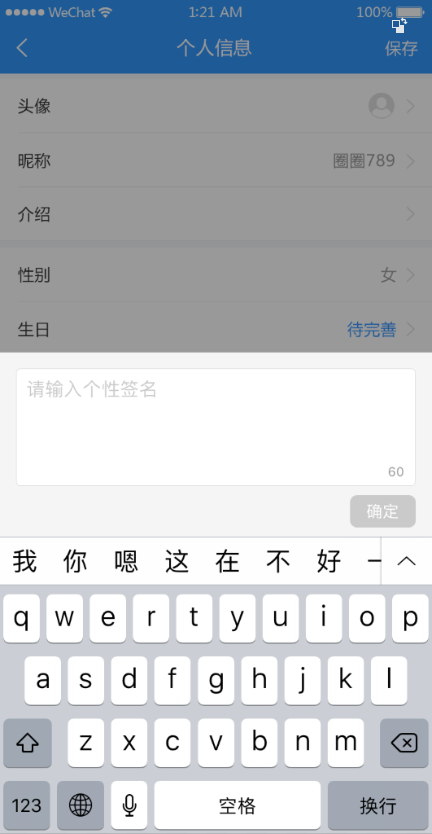

# 十一、编辑用户资料



## 准备

### 创建组件并配置路由

1、创建 `views/user/index.vue`

```html
<template>
  <div>
    <van-nav-bar title="个人信息" left-arrow right-text="保存" />
    <van-cell-group>
      <van-cell title="头像" is-link>
        <van-image
          round
          width="30"
          height="30"
          fit="cover"
          src="http://toutiao.meiduo.site/FgSTA3msGyxp5-Oufnm5c0kjVgW7"
        />
      </van-cell>
      <van-cell title="昵称" value="abc" is-link />
      <van-cell title="性别" value="男" is-link />
      <van-cell title="生日" value="2019-9-27" is-link />
    </van-cell-group>
  </div>
</template>

<script>
  export default {
    name: "UserIndex"
  };
</script>
```

2、将该页面配置到根路由

```js
{
  name: 'user-profile',
  path: '/user/profile',
  component: () => import('@/views/user-profile')
}
```

### 布局

```html

```

## 展示用户资料

思路：

- 请求获取数据
- 模板绑定

1、在 `api/user.js` 中添加封装数据接口

```js
// 获取用户资料
export const updateUserPhoto = data => {
  return request({
    method: 'PATCH',
    url: '/app/v1_0/user/photo',
    data
  })
}
```

2、在 `views/user/index.vue` 组件中请求获取数据

```js
import { getUserProfile } from '@/api/user'

export default {
  name: 'UserProfile',
  components: {},
  props: {},
  data () {
    return {
      user: {}, // 用户资料
      isPreviewShow: false,
      images: [] // 预览的图片列表
    }
  },
  computed: {},
  watch: {},
  created () {
    this.loadUserProfile()
  },
  mounted () {},
  methods: {
    async loadUserProfile () {
      try {
        const { data } = await getUserProfile()
        this.user = data.data
      } catch (err) {
        console.log(err)
        this.$toast.fail('获取数据失败')
      }
    }
  }
}
```

3、模板绑定

## 修改头像

思路：

一、点击选择文件

二、图片预览

三、保存修改

### 点击选择文件

1、在模板中添加一个 file 类型的 input

```html
<input ref="file" type="file" hidden>
```

> 提示
>
> 如果是移动端，则会提示用户拍照、照片、文件

2、当点击头像的时候手动调用 input 的 click 点击事件

```html
<van-cell is-link title="头像" @click="onAvatarClick">
  <van-image
    class="avatar"
    round
    :src="user.photo"
  />
</van-cell>
```

```js
onAvatarClick () {
  // 手动触发 input 的点击事件
  this.$refs['file'].click()
},
```

最后测试。

### 图片上传预览

方式一：结合服务器的图片上传预览

- 优点：兼容好
- 缺点：麻烦，需要结合服务端


方式二：纯客户端实现上传图片预览

- 优点：简单方便
- 缺点：兼容性

```js
// 获取文文件对象
const file = file类型input.files[0]

// 设置图片的 src
img.src = window.URL.createObjectURL(file)
```


下面我们使用纯客户端的方式处理用户头像上传预览。

1、在模板中添加预览组件

```html
<!-- 头像预览 -->
<van-image-preview v-model="isPreviewShow" :images="images">
  <van-nav-bar
    slot="cover"
    left-text="取消"
    right-text="确定"
    @click-left="isPreviewShow = false"
    @click-right="onUpdateAvatar"
  />
</van-image-preview>
<!-- /头像预览 -->
```

```js
data {
  ...
  isPreviewShow: false, // 是否显示图片预览
  images: [] // 预览的图片列表
}
```

2、给 file-input 注册 change 事件

```html
<input ref="file" type="file" hidden @change="onFileChange">
```

change 事件只有在用户所选的文件发生变化之后会出触发，如果选择了同一个文件不会触发。所以为了解决该问题，我们可以在图片预览关闭的时候，手动将 file-input 的 value 清除。

```html
<!-- 头像预览 -->
    <van-image-preview v-model="isPreviewShow" :images="images" @close="$refs.file.value = ''">
      <van-nav-bar
        slot="cover"
        left-text="取消"
        right-text="确定"
        @click-left="isPreviewShow = false"
        @click-right="onUpdateAvatar"
      />
    </van-image-preview>
    <!-- /头像预览 -->
```


3、在事件处理函数中

```js
onFileChange () {
  // 1. 拿到 file 类型 input 选择的文件对象
  const fileObj = this.file.files[0]

  // 2. 使用 window.URL.createObjectURL(file) 得到文件数据
  const fileData = window.URL.createObjectURL(fileObj)

  // 3. 将 img.src = 第2步的结果
  this.images = [fileData] // 这里直接重置数组，防止出现多个预览图片
  this.isPreviewShow = true // 显示图片预览
},
```

最后测试。

### 保存更新

1、在 `api/user.js` 中添加封装数据接口

```js
/**
 * 更新用户头像
 */
export function updateUserPhoto (data) {
  return request({
    method: 'PATCH',
    url: '/app/v1_0/user/photo',
    data
  })
}

```

> 总结：
>
> - 如果 `Content-Type` 是 `application/json`，则传递普通 JavaScript 对象，例如 `{}`
> - 如果 `Content-Type` 是 `multipart/form-data`，则传递 [FormData](https://developer.mozilla.org/zh-CN/docs/Web/API/FormData) 对象，这种情况常见于文件上传的数据接口。

2、给图片预览中的确定注册点击事件

3、在事件处理函数中

```js
async onUpdateAvatar () {
  // 1. 构造包含文件数据的表单对象 FormData
  // 注意：含有文件的数据务必要放到 FormData 中
  const fd = new FormData()
  fd.append('photo', this.file.files[0])

  this.$toast.loading({
    duration: 0, // 持续展示 toast
    message: '保存中...',
    forbidClick: true // 是否禁止背景点击
  })

  // 2. 请求提交
  try {
    const { data } = await updateUserPhoto(fd)

    // 更新页面
    this.user.photo = data.data.photo

    // 关闭图片预览
    this.isPreviewShow = false

    this.$toast.success('更新成功')
  } catch (err) {
    console.log(err)
    this.$toast.fail('更新失败')
  }

  // 3. 根据响应结果执行后续处理
}
```


## 修改昵称

### 布局

### 更新

1、封装 API 请求方法

```js
// 更新用户资料
export const updateUserProfile = data => {
  return request({
    method: 'PATCH',
    url: '/app/v1_0/user/profile',
    data
  })
}
```


2、封装业务请求(更新用户昵称、性别、生日等都使用该方法)

```js
// field: 要修改的数据字段
// value：数据值
async updateUserProfile (field, value) {
  this.$toast.loading({
    duration: 0, // 持续展示 toast
    message: '更新中...',
    forbidClick: true // 是否禁止背景点击
  })

  try {
    await updateUserProfile({
      [field]: value // 注意属性名使用中括号包裹，否则会当做字符串来使用而不是变量
    })
    this.$toast.success('更新成功')
  } catch (err) {
    console.log(err)
    this.$toast.fail('更新失败')
  }
},
```


3、注册确定按钮点击事件

4、在事件处理函数中

```js
async onUpdateName () {
  // 请求提交表单
  await this.updateUserProfile('name', this.inputName)

  // 更新视图
  this.user.name = this.inputName

  // 关闭弹层
  this.isEditNameShow = false
}
```


## 修改性别

## 修改生日


