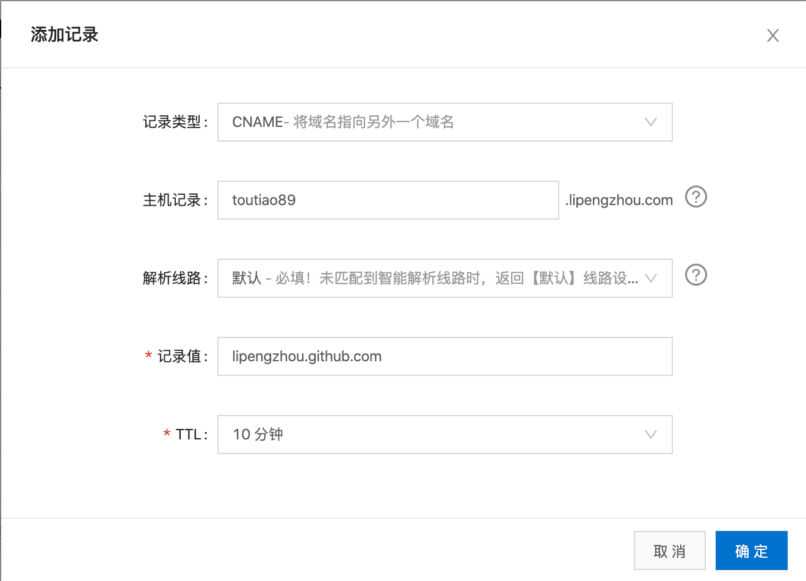
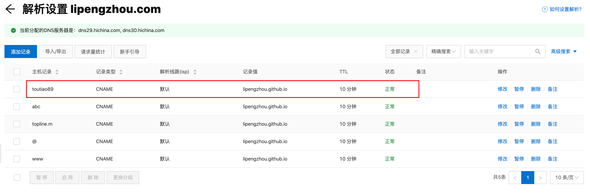
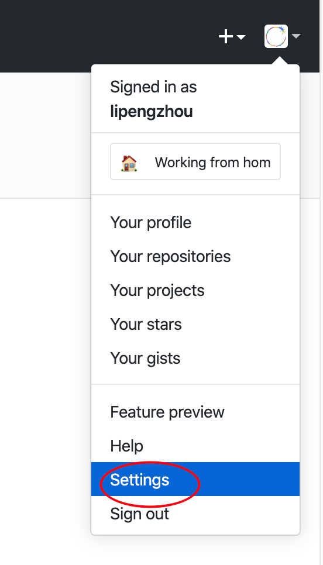
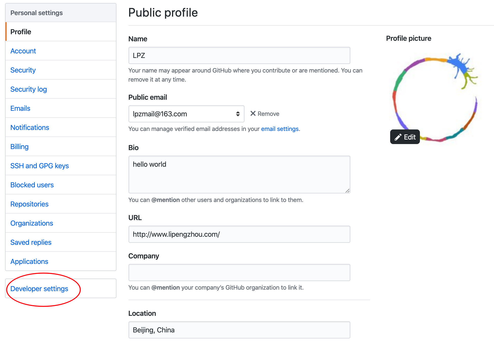
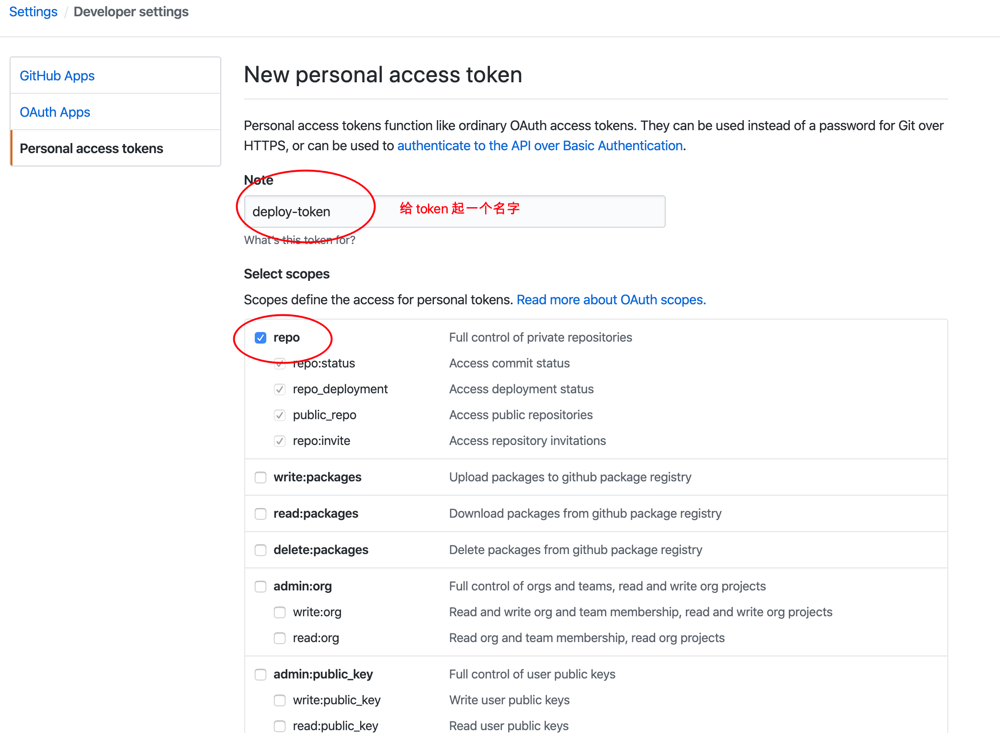
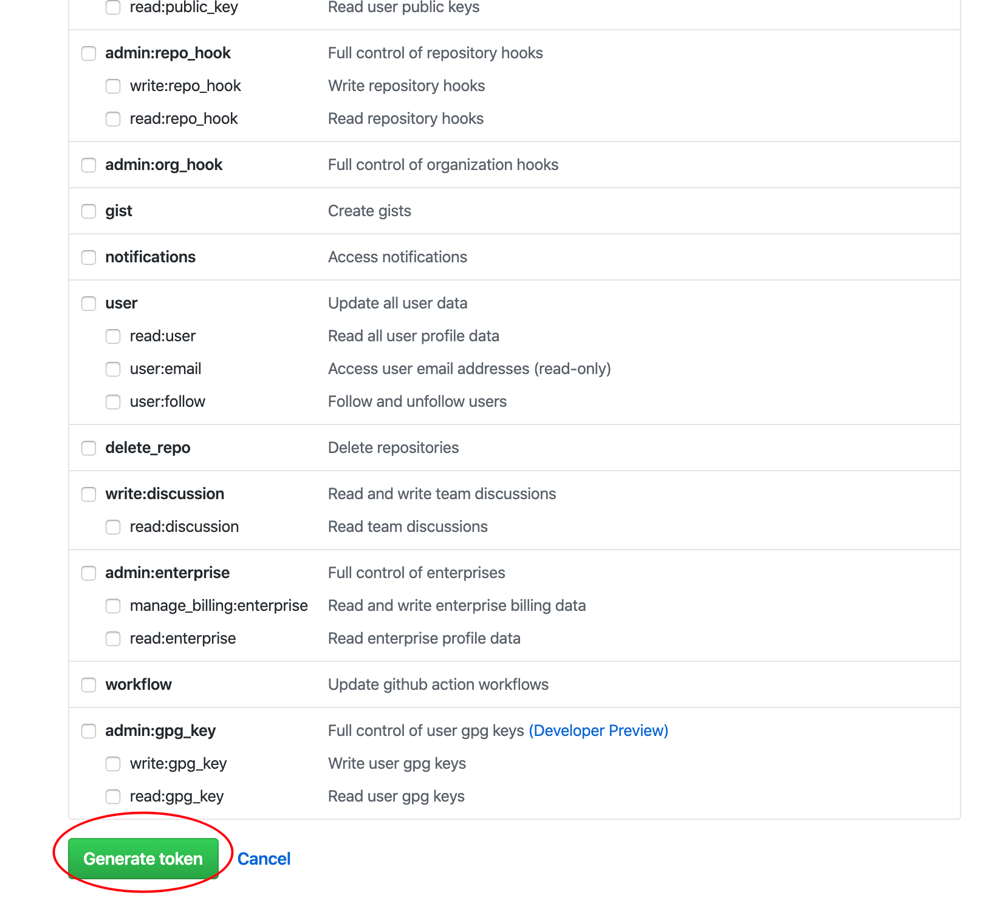
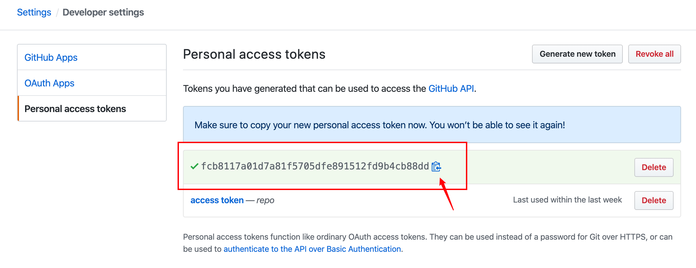
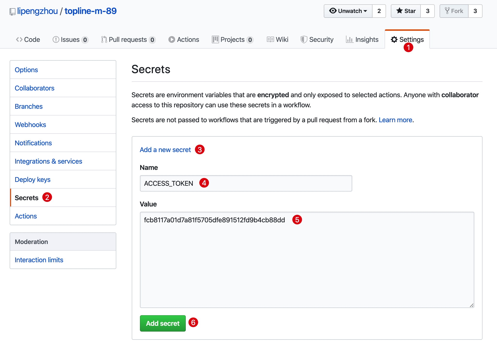
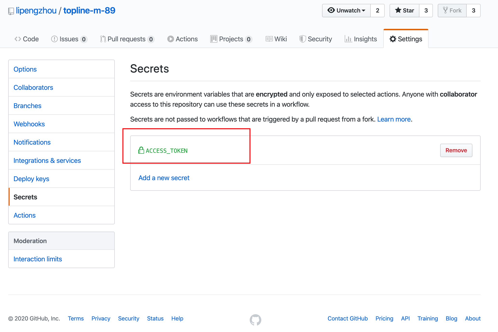

# 十五、打包发布

## 构建打包

```sh
npm run build

# yarn run build
yarn build
```

VueCLI 会把打包结果存储到项目的 `dist` 目录中。

项目中默认配置了生产环境不允许有 `console.log()`，如果有该代码，则打包就会报错。这里我们为了方便，建议手动关闭该规则。

找到项目根目录下的 `.eslintrc` 文件

```js
module.exports = {
  root: true,
  env: {
    node: true
  },
  'extends': [
    'plugin:vue/essential',
    '@vue/standard'
  ],
  rules: {
    // 错误代号: 报错级别
    // process.env.NODE_ENV === 'production' 可以判定当前代码运行环境
    // 如果你的开发环境，则它是 false，如果是生产环境，则它是 true

    // 关闭 console.log 校验
    'no-console': 'off',
    // 'no-console': process.env.NODE_ENV === 'production' ? 'error' : 'off',
    'no-debugger': process.env.NODE_ENV === 'production' ? 'error' : 'off',
    'no-unused-vars': process.env.NODE_ENV === 'production' ? 'error' : 'off'
  },
  parserOptions: {
    parser: 'babel-eslint'
  }
}

```

然后重新打包。

## 测试打包结果

将 dist 放到一个 Web 服务器中运行测试。

- Ngxin
- Apache
- tomcat
- IIS
- 。。。。
- Node.js

这里推荐使用 Vue 官方推荐的一个命令行 http 服务工具：[serve](https://github.com/zeit/serve)。

安装：

```sh
# yarn global add serve
npm install -g serve
```

使用：

```sh
# dist 是运行 Web 服务根目录
serve -s dist
```

> serve 默认占用 5000 端口并启动一个服务

然后在浏览器中访问给出的地址访问测试。

> 提示
>
> `npm run serve` 运行的开发中的源代码（src 中的代码）
>
> 这里使用 `serve` 工具启动运行的是打包结果 dist 中的代码，主要是用来测试打包结果是否可以正常运行。

## 部署

- 公司有专门的 devops，说白了就是运维
  - 有些公司没有专门的运维人员，那就后端负责
- 你只需要把打包结果给人家就可以了


依赖知识：

- 买一个服务器
- Linux 操作系统、常用 Linux 命令
- 域名
- 搭建服务器环境
- 把本地的 Web 网站放到远程服务器
- 维护更新。。。。


## 扩展：GitHub Pages

GitHub Pages 可以帮我们托管静态网站。

GitHub Pages 中的域名：

- 如果你的仓库名字叫：你的用户名.github.io，则访问地址是：https://lipengzhou.github.io/
- 如果是其他的名字，则访问地址是：https://lipengzhou.github.io/仓库名称/

- 自定义域名
  - 首先你得有一个自己的域名
  - 然后将域名解析配置 CNAME 到：`你的用户名.github.io`
  - 在托管的仓库根目录放一个文件

> 提示：
>
> GitHub Pages 默认的域名强制开启 https，自定义域名可以选择 http 或者 https。

使用 GitHub Pages + GitHub Actions 实现自动部署。


### GitHub Pages

### 部署 Vue 项目到 GitHub Pages

GitHub Pages 只能托管静态资源，我们的 Vue 项目需要打包才能产生静态资源。

有了静态资源（dist），把它放到 GitHub 仓库中，开启 GitHub Pages 托管。


一种方式：

- 在本地打包：`npm run build`，得到 `dist` 资源
- 把 dist 推送到 GitHub 仓库中
  - 我们可以新建一个仓库（不推荐，维护麻烦）
  - 也可以使用我们的源代码仓库（推荐，放到 gh-pages 分支中）
- 把编译结果（dist）放到源代码仓库的 gh-pages（该分支名具有特殊含义，GitHub Pages 服务的要求）
- 然后把 gh-pages 分支托管到 GitHub Pages 服务中


注意一：如果你的域名在一个子目录下，则必须配置项目的 publicPath。

````
a.com

a.com/a

.com
.cn
.io

.com/a
.com/a/b
.cn/a
.io/a
````


注意二：GitHub Pages 默认域名强制开启 https 协议，https 协议下的网站不能访问 http 接口地址。

解决办法：

- 把接口更新到 https
- 使用自定义域名，可以不开启 https


### 结合 GitHub Actions 自动部署 Vue 项目

- 手动打包
- 手动推送
- 太麻烦

使用 GitHub Actions 就可以自动起来了。

一、关于域名

GitHub 虽然有默认免费域名，但是只能有一个根路径的域名，而且都必须强制开启 https，所以如果你的项目中有 http 接口是不行的。

所以建议购买一个自己的域名。

推荐阿里云的万网。


二、在域名解析记录中添加一个 CNAME 到 `你的GitHub用户名.github.io`。




>记录类型：CNAME
>
>主机记录：
>
>- `@`: 访问地址：`lipengzhou.com`
>- `www` 访问地址：`www.lipengzhou.com`
>- `abc` → `abc.lipengzhou`
>
>解析线路：默认
>
>记录值：`你的GitHub用户名.github.io`
>
>TTL: 10分钟，默认的




> 添加成功，确认是否能看到添加的这条记录。


然后在项目的 `public` 目录中添加一个文件 `CNAME` 写入你的自定义域名

例如：

```
toutiao89.lipengzhou.com
```


三、生成 GitHub Token











> 滚动到页面底部，点击 Generate token



> 复制绿色背景中的内容，自己保管起来。
>
> 注意：该内容只显示一次，之后不再显示，如果忘了，就重新生成。


四、将 token 配置到项目的 secrets 中



> Name：最好和我的一致，如果你修改了则下面的脚本内容也要修改。
>
> Value：填写上一步生成的那个 token。



> 如图所示，添加成功了。

五、配置 GitHub Actions

在项目中创建 `.github/workflows/main.yml` 并写入下面的配置内容。

```sh
name: build and deploy

# 当 master 分支 push 代码的时候触发 workflow
on:
  push:
    branches:
    - master

jobs:
  build-deploy:
    runs-on: ubuntu-latest
    steps:
    # 下载仓库代码
    - uses: actions/checkout@v2
    
    # 缓存依赖
    - name: Cache dependencies
      uses: actions/cache@v1
      with:
        path: ~/.npm
        key: ${{ runner.os }}-node-${{ hashFiles('**/package-lock.json') }}
        restore-keys: |
          ${{ runner.os }}-node-
    
    # 安装依赖
    - run: npm ci
    
    # 打包构建
    - run: npm run build
    
    # 发布到 GitHub Pages
    - name: Deploy
      uses: peaceiris/actions-gh-pages@v2
      env:
        PERSONAL_TOKEN: ${{ secrets.ACCESS_TOKEN }}
        PUBLISH_BRANCH: gh-pages
        PUBLISH_DIR: ./dist

```

六、推送源代码

```sh
git add
git commit
git push
```

七、查看部署状态


> 自动部署已触发


> 当所有的任务都完成变为绿色的对勾之后，就表示本次自动部署成功了。
>
> 当有新的源码 push 推送过来，会再次触发自动部署。
>
> 如果自动部署失败，会有红色的 ×，它还会给你发一封邮件告诉你部署失败了。


部署成功以后，进入 settings 中查看 GitHub Pages 服务是否正常。


最后在浏览器中访问你的域名。

