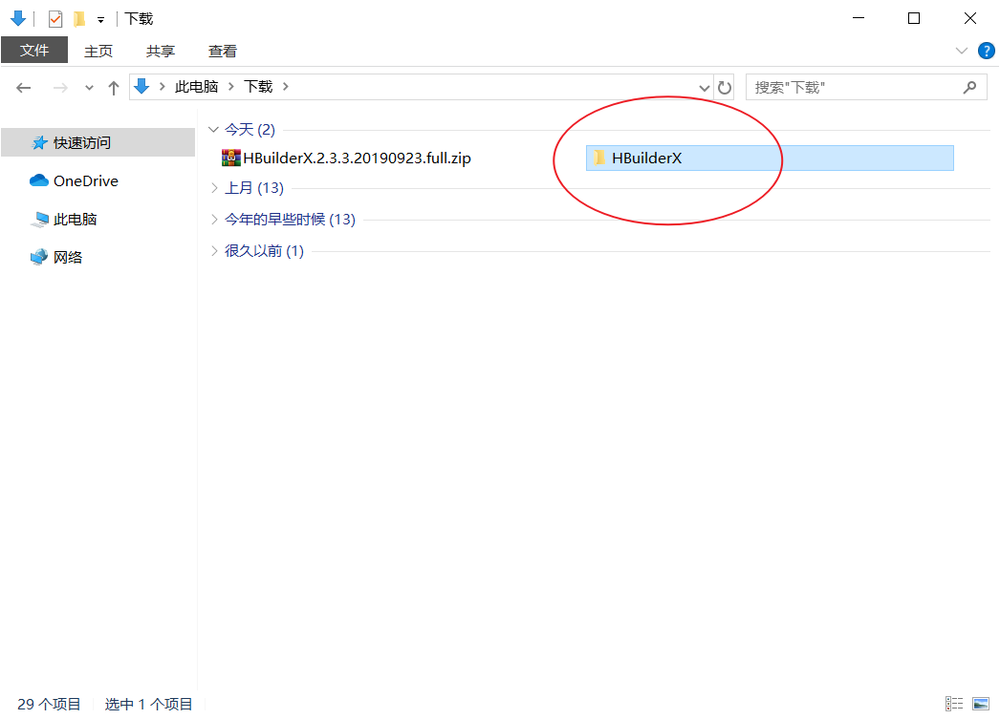

# 十七、移动 App 开发

## [移动 App 开发相关概念](./移动App开发介绍.md)

## 混合应用开发（DCloud HTML5+ App）

- 百分之九十五的技术还是 Web、百分之五的技术是原生应用

## 安装 HBuilder

访问 HBuilder 的下载页面：https://www.dcloud.io/hbuilderx.html


> 选择 DOWNLOAD


> 根据自己的操作系统下载对应的安装包。
>
> - 标准版：可直接用于 web 开发、markdown、字处理场景。做 App 仍需要安装插件
>
> - App 开发板：在标准版的基础之上预置了 App/uni-app 开发所需的插件，开箱即用
>
> 如果是开发 App 建议下载安装 App 开发版即可。


> 下载的文件是一个压缩包


> 解压到当前文件夹（或者其它目录都可以）


> 解压时间比较长，耐心等待一下...



> 解压好以后得到一个名为 `HBuilderX` 的目录


> 进入 HBuilderX 目录中，找到 `HBuilderX.exe` 并打开。


## Hello World

### 创建项目

在 Hbuilder 的菜单栏中依次找到：文件 -> 新建 -> 项目


> - 项目类型：选择 5+App
> - 项目名称：给项目起个名字
> - 存储目录：设置项目的存储目录
> - 项目模板：选择默认模板
>
> 配置好以后，点击“创建”


> 创建完成。

项目目录结构说明：

- `css`：存储项目中的样式文件资源

- `img`：存储项目中的图片文件资源

- `js`：存储项目中的 js 文件资源
- `unpackage`：存储不需要打包的文件资源
- `index.html`：项目首页
- `manifest.json`：打包 App 的配置文件

为了待会儿我们真机调试运行能够看到页面效果，我们这里在项目的 `index.html` 中添加一个标签：

```html
<h1>Hello World</h1>
```

### 真机调试运行

这里我们主要了解如何把上一步创建好的项目运行到手机上（仅用于开发测试）。

#### Android

常见问题：

- HBuilder/HBuilderX真机运行、手机运行、真机联调常见问题：https://ask.dcloud.net.cn/article/97

- 确保手机开启了 USB 调试模式
- 建议下载安装 360 手机助手，如果 360 手机助手能够连接到手机，基本就 OK 了

1、在手机的设置中找到并打开开发者选项

在手机的设置中找到开发者选项：


> 提示：大多数安卓手机的设置中默认没有开发者选项，如果没有就打开百度搜索：你的手机品牌型号开发者选项，例如：小米 9 开发者选项，然后根据搜索到的结果找到并打开开发者选项。

2、启用开发者选项和 USB 调试


3、使用数据线连接手机和电脑

4、在 HBuilder 的菜单栏中依次选择：运行 -> 运行到手机或模拟器 -> 你的手机设备


> 提示：如果没有发现你的手机设备，请参考：[HBuilder/HBuilderX 真机运行、手机运行、真机联调常见问题](http://ask.dcloud.net.cn/article/97)


> 运行到设备之后，Hbuilder 中会自动打开一个控制台并输出运行日志。

然后 Hbuilder 需要安装调试基座（应用）到手机中，这个时候手机会提示你是否允许安装该应用，选择允许即可。

调试基座安装好以后，Hbuilder 会自动打开并将项目运行到这个 App 中。


然后我们在 `index.html` 新增一些内容：

```html
<p>杨柳青青江水平</p>
<p>闻郎江上唱歌声</p>
<p>东边日出西边雨</p>
<p>道是无晴却有晴</p>
```


我们可以看到，手机 App 中的内容也自动更新了。

> 如果没有自动更新，就手动退出并重新打开。

#### iOS

1、下载安装 [iTunes](https://www.apple.com/cn/itunes/download/)

- Windows 用户：不要安装微软商店版
- 最新版的 macOS 不需要安装

2、使用数据线连接到电脑

3、确保 iTunes 能够正常连接到手机

4、在 Hbuilder 中选择运行到你的 iPhone 设备

5、它会在手机中安装一个用于调试的测试 App：Hbuilder

6、在手机上设置 Hbuilder 为受信任的开发者

> 注意：只有安装了未受信任的应用才能在设置中找到设备管理选项。

因为 iPhone 的权限比较高，所以打开 Hbuilder 会提示“未受信任的企业级开发者”，所以这里需要手动设置该应用为受信任的开发者。


> 打开手机的设置


> 在设置中找到通用并打开


> 打开设备管理


> 打开名称为 Digital Heaven... 的选项


> 选择“信任 Digital Heaven...”


> 选择信任

设置好以后就可以正常打开了，之后的其它操作和 Android 类似。

### 访问 HTML5 + API

- [HTML5+ API Reference](http://www.html5plus.org/doc/h5p.html)

### 打包发布

- 配置 [manifest.json](http://ask.dcloud.net.cn/article/94) 文件
- 在 HBuilder 中找到：发行 -> 原生 App（云打包）
- 等待一段时间，得到打包结果安装包，然后安装到手机上测试
- 最后根据需要发布到对应的手机应用商店

项目中的文件都被打包到应用安装包中了，只要安装了这个应用就不需要请求下载这些文件，除非是一些请求接口的功能必须是联网的。这种方式好处是一些核心文件不需要联网下载，但是更新麻烦，如果你修改了代码，则需要重新打包。

还有一种方式，我们把应用部署为网站，然后在这个壳儿里面加载我们的应用的那个网址。

如果是开发测试，则将 `manifest.json` 文件中的 `lanuchpath` 修改为你的局域网地址。

如果是发布部署，则将 `luanchpath` 设置为线上的地址。

#### 配置 manifest

- [Manifest.json 文档说明 manifest 配置](http://ask.dcloud.net.cn/article/94)

#### 打包

- 本地打包
- 云打包

#### 发布

## 使用 Vue.js 开发 HTML5+ App

一、将你的项目部署到服务端

二、真机调试运行

1、启动本地开发 Web 服务

```sh
# yarn serve
npm run serve
```

2、启动手机真机调试

在 HBuilder 中，菜单栏 → 运行 → 运行到手机或模拟器 → 你的手机设备

3、编码测试。。。和原来在 PC 端的开发是一样的，只不过运行到了手机中


### 打包发布

一、打包手机安装包

1、将 `app/manifest.json` 中的 `launch_path` 改为线上地址：`http://toutiao89.lipengzhou.com`。

2、在 HBuilder 中加载项目中的 app 目录，菜单栏 → 发行 → 原生 App 云打包

3、配置打包规则

4、等待打包结果

5、根据需要发行到手机的应用商店供用户下载（安卓安装包可以直接放到自己的服务器供用户下载）


二、更新 App 内容？

只需要更新我们的网站就可以了。

```
将本地代码推送到 GitHub。
触发 GitHub Actions 自动部署

部署好以后，网站就更新了。
```


手机 App 中的网页可能会有缓存问题，解决办法就是：结合前端 + 后端禁用缓存。

参考地址：https://ask.dcloud.net.cn/question/31327

所以一般应用或是网站的更新都会选择在夜深人静的时候。

