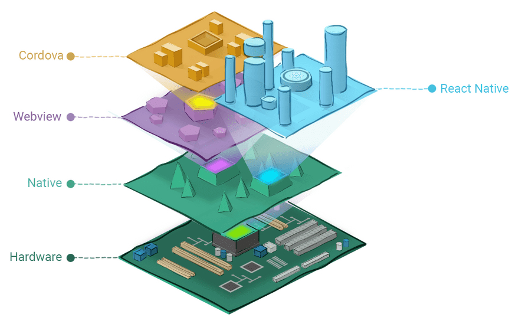
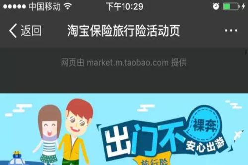

# 移动 App 开发介绍

- 传统的移动应用：能独立安装到手机上的一个独立的软件 App
  - Native App
  - Hybrid App
  - 跨平台开发 Native App
  - Web App
- 另类的移动应用：类似于小程序、公众号、快应用。。

## 原生应用（Native App）

- 原生应用

### 开发技术

- 原生的 Android 平台
- 原生的 iOS 平台

Native APP 指的是原生程序，一般依托于操作系统，有很强的交互，是一个完整的 App，可拓展性强，需要用户下载安装使用。（简单来说，原生应用是特别为某种操作系统开发的，比如 iOS、Android 等等，它们是在各自的移动设备上运行的）

该模式通常是由“云服务器数据+APP 应用客户端”两部份构成，APP 应用所有的 UI 元素、数据内容、逻辑框架均安装在手机终端上。

原生应用程序是某一个移动平台（比如 iOS 或安卓）所特有的，使用相应平台支持的开发工具和语言（比如 iOS 平台支持 Xcode 和 Objective-C，安卓平台支持 Eclipse 和 Java）。原生应用程序看起来（外观）和运行起来（性能）是最佳的。

iOS

- 语言：Object-C、Swift
- 开发工具：XCode
- 操作系统：macOS

Android：

- 语言：Java、Kotlin
- 开发工具：Eclipse、Android Studio
- 操作系统：Windows、macOS、Linux 都支持

### 优点

- 直接依托于操作系统,交互性最强,性能最好

  相比于其它模式的交互,原生 APP 体验是最优的

- 功能最为强大,特别是在与系统交互中,几乎所有功能都能实现

  得益于原生是直接依托于系统的,所以可以直接调用官方提供的 api,功能最为全面(比如本地资源操作,通知,动画等)

### 缺点

- 开发成本高,无法跨平台,不同平台 Android 和 iOS 上都要各自独立开发

  Android 上基于 Java 开发,iOS 上基于 OC 或 Swift 开发,相互之间独立,必须要有各自的开发人员

- 更新缓慢,特别是发布应用商店后,需要等到审核周期

  原生应用更新是一个很大的问题,Android 中还能直接下载整包 APK 进行更新,但是 iOS 中,如果是发布 AppStore,必须通过 AppStore 地址更新,而每次更新都需要审核,所以无法达到及时更新

- 维护成本高

  同开发一样,项目上线后,维护起来也很为麻烦

## 网站应用（Web App）

Web App 指采用 Html5 语言写出的 App，不需要下载安装。类似于现在所说的轻应用。生存在浏览器中的应用，基本上可以说是触屏版的网页应用。（Web 应用本质上是为移动浏览器设计的基于 Web 的应用，它们是用普通 Web 开发语言开发的，可以在各种智能手机浏览器上运行）

Web App 开发即是一种框架型 APP 开发模式（HTML5 APP 框架开发模式），该开发具有跨平台的优势，该模式通常由“HTML5 云网站+APP 应用客户端”两部份构成，APP 应用客户端只需安装应用的框架部份，而应用的数据则是每次打开 APP 的时候，去云端取数据呈现给手机用户。

HTML5 应用程序使用标准的 Web 技术，通常是 HTML5、JavaScript 和 CSS。这种只编写一次、可到处运行的移动开发方法构建的跨平台移动应用程序可以在多个设备上运行。虽然开发人员单单使用 HTML5 和 JavaScript 就能构建功能复杂的应用程序，但仍然存在一些重大的局限性，具体包括

**会话管理、安全离线存储以及访问原生设备功能**

（摄像头、日历和地理位置等）。

### 优点

- 开发成本低,可以跨平台,调试方便，开发速度最快

  web app 一般只需要一个前端人员开发出一套代码,然后即可应用于各大主流浏览器(特殊情况可以代码进行下兼容),没有新的学习成本,而且可以直接在浏览器中调试

- 维护成本低

  同上,如果代码合理,只需要一名前端就可以维护多个 web app

- 更新最为快速

  由于 web app 资源是直接部署在服务器端的,所以只需要替换服务器端的文件,用户访问是就已经更新了(当然需要解决一些缓存问题)

- 无需安装 App,占用少量的手机内存

  通过浏览器即可访问,无需安装,用户就会比较愿意去用

### 缺点

- 性能低,用户体验最差

  由于是直接通过的浏览器访问,所以无法使用原生的 API,操作体验不好

- 依赖于网络,页面访问速度慢,耗费流量

  Web App 每次访问都需要去服务端加载资源访问,所以必须依赖于网络,而且网速慢时访问速度很不理想,特别是在移动端,如果网站优化不好会无故消耗大量流量

- 功能受限,大量功能无法实现

  只能使用 Html5 的一些特殊 api,无法调用原生 API,所以很多功能存在无法实现情况

- 临时性入口,用户留存率低

  这既是它的优点,也是缺点,优点是无需安装,缺点是用完后有时候很难再找到,或者说很难专门为某个 web app 留存一个入口,导致用户很难再次使用

## 混合应用（Hybrid App）

Hybrid APP 指的是半原生半 Web 的混合类 App。需要下载安装，看上去类似 Native App，但只有很少的原生内容，大多数内容是 Web 。

混合应用程序让开发人员可以把 HTML5 应用程序（网页）嵌入到一个细薄的原生容器（包了一个浏览器）里面，集原生应用程序和 HTML5 应用程序的优点（及缺点）于一体。

混合应用大家都知道是原生应用和 Web 应用的结合体，采用了原生应用的一部分、Web 应用的一部分，所以必须在部分在设备上运行、部分在 Web 上运行。不过混合应用中比例很自由，比如 Web 占 90%，原生占 10%；或者各占 50%。

有些应用最开始就是包了个原生客户端的壳，其实里面是 HTML5 的网页，后来才推出真正的原生应用。比较知名的 APP，比如手机百度和淘宝客户端 Android 版，走的也是 Hybrid App 的路线，不过手机百度里面封装的不是 WebView，而是自己的浏览内核，所以体验上更像客户端，更高效。

网站应用可以运行在原生应用中：

- 拥有了类似于原生应用的使用方式，需要安装使用
- 拥有了和手机系统交互的能力，可以调用手机系统API

### 优点

- 开发成本较低,可以跨平台,调试方便

  Hybrid 模式下,由原生提供统一的 API 给 JS 调用,实际的主要逻辑有 Html 和 JS 来完成,而由于最终是放在 webview 中显示的,所以只需要写一套代码即可,达到跨平台效果,另外也可以直接在浏览器中调试,很为方便

  最重要的是只需要一个前端人员稍微学习下 JS api 的调用即可,无需两个独立的原生人员

  一般 Hybrid 中的跨平台最少可以跨三个平台:Android App,iOS App,普通 webkit 浏览器

- 维护成本低,功能可复用

  同上,如果代码合理,只需要一名前端就可以维护多个 app,而且很多功能还可以互相复用

- 更新较为自由

  虽然没有 web app 更新那么快速,但是 Hybrid 中也可以通过原生提供 api,进行资源主动下载,达到只更新资源文件,不更新 apk(ipa)的效果

- 针对新手友好,学习成本较低

  这种开发模式下,只需要前端人员关注一些原生提供的 API,具体的实现无需关心,没有新的学习内容,只需要前端人员即可开发

- 功能更加完善,性能和体验要比起 web app 好太多

  因为可以调用原生 api,所以很多功能只要原生提供出就可以实现,另外性能也比较接近原生了

- 部分性能要求的页面可用原生实现

  这应该是 Hybrid 模式的最多一个好处了,因为这种模式是原生混合 web,所以我们完全可以将交互强,性能要求高的页面用原生写,然后一些其它页面用 JS 写,嵌入 webview 中,达到最佳体验

### 缺点

- 相比原生,性能仍然有较大损耗

  这种模式受限于 webview 的性能桎梏,相比原生而言有不少损耗,体验无法和原生相比

- 不适用于交互性较强的 app

  这种模式的主要应用是:一些新闻阅读类,信息展示类的 app;但是不适用于一些交互较强或者性能要求较高的 app(比如动画较多就不适合)

一般都是一些政府、企业内部项目会采用类似技术。

### 相关技术

共同点：

- 把网页打包成移动 App
- 使你的 Web 程序可以访问手机原生能力，例如调用摄像头之类

#### [Cordova](https://cordova.apache.org/)

Cordova 是 Apache 软件基金会的一个产品。其前身是 PhoneGap，由 Nitobi 开发，2011 年 10 月，Adobe 收够了 Nitobi，并且 PhoneGap 项目也被贡献给 Apache 软件基金会。Apache 在 2012 年 12 月，发布了 Cordova，截止到 2015 年 12 月，最新版面是 3.0。

    该框架的目标用户群体是原生开发者，其设计初衷是希望用户群体能够通过跨平台开发的方法降低原生开发的成本。为此，开发人员需要安装原生开发环境，配置工程，使用HTML5、CSS3、JS和原生SDK生成应用。
    
    Cordova的优势很明显，可以使用的框架、原生接口、支持平台都很多。但是，外国人写的东西，公司使用后，出现的技术问题难以解决。同时，其在使用 jQuery Mobile、Sencha Touch等前端框架的时候，有特效启动慢、页面切换慢、数据请求慢的特点。

#### [APPCan](http://www.appcan.cn/)

AppCan 成立于 2010 年，2011 年推出产品并测试，2012 年正式推出品牌，2013 年商业模式成型，2014 年开发者注册约 70w。AppCan 不是开源平台，同时，企业版和部分插件是收费的。换句话说，AppCan 只是一个卖软件的商业公司。我们认为：这会对其市场的占有率有着直接影响，闭源而没有垄断，所以前景不会太好。

#### [DCloud](https://dcloud.io/)

DCloud 大部分产品开源，W3C 会员单位，HTML5 中国产业联盟的发起公司之一，在 HTML5 这个行业有一定的江湖地位。旗下四款产品：HBuilder、5+ Runtime、MUI、流应用都是弥补并扩展 HTML5 特性的产品。该公司的理念就是解决 HTML5 的性能、工具、能力三方面的问题。MUI 是一款不错的前端框架，性能比 jQuery Mobile、Bootstrap 好很多，主要区别：

- 设计思路不同，MUI 坚持用原生 JS 做，不依赖 jQuery 或者 Angularjs。
- MUI 调用了 5+ Runtime 的底层原生加速，比不带原生加速的框架更快。

  但是，DCloud 毕竟是个新平台，发展才 2 年，新产品内部存在的 Bug 还需要很多的测试。在其官方社区中，不少开发者也在呼吁 DCloud 尽快完善文档和框架。

#### [API Cloud](https://www.apicloud.com/)

APICloud 提供原生应用的功能模块（设备访问，界面布局，开放 SDK 等），开发者可以通过 JS 调用。前端工程师负责页面布局，UI 展现，及简单的交互，原生模块负责性能方面和功能实现，两者结合形成一个完整的应用。同时 APICloud 提供了云数据库的功能，前端不必了解 PHP，Node.js 等后端语言，通过 JS 接口或 Restful API 实现数据库的增删改查。

    但是APICloud的更新速度很快，版本不太稳定。而且，它是为不懂APP开发的人士准备的，不适合科技公司和程序员。

#### 四种方式对比

## 跨平台开发 Native App

> 特点：使用类似于 Web 技术的方式来开发 Native App。

- 原生开发人员
  - 多少学点儿前端
- 前端开发人员
  - 多少学点儿原生

使用 Web 相关技术开发 Native App。

### 相关开发技术

#### React Native（主流）

- 公司：Facebook
- 技术栈：React + 原生
- 语法：JavaScript

#### Weex（使用不多）

- 公司：Apache 开源基金会
- 技术栈：Vue.js + 原生
- 语言：JavaScript
- 和 React Native 相比的差很多

#### Flutter（未来趋势）

- 公司：Google
- 它提供了官方的原生 UI 组件
- 比 RN、Weex 之类的体验更好
- 开发语言：Dart（和 JavaScript 很像）
- 商业应用：闲鱼

### 优点

- 虽然说开发成本大于 Hybrid 模式,但是小于原生模式,大部分代码可复用

  相比于原生模式,这种模式是统一用 JS 写代码,所以往往只需要一名成员投入学习,即可完成跨平台 app 的开发,而且后续代码封装的好,很多功能可复用

- 性能体验高于 Hybrid,不逊色与原生

  这种模式和 Hybrid 不一样,Hybrid 中的 view 层实际上还是 dom,但是这种模式的 view 层是虚拟 dom,所以性能要高于 Hybrid,距离原生差距不大

  这种模式可以认为是用 JS 写原生,即页面用 JS 写,然后原生通过 Bridge 技术分析 JS,将 JS 内容单独渲染成原生 Android 和 iOS,所以也就是为什么性能不逊色原生

- 开发人员单一技术栈,一次学习,跨平台开发

  这种模式是统一由 JS 编写,有着独特的语法,所以只需要学习一次,即可同时开发 Android 和 iOS

- 社区繁荣,遇到问题容易解决

  这应该是 React Native 的很大一个优势,不像 Hybrid 模式和原生模式一样各自为营,这种模式是 Facebook 统一发起的,所以有一个统一的社区,里面有大量资源和活跃的人员,对开发者很友好

### 缺点

- 虽然可以部分跨平台,但并不是 Hybrid 中的一次编写,两次运行那种,而是不同平台代码有所区别

  这种模式实际上还是 JS 来写原生,所以 Android 和 iOS 中的原生代码会有所区别,如果需要跨平台,对开发人员有一定要求

  当然了,如果发展了有一定时间,组件库够丰富了,那么其实影响也就不大了,甚至会比 Hybrid 更快

- 开发人员学习有一定成本

  虽然社区已经比较成熟了,但是一个新的普通前端学习起来还是有一定学习成本的,无法像 Hybrid 模式一样平滑

- 学习成本大，对开发人员技术要求比较高

- 不懂原生开发很难驾驭好

- 说是使用 Web 技术进行开发，还是多少得学点儿原生 App 开发，才能处理好跨平台。

- 前期投入比较大，后劲很足。

## 另类 App（Web 技术为主导）

### 小程序

- 微信小程序
- 百度小程序
- 头条小程序
- 支付宝小程序
- 。。。

### 微网页

- 微信公众号
- 百度直达号
- 。。。

### 快应用（不温不火，iPhone 不参与很难搞起来）

其实就是手机的应用商店中的小程序。

- 各大手机厂商联合制定推出的一种方式，类似于小程序
- 使用 Web 技术进行开发， 而且提供了在 Web 中访问手机硬件等底层交互的 API
- 属于混合 App 的一种方式

### PWA（离线网站）

- 离线应用

- 它可以让网站拥有一个类似于 App 的入口
- 提供了网站的离线应用访问
- Google 在推动
- 兼容不好

### 其它

。。。

## 各大开发模式对比

|                      | Native App                   | Web App                       | Hybrid App                     | React Native App              |
| :------------------- | :--------------------------- | :---------------------------- | :----------------------------- | :---------------------------- |
| 原生功能体验         | 优秀                         | 差                            | 良好                           | 接近优秀                      |
| 渲染性能             | 非常快                       | 慢                            | 接近快                         | 快                            |
| 是否支持设备底层访问 | 支持                         | 不支持                        | 支持                           | 支持                          |
| 网络要求             | 支持离线                     | 依赖网络                      | 支持离线(资源存本地情况)       | 支持离线                      |
| 更新复杂度           | 高(几乎总是通过应用商店更新) | 低(服务器端直接更新)          | 较低(可以进行资源包更新)       | 较低(可以进行资源包更新)      |
| 编程语言             | Android(Java),iOS(OC/Swift)  | js+html+css3                  | js+html+css3                   | 主要使用 JS 编写,语法规则 JSX |
| 社区资源             | 丰富(Android,iOS 单独学习)   | 丰富(大量前端资源)            | 有局限(不同的 Hybrid 相互独立) | 丰富(统一的活跃社区)          |
| 上手难度             | 难(不同平台需要单独学习)     | 简单(写一次,支持不同平台访问) | 简单(写一次,运行任何平台)      | 中等(学习一次,写任何平台)     |
| 开发周期             | 长                           | 短                            | 较短                           | 中等                          |
| 开发成本             | 昂贵                         | 便宜                          | 较为便宜                       | 中等                          |
| 跨平台               | 不跨平台                     | 所有 H5 浏览器                | Android,iOS,h5 浏览器          | Android,iOS                   |
| APP 发布             | App Store                    | Web 服务器                    | App Store                      | App Store                     |

## 如何选择开发模式

目前有多种开发模式,那么我们平时开发时如何选择用哪种模式呢？如下

### 选择纯 Native App 模式的情况

- 性能要求极高,体验要求极好,不追求开发效率

  一般属于吹毛求疵的那种级别了,因为正常来说如果要求不是特别高,会有 Hybrid

### 选择 Web App 模式的情况

- 不追求用户体验和性能,对离线访问没要求

  正常来说,如果追求性能和体验,都不会选用 web app

- 没有额外功能,只有一些信息展示

  因为 web 有限制,很多功能都无法实现,所以有额外功能就只能弃用这种方案了

### 选择 Hybrid App 模式的情况

- 不追求用户体验和性能
- 有一些简单交互的场景，可以选择 hybrid App
  - 网站 + App
  - 而且可以在 hybrid App 中和手机底层进行交互

### 选择 React Native App 模式的情况

- 追求性能,体验,同时追求开发效率,而且有一定的技术资本,舍得前期投入

  React Native 这种模式学习成本较高,所以需要前期投入不少时间才能达到较好水平,但是有了一定水准后,开发起来它的优势就体现出来了,性能不逊色原生,而且开发速度也很快

### 选择其它方案

- 小程序（目前移动 App 中开发成本最低的，体验也是仅次于原生+跨平台 NativeApp）

## 如何分辨一个 App 是原生做的还是 Web 做的

1、看断网情况

通过断开网络，刷新页面，观察内容缓存情况来有个大致的判断，可以正常显示的就是原生写的，显示 404 或者错误页面的就是 html 页面。

2、看布局边界

3、看复制文章的提示，需要通过对比才能得出结果。

比如文章资讯页面可以长按页面试试，如果出现文字选择，粘贴功能的是 H5 页面，否则是 native 原生的页面。

有些原生 APP 开放了复制粘贴功能或者关闭了，而 H5 的 CSS 屏蔽了复制选择功能等情况，需要通过对目标测试 APP 进行对比才可知。

在支付宝 APP、蚂蚁聚宝是可以判断的。

4、看加载的方式

如果在打开新页面导航栏下面有一条加载线的话，这个页面就是 H5 页面，如果没有就是原生的。

5、看 app 顶部，导航栏是否会有关闭的操作

如果 APP 顶部导航栏当中出现了关闭的按钮或者关闭的图标，那么当前的页面是 H5 页面，原生的不会出现（除非设计开发者特意设计），美团、大众点评的 APP、微信 APP 当加载 H5 过多的时候，左上角会出现关闭两个字。

6、判断页面下拉刷新的时候（前提是要有下拉刷新的功能）

如果页面没有明显刷新现象的是原生的，如果有明显刷新现象（比如闪一下）的是 H5 页面（Ios 和 Android）。比如淘宝的众筹页面。

7、下拉页面的时候显示网址提供方的一定是 H5 页面。

 

8、利用系统开发人员工具

找到手机的设置，开发者选项，显示布局边界，选择开启后再去查看 APP 整体布局边界，这样所有应用控件布局就会一目了然。

如果是 native APP 那么每个按钮、文字、图片都是红色的线显示这个控件的布局情况。如下图的微信：

如果是 web APP 那么应该就是一个 webview 去加载网页，webview 作为一个控件，只有一个边界框，即只有屏幕边才有红色线，如下图：

混合 APP 则是 native 与 webview 混排的界面，如下图红色线框是各控件的绘制边界，中间那一大块布局丰富的界面没有显示出很多边界红线，就是网页实现的。如下图的京东：

